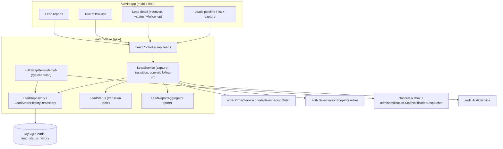

# Design Document

## Overview

Lead Management adds a pre-order **Lead** aggregate and a small **sales pipeline** to the Shifa OMS,
implemented as a new `com.shifa.oms.lead` module that mirrors the conventions already used by the
`order` module. A lead is captured the moment an enquiry arrives, worked through
`NEW → CONTACTED → QUOTED`, and either **converted** into an order (→ `WON`) or marked `LOST` with a
categorized reason. Salespeople see only their own leads (reusing `SalespersonScopeResolver`); admins
see all. Follow-up reminders reuse the transactional outbox + staff in-app notifications; status
changes and conversions are audited; conversion reuses the existing `OrderService` order-creation
path. Reporting adds leads-by-source, conversion-rate, pipeline-snapshot, and lost-reason aggregates.

This is an enhancement — additive only. One new Flyway migration (**V25**, the next unused version)
creates the lead tables; no applied migration is edited. The UI follows the shipped mobile-first
redesign (green shell, cards, status pills, role-aware nav).

### Grounding in the current codebase
- **Roles / scoping**: `auth.Role` (ADMIN/SALESPERSON/PACKING_USER/ACCOUNTANT), `SalespersonScopeResolver.creatorConstraint(actor)` returns the salesperson's own id or empty for admin — reused verbatim.
- **Lead source**: the existing `order.LeadSource` enum is reused for the lead's source (no new enum).
- **Conversion**: `OrderService.createSalespersonOrder(CreateOrderRequest, AuthPrincipal)` already builds a salesperson order and stamps `leadSource`; convert calls it, then links the returned order to the lead.
- **Notifications**: `platform.outbox.OutboxEventPublisher` + `adminnotification.StaffNotificationDispatcher` (role/user-addressed in-app) already exist — the follow-up reminder reuses them.
- **Audit**: `audit.AuditService.record(...)` (+ the explicit-actor overload) records status changes/conversions.
- **Reporting**: mirrors the pure `reporting.domain` aggregators; new lead aggregates are pure functions over lead rows.
- **UI**: `admin-shell.component.ts` role-aware nav + the redesign's card/pill/KPI patterns.

---

## Architecture



The `LeadService` is the single entry point for lead operations (capture, status transition, set
follow-up, convert), keeping legality (via `LeadStatus`), scoping, audit, and notification enqueue in
one place — the same pattern as `OrderWorkflowService`.

---

## Components and Interfaces

New components in `com.shifa.oms.lead`:

- **`LeadEntity`** (`@Table("leads")`) + **`LeadStatusHistory`** (`@Table("lead_status_history")`) — JPA aggregates matching the V25 schema.
- **`LeadStatus`** (enum) — frozen transition table + `canTransitionTo(from,to)` / `allowedTargets(from)` / `isTerminal()` (pure, like `OrderStatus`).
- **`LostReason`** (enum). Channel reuses `order.LeadSource`.
- **`LeadRepository`** / **`LeadStatusHistoryRepository`** — Spring Data; scoped finders taking an optional `ownerUserId` (null = admin/unscoped) mirroring `OrderRepository.findAllScoped`.
- **`LeadService`** — capture / edit / `transition(id, toStatus, lostReason, actor)` / `setFollowUp` / `convert(id, orderRequest, actor)` / list/detail/pipeline/dueFollowUps; owns scoping, legality, history, audit, and reminder-enqueue.
- **`LeadController`** (`/api/leads`) — REST surface from the API section, `@PreAuthorize("hasAnyRole('SALESPERSON','ADMIN')")`.
- **`LeadReportAggregator`** (pure) + report DTOs — by-source / conversion / pipeline / lost-reasons.
- **`FollowUpReminderJob`** (`@Scheduled`) — enqueues due-follow-up in-app reminders via the outbox.
- DTOs: `CreateLeadRequest`, `LeadResponse`, `LeadSummaryResponse`, `LeadStatusChangeRequest`, `FollowUpRequest`, `LeadConvertRequest`.

Reused (unchanged): `auth.SalespersonScopeResolver`, `auth.CurrentUserService`, `order.OrderService.createSalespersonOrder`, `order.LeadSource`, `platform.outbox.OutboxEventPublisher`, `adminnotification.StaffNotificationDispatcher`, `audit.AuditService`. Extended: `dashboard` role-summary payload gains lead pipeline + due-follow-up counts (Req 6.6).

---

## Data Models

### 3.1 New enums (in `com.shifa.oms.lead`)
- `LeadStatus { NEW, CONTACTED, QUOTED, WON, LOST }` — with a frozen transition table (see §4).
- `LostReason { PRICE, OUT_OF_STOCK, NO_RESPONSE, DUPLICATE, NOT_INTERESTED, OTHER }` (stored as string;
  `OTHER` may carry a short free-text note). Reuses `order.LeadSource` for the channel.

### 3.2 `leads` table
| Column | Type | Null | Notes |
|--------|------|------|-------|
| `id` | BIGINT PK AI | no | |
| `customer_name` | VARCHAR(120) | no | required at capture |
| `customer_mobile` | VARCHAR(10) | yes | validated 10-digit when present |
| `customer_email` | VARCHAR(150) | yes | optional |
| `lead_source` | VARCHAR(20) | no | `LeadSource` enum name |
| `lead_source_note` | VARCHAR(200) | yes | only for `OTHER` |
| `status` | VARCHAR(16) | no | `LeadStatus` enum name, default `NEW` |
| `lost_reason` | VARCHAR(20) | yes | set when `status = LOST` |
| `lost_reason_note` | VARCHAR(200) | yes | optional for `OTHER` lost reason |
| `note` | VARCHAR(1000) | yes | free-text working note |
| `follow_up_date` | DATE | yes | next follow-up |
| `owner_user_id` | BIGINT | no | FK → users.id (Lead_Owner / salesperson or admin) |
| `converted_order_id` | BIGINT | yes | FK → orders.id, set on WON |
| `created_at` | DATETIME | no | default CURRENT_TIMESTAMP |
| `updated_at` | DATETIME | no | ON UPDATE CURRENT_TIMESTAMP |

Indexes: `ix_leads_owner_status (owner_user_id, status)`, `ix_leads_status (status)`,
`ix_leads_follow_up (follow_up_date, status)`, `ix_leads_source (lead_source)`, `ix_leads_mobile (customer_mobile)`.

### 3.3 `lead_status_history` table
| Column | Type | Null | Notes |
|--------|------|------|-------|
| `id` | BIGINT PK AI | no | |
| `lead_id` | BIGINT | no | FK → leads.id |
| `from_status` | VARCHAR(16) | yes | null on creation row |
| `to_status` | VARCHAR(16) | no | |
| `actor` | VARCHAR(100) | no | username |
| `changed_at` | DATETIME | no | default CURRENT_TIMESTAMP |

### 3.4 Migration `V25__leads.sql` (sketch)
```sql
CREATE TABLE leads (
  id BIGINT NOT NULL AUTO_INCREMENT,
  customer_name VARCHAR(120) NOT NULL,
  customer_mobile VARCHAR(10) NULL,
  customer_email VARCHAR(150) NULL,
  lead_source VARCHAR(20) NOT NULL,
  lead_source_note VARCHAR(200) NULL,
  status VARCHAR(16) NOT NULL DEFAULT 'NEW',
  lost_reason VARCHAR(20) NULL,
  lost_reason_note VARCHAR(200) NULL,
  note VARCHAR(1000) NULL,
  follow_up_date DATE NULL,
  owner_user_id BIGINT NOT NULL,
  converted_order_id BIGINT NULL,
  created_at DATETIME NOT NULL DEFAULT CURRENT_TIMESTAMP,
  updated_at DATETIME NOT NULL DEFAULT CURRENT_TIMESTAMP ON UPDATE CURRENT_TIMESTAMP,
  CONSTRAINT pk_leads PRIMARY KEY (id),
  CONSTRAINT fk_leads_owner FOREIGN KEY (owner_user_id) REFERENCES users (id),
  CONSTRAINT fk_leads_order FOREIGN KEY (converted_order_id) REFERENCES orders (id),
  CONSTRAINT ck_leads_status CHECK (status IN ('NEW','CONTACTED','QUOTED','WON','LOST'))
) ENGINE=InnoDB DEFAULT CHARSET=utf8mb4 COLLATE=utf8mb4_unicode_ci;
CREATE INDEX ix_leads_owner_status ON leads (owner_user_id, status);
CREATE INDEX ix_leads_status ON leads (status);
CREATE INDEX ix_leads_follow_up ON leads (follow_up_date, status);
CREATE INDEX ix_leads_source ON leads (lead_source);
CREATE INDEX ix_leads_mobile ON leads (customer_mobile);

CREATE TABLE lead_status_history (
  id BIGINT NOT NULL AUTO_INCREMENT,
  lead_id BIGINT NOT NULL,
  from_status VARCHAR(16) NULL,
  to_status VARCHAR(16) NOT NULL,
  actor VARCHAR(100) NOT NULL,
  changed_at DATETIME NOT NULL DEFAULT CURRENT_TIMESTAMP,
  CONSTRAINT pk_lead_status_history PRIMARY KEY (id),
  CONSTRAINT fk_lead_history_lead FOREIGN KEY (lead_id) REFERENCES leads (id)
) ENGINE=InnoDB DEFAULT CHARSET=utf8mb4 COLLATE=utf8mb4_unicode_ci;
CREATE INDEX ix_lead_history_lead ON lead_status_history (lead_id);
```
Safe on the seeded V22 dataset (new tables only). Hibernate `ddl-auto: validate` requires the new
`Lead` / `LeadStatusHistory` entities to match these columns exactly.

---

## State Machine Design

`LeadStatus` holds a frozen transition table:

| From | Allowed → | Trigger |
|------|-----------|---------|
| `NEW` | `CONTACTED`, `LOST` | salesperson/admin |
| `CONTACTED` | `QUOTED`, `LOST` | salesperson/admin |
| `QUOTED` | `LOST` (and `WON` **only via Convert**) | salesperson/admin |
| `WON`, `LOST` | — (terminal) | — |

- Forward-only through the funnel; `LOST` reachable from any non-terminal status (requires `LostReason`).
- `WON` is **not** a manually selectable target — it is set only by the Convert action (Req 2.5, 4.2).
- Illegal transitions throw a `IllegalLeadTransitionException` (HTTP 409); terminal leads reject changes.
- Every successful transition appends one `lead_status_history` row and an audit event.

---

## API Design

All endpoints require authentication; method-level `@PreAuthorize("hasAnyRole('SALESPERSON','ADMIN')")`.
Salesperson requests are scoped to their own leads server-side (`SalespersonScopeResolver`); an
out-of-scope lead id yields 404 (mirrors order scoping). Base path `/api/leads`.

- `POST /api/leads` — capture a lead (`CreateLeadRequest`: name, source, optional mobile/email/note/followUpDate, sourceNote). → 201 with `LeadResponse`. 400 on missing name/invalid source.
- `GET /api/leads` — list, scoped; query params `q` (name/mobile), `status`, `source`. Returns summaries.
- `GET /api/leads/pipeline` — active-lead counts per `LeadStatus` (scoped) for the pipeline board.
- `GET /api/leads/{id}` — full detail incl. status history + linked order (scoped; 404 if out of scope).
- `POST /api/leads/{id}/status` — advance status (`{ toStatus, lostReason?, lostReasonNote? }`). 409 on illegal/terminal; requires lostReason when `toStatus=LOST`.
- `PUT /api/leads/{id}/follow-up` — set/clear `{ followUpDate }`.
- `PUT /api/leads/{id}` — edit capture fields (name/mobile/email/note/source) while non-terminal.
- `GET /api/leads/follow-ups/due` — the acting user's non-terminal leads with `follow_up_date <= today`.
- `POST /api/leads/{id}/convert` — create an order from the lead and mark it WON. Body: the order line
  items + payment fields (a `CreateOrderRequest`-shaped payload seeded from the lead on the client);
  server pre-stamps customer + leadSource from the lead, calls `OrderService.createSalespersonOrder`,
  then sets the lead `WON` + `converted_order_id`. 409 if the lead is already terminal.
- Reports (ADMIN unscoped; SALESPERSON scoped to own): `GET /api/leads/reports/by-source`,
  `.../conversion`, `.../pipeline`, `.../lost-reasons` — each accepts `from`/`to` where date-ranged.
- Dashboard: `GET /api/dashboard/summary` (existing) is extended so the SALESPERSON payload includes
  pipeline counts + due-follow-up count (Req 6.6), and ADMIN gets a leads/conversion summary.

---

## Convert Flow

1. Client opens the New Order form pre-filled from `GET /api/leads/{id}` (name/mobile/email/source).
2. On save, client calls `POST /api/leads/{id}/convert` with the order payload.
3. `LeadService.convert`: load scoped lead → reject if terminal (409) → build a `CreateOrderRequest`
   forcing `leadSource`/customer from the lead → `orderService.createSalespersonOrder(req, actor)` in
   the same transaction → set lead `status=WON`, `converted_order_id=order.id`, append history + audit.
4. If order creation throws (validation/stock), the transaction rolls back — the lead stays unchanged
   and no order is created (Req 4.4).

---

## Follow-up Reminders

- `FollowUpReminderJob` (`@Scheduled`, e.g. every 15 min or a daily morning cron; config-driven) finds
  non-terminal leads whose `follow_up_date <= today` and which have not yet been reminded today, and for
  each enqueues an in-app notification addressed to the Lead_Owner via the existing outbox +
  `StaffNotificationDispatcher` (recipient = the owner user id). De-dup via a "last reminded" marker
  (a `reminded_on` DATE column added to `leads`, or a per-day dedup key on the outbox event) so a lead
  is reminded at most once per due day. The `due` view (`GET /api/leads/follow-ups/due`) is the
  synchronous counterpart the dashboard/badge reads.

---

## Reporting

Pure `LeadReportAggregator` over lead rows (mirrors `reporting.domain`):
- **by-source**: counts grouped by `LeadSource` in range.
- **conversion**: per source and per owner → `{leads, won, conversionRate = won/leads}` (0 when leads=0).
- **pipeline**: current active-lead counts per `LeadStatus`.
- **lost-reasons**: `LOST` counts grouped by `LostReason` in range.
Salesperson requests are scoped to `owner_user_id = self`.

---

## Frontend / UX

- New `leads` feature: a **pipeline/list** screen (mobile-first cards grouped by status with counts +
  colored status pills), a **capture form** (name, source, mobile/email/note/follow-up), a **lead
  detail** (status history, advance-status action, set follow-up, **Convert** button), and a **due
  follow-ups** list. Reuse the redesign's card/pill/KPI CSS and the product-image-free contact style
  from the order detail.
- **Navigation (decision)**: keep the 4 salesperson bottom tabs unchanged; add **Leads** to the
  hamburger for `SALESPERSON` + `ADMIN`, plus a "Leads" / "Due follow-ups" quick action on the
  salesperson dashboard. (Bottom-tab swap can be revisited after the client sees it.)
- Convert navigates to the New Order form pre-filled, then calls the convert endpoint on save.
- Salesperson dashboard gains pipeline-by-stage counts + a due-follow-ups badge (from the extended summary).

---

## Correctness Properties

*Properties that should hold across all valid executions; drive the jqwik PBT suite.*

### Property 1: Lead transition legality matches the table
For any `(from, to)`, `LeadStatus.canTransitionTo(from,to)` is true iff `(from,to)` is in the §4 table;
attempting an illegal transition raises a 409 and leaves the lead + its history unchanged.
**Validates: Requirements 2.2, 2.4, 2.7**

### Property 2: WON is unreachable by manual status change
For any lead and any manual status request, the result is never `WON`; `WON` is produced only by the
convert path.
**Validates: Requirements 2.5, 4.2**

### Property 3: LOST requires and stores a reason
A transition to `LOST` is accepted iff a valid `LostReason` is supplied; when accepted the reason is
persisted and the lead is terminal; when rejected the lead is unchanged.
**Validates: Requirements 2.3, 2.4**

### Property 4: Each successful transition appends exactly one history row
Every accepted status change appends exactly one `lead_status_history` row capturing from/to/actor and
records one audit event.
**Validates: Requirements 2.6, 7.5**

### Property 5: Salesperson scoping
For any mix of owners, a salesperson's list/detail/report queries return exactly their own leads;
admin queries are unscoped; an out-of-scope detail id is a 404.
**Validates: Requirements 3.1, 3.2, 6.5, 7.2**

### Property 6: Capture validation
A lead is created iff it has a non-blank name and an in-set `LeadSource` (with an `OTHER` note ≤200);
otherwise it is rejected and nothing is persisted; a created lead starts `NEW` with owner = actor and
one creation history row (from=null).
**Validates: Requirements 1.1, 1.2, 1.6, 2.1**

### Property 7: Convert marks WON, links the order, and preserves source; failure is a no-op
A successful convert of a non-terminal lead produces an order carrying the lead's `LeadSource`, sets the
lead `WON` with `converted_order_id` set; a convert of a terminal lead is rejected; if order creation
fails the lead is unchanged and no order exists.
**Validates: Requirements 4.2, 4.3, 4.4, 4.5, 7.3**

### Property 8: Due-follow-ups membership
For any set of leads, the due-follow-ups result for a user equals exactly their non-terminal leads whose
`follow_up_date <= today`; leads without a follow-up date are excluded.
**Validates: Requirements 5.2, 5.4**

### Property 9: Conversion-rate report is exact
For any set of leads, per-source/per-owner `conversionRate = won/leads` (0 when leads=0), and group
counts sum to the in-range lead count; lost-reason and pipeline counts equal the multiset groupings.
**Validates: Requirements 6.1, 6.2, 6.3, 6.4**

---

## Error Handling

- Illegal/terminal transition → 409 `ILLEGAL_LEAD_TRANSITION` (via `common` error envelope), lead unchanged.
- Validation (missing name, invalid source, missing lost reason, bad mobile) → 400.
- Out-of-scope / unknown lead → 404 (scoping-safe, mirrors orders).
- Convert failure (order validation/stock) → the order error surfaces; the lead stays unchanged (rollback).
- Reminder job is best-effort and idempotent per due-day; a send failure retries via the existing outbox drainer.

---

## Testing Strategy

- **jqwik PBT** for the 9 properties (pure `LeadStatus`, `LeadReportAggregator`, scoping predicate, due
  predicate; `LeadService` with recording repos/audit). ≥100 iterations, tagged
  `Feature: lead-management, Property {n}: {text}`. Java-25 gotcha: real instances / recording subclasses,
  no Mockito mocks of concrete classes.
- **Unit/example**: capture happy-path + each validation; each legal transition; convert happy-path +
  terminal-reject + order-failure rollback.
- **Integration**: `V25` applies cleanly on the seeded dataset + Hibernate `validate`; `/api/leads`
  endpoint role guards (SALESPERSON/ADMIN 2xx, others 403); convert creates a linked WON order.
- **Frontend**: build passes; component checks for pipeline cards + capture form + convert action at 360px.
