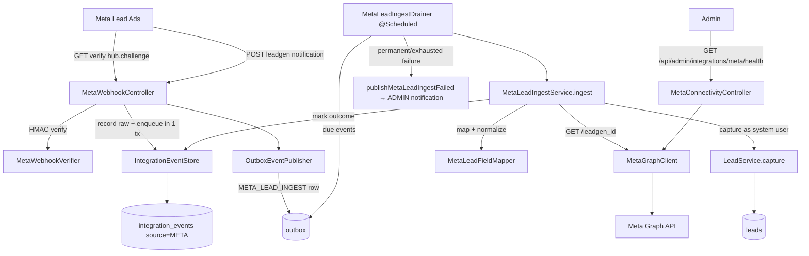

# Design Document

## Overview

Meta Lead Sync ingests Facebook/Instagram Lead Ads submissions into the Shifa OMS `leads` pipeline automatically, using Meta's "notify then fetch" model. It is built as a new package `com.shifa.oms.integration.meta`, deliberately mirroring the existing `integration.shopify` inbound-webhook feature so the retry, idempotency, and admin-alert semantics read the same across every integration in the system.

The flow:

1. Meta POSTs a lightweight `leadgen` webhook notification (carrying `leadgen_id`, `form_id`, `page_id`) to a public endpoint.
2. The endpoint verifies the `X-Hub-Signature-256` HMAC, **stores the raw delivery**, enqueues an outbox event, and returns `200` immediately.
3. An out-of-band drainer fetches the full lead field data from the Graph API by `leadgen_id`, maps and normalizes it, and persists it through the existing `LeadService.capture` on behalf of a dedicated **Meta Leads** system user.
4. Transient failures retry with backoff; permanent failures (bad token, capture rejection) are recorded and raise a single ADMIN notification.

### Key design decision — reuse `integration_events`, not a new table

Requirements 12.1/12.2 called for a *new* dedicated ingest table with a unique `leadgen_id`. The design instead **reuses the existing `integration_events` table** (from the Shopify/QuikShipX feature) by adding a `META` value to `IntegrationSource`, with `external_event_id = leadgen_id`. This is strictly better and fully satisfies the intent:

- `UNIQUE(source, external_event_id)` already gives per-source idempotency on `leadgen_id` (Req 4).
- Raw payload storage, terminal-outcome tracking, attempt counting, and the admin health/replay surface all come for free and stay consistent with the other integrations.
- It removes duplicated schema and code.

The `Ingest_Record` glossary term therefore maps to an `IntegrationEvent` row with `source = META`. The only new migration needed is the **Meta Leads system user** (V49); no new ingest table.

## Architecture



## Components and Interfaces

All classes live under `com.shifa.oms.integration.meta` (with `dto/` for records) unless noted.

### 1. `MetaProperties` (`@ConfigurationProperties("app.meta")`)
Bound record mirroring `ShopifyProperties`:

| Field | Default | Purpose |
|-------|---------|---------|
| `enabled` | `false` | Master switch — gates *capture*, not receipt (deliveries are always stored). |
| `appSecret` | `""` | HMAC key for `X-Hub-Signature-256`. Blank ⇒ reject all POSTs (fail closed). |
| `pageAccessToken` | `""` | Bearer token for Graph API calls. |
| `verifyToken` | `""` | Shared secret for the GET handshake. |
| `pageId` | `105357624712950` | Configured Page id; falls back to this local default (Req 9.2). |
| `graphApiBaseUrl` | `https://graph.facebook.com` | Graph host. |
| `graphApiVersion` | `v21.0` | Graph version path segment. |
| `requestTimeout` | `PT10S` | Graph call timeout (Req 5.5). |
| `maxPayloadBytes` | `1048576` | Reject oversized bodies before hashing. |
| `maxAttempts` | `4` | 1 attempt + 3 retries. |
| `retryBackoff` | `PT30S` | First-retry delay (reuses `RetryBackoff`). |
| `retryMaxBackoff` | `PT15M` | Backoff ceiling. |
| `ingestDrainIntervalMs` | `15000` | Drainer poll interval. |

Constants: `SIGNATURE_HEADER = "X-Hub-Signature-256"`. Helpers: `isEnabled()`, `hasAppSecret()`, `hasPageAccessToken()`, `hasVerifyToken()`, `resolvedPageId()`, `graphUrl(pathSegment)`.

### 2. `MetaConfig` (`@Configuration @EnableConfigurationProperties(MetaProperties.class)`)
Unconditional (endpoint + store exist even when disabled). Adds a `@PostConstruct` that logs a **warning naming each missing key** (`app.meta.app-secret`, `page-access-token`, `verify-token`) at startup (Req 9.3) — never logging the values.

### 3. `MetaWebhookVerifier` (`@Component`)
`isValid(byte[] rawBody, String signatureHeader)`:
- Fail closed when `appSecret` blank (Req 2, mirrors Shopify).
- Meta sends `X-Hub-Signature-256: sha256=<hex>`. Strip the `sha256=` prefix, compute **hex** HMAC-SHA256 of the raw bytes, and compare with `MessageDigest.isEqual` (constant-time, Req 2.5).
- Static `sign(byte[], secret)` for tests.

### 4. `MetaWebhookController` (`@RestController @RequestMapping("/api/webhooks/meta")`)
Public via the existing `/api/webhooks/**` `permitAll` rule — **no `SecurityConfig` change**.

- `GET` — verification handshake (Req 1). Params `hub.mode`, `hub.verify_token`, `hub.challenge`. If `mode == "subscribe"` and token matches ⇒ `200` with the challenge body; token mismatch ⇒ `403`; missing params ⇒ `400`.
- `POST` — notification (Req 2, 3). Reads `@RequestBody byte[] rawBody` (raw bytes so the HMAC stays valid) + `X-Hub-Signature-256` header. Order: size check → signature (`401` on fail) → delegate to `MetaLeadIngestService.receive(rawBody)` which records + enqueues in one `@Transactional` and returns an ack → `200`. A `500` on storage failure lets Meta retry (Req 3.5).

### 5. `MetaLeadNotificationCodec` (pure static)
`parse(String json) -> List<MetaLeadEntry>` where `MetaLeadEntry(String leadgenId, String formId, String pageId, Long createdTime)`. Walks `entry[].changes[]` and keeps only `field == "leadgen"` (Req 3.4); ignores others. Malformed JSON ⇒ `MalformedPayloadException` (reused from `integration`).

### 6. `MetaLeadIngestService` (`@Service`)
- `receive(byte[] rawBody)` `@Transactional`: parse entries; for each `leadgen` entry `eventStore.record(META, leadgenId, "leadgen", payload)`. If present (not duplicate), `outboxPublisher.publishMetaLeadIngest(integrationEventId, leadgenId)`. Duplicate (empty Optional) ⇒ skip (Req 4.2). Returns a small ack summary.
- `ingest(Long integrationEventId) -> IngestResult`: the drainer's unit of work. **Not** wrapped in one big transaction — the Graph call is I/O:
  1. Load the event; if already terminal/PROCESSED ⇒ `DUPLICATE_SKIPPED`.
  2. `graphClient.fetchLead(leadgenId)` → transient failure ⇒ `RETRYABLE_FAILURE`; auth failure ⇒ record outcome `PROCESSING_FAILED` + `PERMANENT_FAILURE` (Req 5.4).
  3. `MetaLeadFieldMapper.map(fields)` → `CreateLeadRequest`.
  4. `leadService.capture(request, metaSystemActor)` — validation error ⇒ record `PROCESSING_FAILED` + `PERMANENT_FAILURE` (Req 7.5).
  5. Success ⇒ `eventStore.markOutcome(id, PROCESSED, null, leadId)` + `CAPTURED`.

`IngestResult(Status status, String detail)`, `Status ∈ {CAPTURED, DUPLICATE_SKIPPED, RETRYABLE_FAILURE, PERMANENT_FAILURE}`.

### 7. `MetaLeadIngestDrainer` (`@Component`, mirrors `ShopifyIngestDrainer`)
`@Scheduled(fixedDelayString = "${app.meta.ingest-drain-interval-ms:15000}")`. Pulls due `META_LEAD_INGEST` `PENDING` events via `outboxEventRepository.findDue(...)`. Per event:
- `CAPTURED` / `DUPLICATE_SKIPPED` ⇒ `markSent`.
- `RETRYABLE_FAILURE` ⇒ attempts left → `recordRetry(RetryBackoff.nextDelay(...))`; exhausted → `markFailed` + `publishMetaLeadIngestFailed` (Req 8.3).
- `PERMANENT_FAILURE` ⇒ `markFailed` + `publishMetaLeadIngestFailed` immediately (no retry).

### 8. `MetaGraphClient` (interface) + `HttpMetaGraphClient` (`@Component`)
`java.net.http.HttpClient` with `MetaProperties.requestTimeout` (like `HttpQuikShipXClient`).
- `MetaLeadData fetchLead(String leadgenId)` — `GET {base}/{version}/{leadgenId}?fields=field_data,created_time,form_id&access_token=…`. Parse `field_data[]` into `List<MetaField(String name, String value)>`.
- `String fetchPageName()` — `GET {base}/{version}/{pageId}?fields=name&access_token=…` for the connectivity test.
- Failure classification via `MetaGraphException(String message, boolean retryable)`: timeouts/IO/`429`/`5xx` ⇒ retryable; `4xx` with an OAuth/`190` error ⇒ non-retryable auth failure. **Never logs the token.**

### 9. `MetaLeadFieldMapper` (pure static)
`map(List<MetaField> fields, String formName) -> CreateLeadRequest`:
- Name from `full_name` / `first_name`+`last_name` / `name`; blank ⇒ placeholder `"Meta Lead"` (Req 6.6).
- Phone from `phone_number` / `phone` via `MobileNumberNormalizer.normalize(...)` (reused): success ⇒ `customerMobile`; failure ⇒ `null` mobile + original appended to `note` (Req 6.2, 6.3).
- Email from `email`.
- Custom questions ⇒ appended to `note` as `Label: answer` lines, clamped to 1000 chars (Req 6.5).
- `leadSource = FACEBOOK`; `leadSourceNote = formName` clamped to 200 (Req 7.3, 7.4).

### 10. `MetaSystemActorProvider` (`@Component`)
Resolves the `meta-leads` user (by username) via `UserRepository` and returns a cached `AuthPrincipal(userId, "meta-leads", Role.SALESPERSON)` used as the `actor` for `LeadService.capture` (Req 7.2). Throws a clear `IllegalStateException` if the migration user is missing.

### 11. `MetaConnectivityController` (`@RestController @RequestMapping("/api/admin/integrations/meta")`, `@PreAuthorize("hasRole('ADMIN')")`)
`GET /health` → `MetaConnectivityResponse(boolean ok, String pageId, String pageName, String error)` by calling `graphClient.fetchPageName()`. Token excluded from the response (Req 10.4). Standard authenticated `/api/**` route.

### Additions to shared classes
- `IntegrationSource`: add `META`.
- `OutboxEvent`: add `EVENT_META_LEAD_INGEST = "META_LEAD_INGEST"`, `EVENT_META_LEAD_INGEST_FAILED = "META_LEAD_INGEST_FAILED"`, `AGGREGATE_META = "META"`.
- `OutboxEventPublisher`: add `publishMetaLeadIngest(integrationEventId, leadgenId)` and `publishMetaLeadIngestFailed(integrationEventId, leadgenId, error)` (aggregate `META`, aggregate id = integration event id).

## Data Models

### Reused: `integration_events` (no migration)
`source = 'META'`, `external_event_id = leadgen_id`, `event_topic = 'leadgen'`, `raw_payload = notification JSON`, `outcome ∈ {RECEIVED, PROCESSED, PROCESSING_FAILED}`, `order_id` reused to hold the created **lead id**.

### New migration: `V52__meta_leads_system_user.sql`
(Numbered V52 because the `shopify-quikshipx-order-sync` feature already occupies V49–V51 in the working tree.) Inserts the Meta Leads system user, guarded so it is safe on any DB state (Req 12.3–12.5):

```sql
INSERT INTO users (username, password_hash, role, full_name, active, verification_status, created_at)
SELECT 'meta-leads', '!LOCKED-NO-LOGIN', 'SALESPERSON', 'Meta Leads (Auto-Import)', 1, 'VERIFIED', NOW()
WHERE NOT EXISTS (SELECT 1 FROM users WHERE username = 'meta-leads');
```

`password_hash = '!LOCKED-NO-LOGIN'` is not a valid BCrypt digest, so `BCryptPasswordEncoder.matches` can never succeed ⇒ **no usable login** (Req 12.4). Role `SALESPERSON` makes the leads it owns behave like ordinary salesperson leads (ADMIN sees all). Additive; edits no prior migration. V52 becomes the highest migration.

## Configuration

`application.yml` gains an `app.meta.*` block (all env-overridable, secrets blank in the repo):

```yaml
  meta:
    enabled: ${META_ENABLED:false}
    app-secret: ${META_APP_SECRET:}
    page-access-token: ${META_PAGE_ACCESS_TOKEN:}
    verify-token: ${META_VERIFY_TOKEN:}
    page-id: ${META_PAGE_ID:105357624712950}
    graph-api-base-url: ${META_GRAPH_BASE_URL:https://graph.facebook.com}
    graph-api-version: ${META_GRAPH_VERSION:v21.0}
    request-timeout: PT10S
    max-payload-bytes: ${META_MAX_PAYLOAD_BYTES:1048576}
    max-attempts: ${META_MAX_ATTEMPTS:4}
    retry-backoff: PT30S
    retry-max-backoff: PT15M
    ingest-drain-interval-ms: ${META_INGEST_DRAIN_INTERVAL_MS:15000}
```

`local-secrets.properties` gains `META_APP_SECRET`, `META_PAGE_ACCESS_TOKEN`, `META_VERIFY_TOKEN`, `META_PAGE_ID`, and `META_ENABLED=true` for local testing (git-ignored; production uses `/etc/shifa/shifa.env`).

## Error Handling

| Situation | Handling | Requirement |
|-----------|----------|-------------|
| Missing/invalid HMAC on POST | `401`, nothing stored | 2.2, 2.3 |
| Oversized body | `413` before hashing | (reuses `WebhookPayloadLimit`) |
| Duplicate `leadgen_id` | `200`, no new lead | 4.2 |
| Storage failure | `500` ⇒ Meta retries | 3.5 |
| Graph transient (timeout/5xx/429/IO) | retry with backoff; exhausted ⇒ FAILED + ADMIN alert | 5.3, 8.2, 8.3 |
| Graph auth failure (bad/expired token) | outcome `PROCESSING_FAILED` + ADMIN alert, no retry | 5.4 |
| Capture validation error | outcome `PROCESSING_FAILED` + ADMIN alert, no retry | 7.5 |
| Missing mapped fields | placeholder name, null mobile, original in note | 6.3, 6.6 |

## Testing Strategy

Unit / pure (no Spring):
- `MetaWebhookVerifier` — valid/invalid/blank-secret/tampered-body; `sha256=` prefix handling.
- `MetaLeadFieldMapper` — full-name split, blank-name placeholder, phone normalize (+91/0/00 91/unnormalizable→note), email, custom-question note clamp, source note clamp.
- `MetaLeadNotificationCodec` — multiple entries, non-`leadgen` filtered, malformed JSON.
- `RetryBackoff` reuse already covered.

Service tests:
- `MetaLeadIngestService` — idempotent receive (duplicate ⇒ skip); ingest success ⇒ `CAPTURED` + lead persisted as `meta-leads` owner + source `FACEBOOK`; transient ⇒ `RETRYABLE_FAILURE`; auth/capture failure ⇒ `PERMANENT_FAILURE`. Use a recording/stub `MetaGraphClient` and a real `LeadService` over a mocked repo (Java 25 can't Mockito-mock concretes — use real instances / recording subclasses).
- `MetaLeadIngestDrainer` — retry ladder + failed-notification on exhaustion, mirroring `ShopifyIngestDrainer` tests.

Endpoint guard: extend the existing role-guard integration test to assert `GET /api/admin/integrations/meta/health` requires ADMIN and `/api/webhooks/meta` is public.

Verification: `mvn -f "backend/pom.xml" clean test` (clean, to catch enum-switch exhaustiveness gaps per the project gotcha). No new dependencies (JDK `HttpClient`, `javax.crypto`, existing Jackson).

## Correctness Properties

### Property 1: Idempotency
For any `leadgen_id`, at most one `integration_events` row (source `META`) and at most one captured lead exist, regardless of how many times Meta redelivers (enforced by `UNIQUE(source, external_event_id)`).
**Validates: Requirements 4.1, 4.2, 4.4**

### Property 2: Store-before-ack
A `200` is returned only after the raw delivery and its outbox event are committed in one transaction; a storage failure yields `500` so Meta retries.
**Validates: Requirements 3.2, 3.3, 3.5**

### Property 3: Fail-closed authenticity
A POST is processed only if the HMAC over the exact raw bytes matches; a blank secret rejects everything.
**Validates: Requirements 2.1, 2.3, 2.5**

### Property 4: No lost leads
A transient Graph failure never settles the event; it stays retryable until success or the attempt budget is exhausted, at which point exactly one ADMIN notification is raised.
**Validates: Requirements 5.3, 8.2, 8.3**

### Property 5: Capture invariants preserved
Every imported lead goes through `LeadService.capture`, so it always starts `NEW` with one status-history row, owned by the `meta-leads` user, source `FACEBOOK`, and a valid (or absent) 10-digit mobile.
**Validates: Requirements 7.1, 7.2, 7.3, 6.2**

### Property 6: Secret confidentiality
`app-secret`, `page-access-token`, and `verify-token` never appear in logs or API responses.
**Validates: Requirements 9.4, 10.4**
