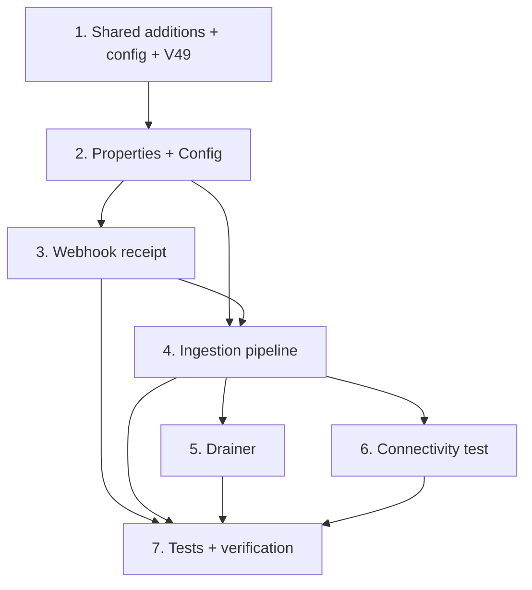

# Implementation Plan

## Overview

Builds the `com.shifa.oms.integration.meta` module that ingests Meta Lead Ads into the `leads` pipeline, mirroring the existing Shopify inbound-webhook feature. Reuses `integration_events` (source `META`) for idempotency/raw-payload/outcome, the transactional outbox for out-of-band processing, and `LeadService.capture` for persistence. Only one new migration (the Meta Leads system user) and no new dependencies.

## Task Dependency Graph

```json
{
  "waves": [
    { "wave": 1, "tasks": ["1.1", "1.2", "1.3"], "dependsOn": [] },
    { "wave": 2, "tasks": ["2.1", "2.2"], "dependsOn": ["1.1", "1.2"] },
    { "wave": 3, "tasks": ["3.1", "3.2", "3.3"], "dependsOn": ["2.1", "2.2"] },
    { "wave": 4, "tasks": ["4.1", "4.2", "4.3", "4.4", "4.5"], "dependsOn": ["3.1", "3.2", "3.3"] },
    { "wave": 5, "tasks": ["5.1"], "dependsOn": ["4.5"] },
    { "wave": 6, "tasks": ["6.1"], "dependsOn": ["4.2"] },
    { "wave": 7, "tasks": ["7.1", "7.2", "7.3"], "dependsOn": ["5.1", "6.1"] }
  ]
}
```



## Tasks

- [ ] 1. Shared-class additions and configuration
- [ ] 1.1 Add `META` to `IntegrationSource`; add `AGGREGATE_META`, `EVENT_META_LEAD_INGEST`, `EVENT_META_LEAD_INGEST_FAILED` constants to `OutboxEvent`; add `publishMetaLeadIngest` + `publishMetaLeadIngestFailed` to `OutboxEventPublisher`.
  - _Requirements: 3.3, 4.1, 8.1, 8.3_
- [ ] 1.2 Add the `app.meta.*` block to `application.yml` and the `META_*` keys to `local-secrets.properties`.
  - _Requirements: 9.1, 9.2, 9.4_
- [ ] 1.3 Create `V52__meta_leads_system_user.sql` (guarded insert, no usable password, VERIFIED; V49–V51 taken by shopify spec).
  - _Requirements: 12.3, 12.4, 12.5_

- [ ] 2. Config and secrets binding
- [ ] 2.1 `MetaProperties` (`@ConfigurationProperties("app.meta")`) with defaults, header constant, and helper methods.
  - _Requirements: 9.1, 9.2_
- [ ] 2.2 `MetaConfig` (`@EnableConfigurationProperties`) + startup warning naming any missing secret key (no values logged).
  - _Requirements: 9.3, 9.4_

- [ ] 3. Webhook receipt
- [ ] 3.1 `MetaWebhookVerifier` — hex HMAC-SHA256 over raw body, `sha256=` prefix strip, fail-closed on blank secret, constant-time compare, static `sign` for tests.
  - _Requirements: 2.1, 2.2, 2.3, 2.4, 2.5_
- [ ] 3.2 `MetaLeadNotificationCodec` (pure) — parse `entry[].changes[]`, keep only `leadgen`, malformed ⇒ `MalformedPayloadException`.
  - _Requirements: 3.1, 3.4_
- [ ] 3.3 `MetaWebhookController` GET verification handshake (echo challenge / 403 / 400) and POST (size → signature → delegate → 200).
  - _Requirements: 1.1, 1.2, 1.3, 1.4, 2.2, 2.3, 3.2, 3.5_

- [ ] 4. Ingestion pipeline
- [ ] 4.1 `MetaLeadIngestService.receive(...)` — record `integration_events` (source META) + enqueue outbox event in one transaction; idempotent on `leadgen_id`.
  - _Requirements: 3.1, 3.3, 4.1, 4.2_
- [ ] 4.2 `MetaGraphClient` + `HttpMetaGraphClient` — `fetchLead(leadgenId)` and `fetchPageName()`, 10s timeout, transient-vs-auth classification, token never logged.
  - _Requirements: 5.1, 5.2, 5.3, 5.4, 5.5_
- [ ] 4.3 `MetaLeadFieldMapper` (pure) — name/placeholder, phone normalize (+ note fallback), email, custom-questions note, source-note clamp.
  - _Requirements: 6.1, 6.2, 6.3, 6.4, 6.5, 6.6, 7.3, 7.4_
- [ ] 4.4 `MetaSystemActorProvider` — resolve `meta-leads` user → cached `AuthPrincipal`.
  - _Requirements: 7.2_
- [ ] 4.5 `MetaLeadIngestService.ingest(...)` — fetch → map → `LeadService.capture` as system actor → record outcome (lead id) / classify failures.
  - _Requirements: 4.3, 4.4, 5.4, 7.1, 7.2, 7.3, 7.5, 11.1, 11.2_

- [ ] 5. Out-of-band drainer
- [ ] 5.1 `MetaLeadIngestDrainer` (`@Scheduled`) mirroring `ShopifyIngestDrainer`: markSent / backoff-retry / fail + ADMIN notification.
  - _Requirements: 8.1, 8.2, 8.3, 8.4_

- [ ] 6. Connectivity test
- [ ] 6.1 `MetaConnectivityController` (`GET /api/admin/integrations/meta/health`, ADMIN) + `MetaConnectivityResponse` (token excluded).
  - _Requirements: 10.1, 10.2, 10.3, 10.4_

- [ ] 7. Tests and verification
- [ ] 7.1 Pure tests: `MetaWebhookVerifier`, `MetaLeadFieldMapper`, `MetaLeadNotificationCodec`.
  - _Requirements: 2.5, 6.2, 6.3, 6.6, 3.4_
- [ ] 7.2 Service tests: `MetaLeadIngestService` idempotency + ingest success/transient/permanent paths (recording graph client, real LeadService).
  - _Requirements: 4.2, 4.4, 5.4, 7.1, 7.5_
- [ ] 7.3 Extend endpoint role-guard test (meta health = ADMIN; webhook = public) and run `mvn clean test`.
  - _Requirements: 10.3, 1.4_

## Notes

- No new Maven dependencies: uses JDK `java.net.http.HttpClient`, `javax.crypto`, and existing Jackson.
- Reuses `integration_events` + `IntegrationSource.META` instead of a new ingest table (see design "Key design decision"); `leadgen_id` is the idempotency key.
- V52 is the only new migration and becomes the highest (V49–V51 are the shopify spec's). Verify with `mvn -f "backend/pom.xml" clean test` (clean build catches enum-switch exhaustiveness gaps).
- Owner reassignment of imported leads (salesperson picking one from the pool) is out of scope; ADMIN sees all Meta leads today. Flagged as a follow-up.
