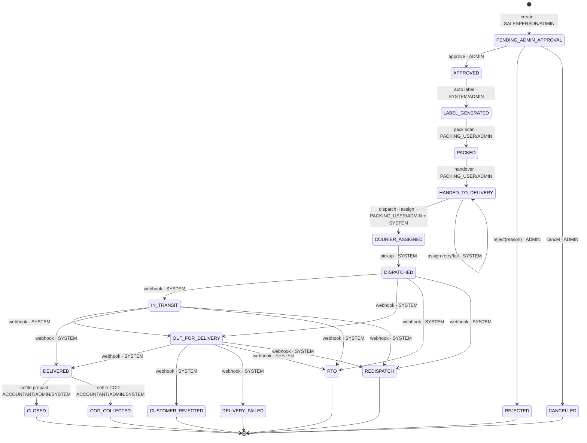
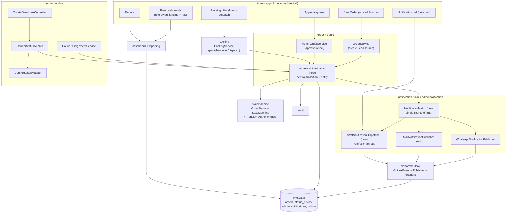

# Design Document

## Overview

This feature turns the existing Shifa OMS admin dashboard into a coherent, role-driven,
mobile-first operational flow that carries an order from lead capture → admin approval →
packing → **handover to the delivery courier** → courier dispatch → a defined set of
downstream delivery outcomes, with the right notifications reaching the right people at each
step.

**This is an enhancement, not a rewrite.** It extends modules that already exist and are wired
together today. The current lifecycle already runs end to end
(`PENDING_ADMIN_APPROVAL → APPROVED → LABEL_GENERATED → PACKED → COURIER_ASSIGNED →
DISPATCHED → … → DELIVERED → COD_COLLECTED/CLOSED`) through
`com.shifa.oms.statemachine.OrderStatus`, `OrderStatusStateMachine`, and the per-module services
(`AdminOrderService`, `PackingService`, `CourierAssignmentService`, `CourierStatusApplier`). The
transactional outbox (`com.shifa.oms.platform.outbox`) already delivers WhatsApp notifications
(`WhatsAppOutboxDrainer`) and durable in-app admin alerts (`AdminNotificationOutboxSink`).

What actually changes:

1. **Three new lifecycle states** on `OrderStatus`: `HANDED_TO_DELIVERY` (between `PACKED` and
   `COURIER_ASSIGNED`), and two distinct downstream outcomes — `CUSTOMER_REJECTED` (customer
   refusal) and `DELIVERY_FAILED` (failed delivery attempt) — reconciled with the existing `RTO`
   and `REDISPATCH` exception states.
2. **Per-transition role authorization** made explicit and enforced by the state machine layer,
   rather than only implied by which controller/service triggers a transition.
3. **A `lead_source` field** (plus an optional free-text note) on the order, distinct from the
   existing `OrderSource` provenance enum.
4. **A single Notification Matrix** (event → channels → recipient roles) as the source of truth
   for all lifecycle notifications, adding a **customer email** channel on key milestones and
   making in-app notifications **addressable per staff role/user** (today they are global-admin only).
5. **Handover and Dispatch actions** exposed as first-class endpoints and packer UI actions; the
   automatic courier assignment moves from "immediately after PACKED" to "on dispatch from
   HANDED_TO_DELIVERY".
6. **Per-role dashboards** and **role-aware navigation**, and a **mobile-first** pass over the
   workflow screens.
7. **New reports**: orders by lead source, by status, by salesperson, and by delivery outcome.

All external integrations (courier, WhatsApp, email) remain mock/sandbox, consistent with the
current project. No new role is added — the design uses the existing four operational roles
(`ADMIN`, `SALESPERSON`, `PACKING_USER`, `ACCOUNTANT`) already defined on `com.shifa.oms.auth.Role`.

### Research notes (grounded in the current codebase)

- **State machine.** `OrderStatus` encodes an explicit, frozen `EnumMap<OrderStatus, Set<OrderStatus>>`
  transition table and exposes `canTransitionTo`, `allowedTargets`, `isTerminal`.
  `OrderStatusStateMachine.transition(...)` validates legality, throws
  `IllegalStatusTransitionException` (HTTP 409) on an illegal move, and appends exactly one
  `StatusHistoryEntry`. It carries **no role authorization today** — that is added by this feature.
- **Persistence of status.** `OrderEntity.orderStatus` and `OrderStatusHistory.{fromStatus,toStatus}`
  are `@Enumerated(EnumType.STRING)` columns of length **30**. All three new names fit
  (`HANDED_TO_DELIVERY`=18, `CUSTOMER_REJECTED`=17, `DELIVERY_FAILED`=15), so **no column widening
  is required** — but new enum values must be persisted correctly and reports must handle them.
- **Order aggregate.** `OrderEntity` has `source` (`OrderSource`), `createdBy` (salesperson id),
  `customerName`, `customerMobile`, address fields — but **no `lead_source` and no customer email**.
- **Approval.** `AdminOrderService.approve` transitions `PENDING_ADMIN_APPROVAL → APPROVED`, then
  immediately runs `LabelService.generateInternalLabelOnApproval` which advances `APPROVED →
  LABEL_GENERATED`. `reject` requires a non-blank reason and stores it (`OrderEntity.rejectionReason`).
- **Packing.** `PackingService.scan` transitions `LABEL_GENERATED → PACKED`, then publishes an
  `ORDER_PACKED` outbox event **and** a `COURIER_ASSIGN` outbox event. Under the new flow the
  `COURIER_ASSIGN` publish moves to the **dispatch** action (see §4).
- **Courier.** `CourierAssignmentService.assignForOrder` (driven by `OutboxCourierDrainer`) currently
  requires the order to be `PACKED` and advances `PACKED → COURIER_ASSIGNED`; this changes to require
  `HANDED_TO_DELIVERY` and advance `HANDED_TO_DELIVERY → COURIER_ASSIGNED`. `CourierWebhookController`
  (HMAC-verified) → `CourierStatusApplier.applyByAwb` maps a raw courier token via
  `CourierStatusMapper` and applies it **only when the transition is legal** (duplicate/out-of-order
  updates are ignored). New tokens map to `CUSTOMER_REJECTED` / `DELIVERY_FAILED`.
- **Notifications.** `WhatsAppNotificationPublisher.enqueue` writes a `WHATSAPP_NOTIFY` outbox row
  with the fully-resolved template; `WhatsAppOutboxDrainer` sends with bounded retries and, on
  exhaustion, raises a `WHATSAPP_FAILED` admin notification. `NotificationEvent.fromOrderStatus`
  currently only covers courier-driven states; it must gain `APPROVED` and `PACKED`. Email
  (`MailService` / `MockMailService`) exists but is **not** wired into the lifecycle yet.
- **In-app notifications.** `AdminNotification` has no recipient addressing; `AdminNotificationOutboxSink`
  writes one global row per admin-facing outbox event and `AdminNotificationController` is
  `@PreAuthorize("hasRole('ADMIN')")`. Per-role/user addressing is added by this feature.
- **Dashboards / reporting.** `DashboardMetricsService` is admin-only and unscoped;
  `ReportService` already applies `SalespersonScopeResolver` so a salesperson sees only their own
  orders. Both consume the pure `ReportAggregator` / `OrderReportRecord` core.

---

## Architecture

### 2.1 Order lifecycle state machine (current + new)

The triggering role is shown on each transition. `SYSTEM` denotes an automatic transition made by
the courier integration (webhook/poller/assignment drainer), recorded in the audit trail as the
System actor (Req 15.5).



### 2.2 Component interaction



The key architectural move is a small **`OrderWorkflowService`** (in the `order` module) that
centralizes "apply a transition": authorize the role, run `OrderStatusStateMachine`, persist the
status + one `status_history` row, write the audit entry, and hand the event to the
**`NotificationMatrix`**. The existing services (`AdminOrderService`, `PackingService`,
`CourierAssignmentService`, `CourierStatusApplier`) already duplicate an `applyTransition(...)`
helper; they are refactored to call the shared workflow service so notifications and role checks
live in exactly one place.

---

## Data Models

All changes are **additive** and delivered as **new Flyway migrations**. The current highest
applied migration is `V22__seed_demo_data.sql`, so the next versions are **V23** and **V24**
(confirmed against `backend/src/main/resources/db/migration`). Per the project rule, no applied
migration is edited.

### 3.1 `orders` — lead source, note, customer email

`OrderEntity` gains three fields (JPA `@Enumerated(EnumType.STRING)` for the enum):

| Column               | Type          | Null | Notes |
|----------------------|---------------|------|-------|
| `lead_source`        | VARCHAR(20)   | YES  | New `LeadSource` enum: `WHATSAPP, INSTAGRAM, FACEBOOK, GOOGLE, OFFLINE, OTHER`. Distinct from `orders.source` (`OrderSource`). Required at the service/DTO layer for new salesperson orders (Req 4.1–4.3); nullable at the column level so pre-existing seeded rows remain valid and are reported as `UNSPECIFIED`. |
| `lead_source_note`   | VARCHAR(200)  | YES  | Optional free-text, only meaningful when `lead_source = OTHER` (Req 4.5); ≤ 200 chars enforced at the DTO. |
| `customer_email`     | VARCHAR(150)  | YES  | Needed for customer emails on key milestones (Req 7.2, 10.7, 11.4). The order aggregate has no email today; when absent, the email channel is skipped and the skip recorded (mirrors the WhatsApp no-mobile skip, Req 7.5). |

New enum `com.shifa.oms.order.LeadSource` sits beside `OrderSource`. `OrderService.createSalespersonOrder`
and `CreateOrderRequest` validate presence + membership and (for `OTHER`) the optional note length.

### 3.2 `status_history` / `orders.order_status` — new enum values

No DDL change: `order_status`, `from_status`, `to_status` are already `VARCHAR(30)` and the three
new names fit. The only requirement is that the enum values are added to `OrderStatus` and every
consumer that pattern-matches on status (dashboard buckets, reporting) handles them (see §6, §7).

### 3.3 `admin_notifications` — recipient-role/user addressing

Today the table (V16) has no recipient targeting and the controller is admin-only. To make in-app
notifications addressable per role/user (Req 13.3, 13.4, and the per-event recipients in Req 7/8/9/10/11):

| Column             | Type        | Null | Notes |
|--------------------|-------------|------|-------|
| `recipient_role`   | VARCHAR(20) | YES  | When set (and `recipient_user_id` NULL) the notification is addressed to **every active user** holding that role (Req 13.4). |
| `recipient_user_id`| BIGINT      | YES  | When set, addressed to that specific user (e.g. the creating salesperson, Req 7.3). |

Back-compatibility: existing rows have both NULL → treated as "legacy admin broadcast" and remain
visible to `ADMIN`. A partial index `ix_admin_notifications_recipient (recipient_role, recipient_user_id, read_flag)`
backs the per-user query. Read/unread state stays per-row; when a role-addressed notification is
read, it is marked read for the whole role (single row shared by the role), which matches the
console's existing "mark read" semantics and keeps the fan-out cheap.

### 3.4 Migration DDL sketch

**`V23__order_lead_source_and_customer_email.sql`**

```sql
-- Lead source capture (Req 4) + customer email for milestone emails (Req 7/10/11).
ALTER TABLE orders ADD COLUMN lead_source      VARCHAR(20)  NULL AFTER source;
ALTER TABLE orders ADD COLUMN lead_source_note VARCHAR(200) NULL AFTER lead_source;
ALTER TABLE orders ADD COLUMN customer_email   VARCHAR(150) NULL AFTER customer_mobile;

-- Report grouping by lead source over date ranges.
CREATE INDEX ix_orders_lead_source ON orders (lead_source);
```

**`V24__admin_notification_recipient_addressing.sql`**

```sql
-- Make in-app notifications addressable per staff role / user (Req 13.3, 13.4).
ALTER TABLE admin_notifications ADD COLUMN recipient_role    VARCHAR(20) NULL AFTER severity;
ALTER TABLE admin_notifications ADD COLUMN recipient_user_id BIGINT      NULL AFTER recipient_role;

CREATE INDEX ix_admin_notifications_recipient
    ON admin_notifications (recipient_role, recipient_user_id, read_flag);
```

> Both migrations run against the existing `shifa_dashboard` schema and are safe on the seeded
> V22 dataset (all new columns are nullable, no backfill required). The existing
> `ux_admin_notifications_source_event` unique index still de-dupes on the originating outbox
> event; because one lifecycle event now fans out to several recipient rows, de-duplication moves
> to a composite key at the write site (see §5).

---

## Components and Interfaces

This section defines the components introduced or changed by this feature and the interfaces
between them. The full state-machine table, notification matrix, API surface, and UX are detailed
in the dedicated subsections that follow.

**New components**

- `com.shifa.oms.order.OrderWorkflowService` — the single entry point for "apply a transition":
  authorize the role (`TransitionAuthority`), validate + apply via `OrderStatusStateMachine`, persist
  the status and one `status_history` row, write the audit entry, and hand the event to the
  `NotificationMatrix`. Interface: `applyTransition(OrderEntity, OrderStatus target, Actor actor)`.
- `com.shifa.oms.statemachine.TransitionAuthority` — pure `(from, to) → Set<Role>` (+ `SYSTEM`)
  lookup. Interface: `assertAuthorized(from, to, role)` / `permits(from, to, role)`.
- `com.shifa.oms.notification.NotificationMatrix` — pure lookup `event → Set<NotificationSpec>`
  where a spec is `(channel, recipient)`. Single source of truth for Req 7/8/10/11.
- `com.shifa.oms.notification.MailNotificationPublisher` — enqueues an `EMAIL_NOTIFY` outbox row for
  a customer milestone email (mirrors `WhatsAppNotificationPublisher`).
- `com.shifa.oms.adminnotification.StaffNotificationDispatcher` — fans a matrix event out to
  role-addressed / user-addressed `AdminNotification` rows (replaces the single-row sink behavior).
- `com.shifa.oms.order.LeadSource` — new enum beside `OrderSource`.

**Changed components**

- `OrderStatus` — three new enum values + extended transition table (§ State Machine Design).
- `PackingService` — adds `handover(id, actor)` and `dispatch(id, actor)`; removes the immediate
  `COURIER_ASSIGN` publish from `scan(...)`.
- `CourierAssignmentService` — gate changes from `PACKED` to `HANDED_TO_DELIVERY`; advances
  `HANDED_TO_DELIVERY → COURIER_ASSIGNED`.
- `CourierStatusMapper` — new tokens for `CUSTOMER_REJECTED` / `DELIVERY_FAILED`.
- `NotificationEvent` — adds `APPROVED`, `PACKED`.
- `AdminNotification` / `AdminNotificationService` / `AdminNotificationController` — recipient
  addressing + per-user query; a staff-facing `GET /api/notifications`.
- `OutboxEventPublisher` — order-scoped payloads carry `salespersonUserId`.
- `ReportService` / `ReportAggregator` — new report types.
- `DashboardMetricsService` (+ new role-summary endpoint) — per-role payloads.

### State Machine Design

### 4.1 Full legal-transition table

`from → to`, the role(s) permitted to trigger it, and notes. This extends the table currently
built in `OrderStatus.buildTransitions()`.

| From | To | Triggering role(s) | Notes |
|------|----|--------------------|-------|
| — (create) | `PENDING_ADMIN_APPROVAL` | SALESPERSON, ADMIN | Initial status; synthetic creation history row with `from = null` (Req 5.1, 5.3, 12.2). |
| `PENDING_ADMIN_APPROVAL` | `APPROVED` | ADMIN | Req 6.2. |
| `PENDING_ADMIN_APPROVAL` | `REJECTED` | ADMIN | Requires non-blank reason (Req 6.3, 6.4). |
| `PENDING_ADMIN_APPROVAL` | `CANCELLED` | ADMIN | Existing. |
| `APPROVED` | `LABEL_GENERATED` | SYSTEM (label service), ADMIN | Auto on approval (existing `LabelService`). |
| `LABEL_GENERATED` | `PACKED` | PACKING_USER, ADMIN | Barcode scan (Req 8.2). |
| `PACKED` | `HANDED_TO_DELIVERY` | PACKING_USER, ADMIN | **New** handover (Req 9.2, 9.3). |
| `HANDED_TO_DELIVERY` | `COURIER_ASSIGNED` | PACKING_USER, ADMIN (dispatch) → SYSTEM (assign) | **New**; dispatch enqueues courier assignment (Req 9.5, 10.1). |
| `HANDED_TO_DELIVERY` | `HANDED_TO_DELIVERY` | SYSTEM | Self-retain when courier assignment fails/retries (replaces old `PACKED→PACKED`, Req 10.4). |
| `COURIER_ASSIGNED` | `DISPATCHED` | SYSTEM | Courier pickup (Req 10.2). |
| `DISPATCHED` | `IN_TRANSIT`, `OUT_FOR_DELIVERY`, `RTO`, `REDISPATCH` | SYSTEM | Courier webhook (Req 10.3). |
| `IN_TRANSIT` | `OUT_FOR_DELIVERY`, `DELIVERED`, `RTO`, `REDISPATCH` | SYSTEM | Courier webhook. |
| `OUT_FOR_DELIVERY` | `DELIVERED`, `CUSTOMER_REJECTED`, `DELIVERY_FAILED`, `RTO`, `REDISPATCH` | SYSTEM | **New** outcomes added (Req 11.1, 11.2). |
| `DELIVERED` | `CLOSED`, `COD_COLLECTED` | ACCOUNTANT, ADMIN, SYSTEM | Settlement (existing). |
| `REJECTED`, `CANCELLED`, `CUSTOMER_REJECTED`, `DELIVERY_FAILED`, `RTO`, `REDISPATCH`, `COD_COLLECTED`, `CLOSED` | — | — | Terminal, no outgoing transitions (Req 12.7). |

**Reconciliation of downstream outcomes (Req 11.1, 11.2).** The four business outcomes map to
states as follows, keeping the two pre-existing exception states distinct and reportable:

| Business outcome | Order status | Existing or new |
|------------------|--------------|-----------------|
| Delivered | `DELIVERED` | existing |
| Customer-Rejected (customer refused at the door) | `CUSTOMER_REJECTED` | **new** |
| Failed-to-Deliver (attempt failed, not reachable) | `DELIVERY_FAILED` | **new** |
| Cancelled | `CANCELLED` | existing |
| Returned to origin (logistics return) | `RTO` | existing, retained distinct |
| Lost/damaged by courier | `REDISPATCH` | existing, retained distinct |

### 4.2 Role authorization

`OrderStatus` stays the authority on **legality**; a new pure component
`com.shifa.oms.statemachine.TransitionAuthority` holds the **(from,to) → Set<Role> (+ SYSTEM)**
map above. `OrderWorkflowService` calls `TransitionAuthority.assertAuthorized(from, to, actorRole)`
**before** `OrderStatusStateMachine.transition(...)`. A role that is not permitted for a legal
transition yields HTTP 403 and leaves the status unchanged (Req 12.5, 1.5, 2.7); an illegal
transition (absent from the table) yields the existing HTTP 409
`IllegalStatusTransitionException` (Req 12.4). This keeps two clean failure modes: *not allowed
for you* vs *not allowed from here*.

### 4.3 Rejection of illegal transitions

Unchanged mechanism, now uniformly routed through `OrderWorkflowService`:
`OrderStatusStateMachine.transition` throws `IllegalStatusTransitionException` when
`!current.canTransitionTo(target)`, the surrounding `@Transactional` rolls back, and neither the
status nor the history is mutated. Courier webhooks are additionally tolerant: `CourierStatusApplier`
checks `current.canTransitionTo(target)` and silently ignores non-legal mapped updates so duplicate
/ out-of-order courier callbacks are harmless (Req 10.5).

---

## Notification Matrix

A single `com.shifa.oms.notification.NotificationMatrix` (a pure, table-driven lookup) is the
source of truth referenced by Req 7, 8, 10, 11 (Req 13.1, 13.7). For a lifecycle event it returns
the exact set of `(channel, recipient)` notifications to enqueue. `OrderWorkflowService` consults it
after every successful transition and enqueues **exactly** that set (Req 13.2).

### 5.1 The matrix

Customer channels address the order's customer (WhatsApp → `customer_mobile`, email →
`customer_email`). Staff channels are in-app, addressed to a role (all active users of that role)
or to the specific creating salesperson.

| Lifecycle event (status entered) | WhatsApp (customer) | Email (customer) | In-app (staff) |
|----------------------------------|:-------------------:|:----------------:|----------------|
| `APPROVED` | ✅ (Req 7.1) | ✅ **milestone** (Req 7.2) | Salesperson-creator (Req 7.3) |
| `REJECTED` | — | — | Salesperson-creator |
| `PACKED` | ✅ (Req 8.4) | — | Salesperson-creator + ADMIN role (Req 8.5) |
| `HANDED_TO_DELIVERY` | — | — | ADMIN role (Req 9.7) |
| `DISPATCHED` | ✅ (Req 10.6) | ✅ **milestone** (Req 10.7) | ADMIN role + Salesperson-creator + PACKING_USER role (Req 10.8) |
| `OUT_FOR_DELIVERY` | ✅ (Req 11.3) | — | — |
| `DELIVERED` | ✅ (Req 11.4) | ✅ **milestone** (Req 11.4) | ADMIN role + Salesperson-creator (Req 11.4) |
| `CUSTOMER_REJECTED` | — | — | ADMIN role + Salesperson-creator + ACCOUNTANT role (Req 11.5) |
| `DELIVERY_FAILED` | — | — | ADMIN role + PACKING_USER role (Req 11.6) |
| `CANCELLED` | — | — | ADMIN role + Salesperson-creator (Req 11.7) |
| `RTO` | ✅ (existing) | — | ADMIN role |
| `REDISPATCH` | ✅ (existing) | — | ADMIN role (existing claim-required alert) |
| Notification delivery permanently failed | — | — | ADMIN role (Req 14.5, existing `WHATSAPP_FAILED`) |

**Email is enqueued iff the transition is a Key_Milestone** — exactly `APPROVED`, `DISPATCHED`,
`DELIVERED` (Req 13.5, 13.6). This is a single rule in the matrix, not scattered per event.

### 5.2 Enqueue, fan-out, and retry

- **Atomic enqueue.** Every notification is written as an `OutboxEvent` in the **same transaction**
  as the status change (Req 14.1), reusing `OutboxEventPublisher`. Channels map to event types:
  `WHATSAPP_NOTIFY` (existing), a new `EMAIL_NOTIFY`, and staff in-app rows.
- **Customer channels.** `WhatsAppNotificationPublisher` (existing) resolves the pre-approved
  template via `WhatsAppMessageFactory`/`WhatsAppTemplateRegistry`; a new `MailNotificationPublisher`
  resolves a plain-text milestone email. `NotificationEvent` gains `APPROVED` and `PACKED` values so
  `fromOrderStatus` covers the new customer-facing states.
- **Role-addressed in-app fan-out.** A new `StaffNotificationDispatcher` replaces the single-row
  `AdminNotificationOutboxSink` behavior: for each matrix recipient it writes one
  `AdminNotification` row with `recipient_role` (role recipients) or `recipient_user_id` (the
  salesperson creator). "Available to every active user of a role" (Req 13.4) is realized by
  addressing the **role** (a single shared row) and letting the per-user query match on role
  membership — cheaper and consistent with mark-read semantics. De-duplication uses a composite of
  `(source_event_id, recipient_role, recipient_user_id)` since one event now yields several rows;
  the V16 unique index on `source_event_id` alone is superseded by this write-site guard.
- **Retry.** The existing drainers (`WhatsAppOutboxDrainer`, and a mirrored `EmailOutboxDrainer`)
  keep a `PENDING` row on failure with incremented `attempts`, recorded `last_error`, and a backoff
  `next_attempt_at` (Req 14.2, 14.3); mark it `SENT` once on success (Req 14.4); and on exhausting
  `maxAttempts` mark it `FAILED` and raise an ADMIN-role in-app notification (Req 14.5).
- **Salesperson id in payloads.** To address the creating salesperson, order-scoped outbox payloads
  now carry `salespersonUserId` (from `OrderEntity.createdBy`); publisher methods in
  `OutboxEventPublisher` are extended to include it.
- **Missing contact info.** No customer mobile → skip WhatsApp, still enqueue the rest, record the
  skip (Req 7.5). No customer email → skip email likewise.

---

## API Design

All endpoints require authentication (JWT via `JwtAuthenticationFilter`); method-level
`@PreAuthorize` enforces the role matrix independently of the Angular route guards (Req 1.6, 2.7).
Salesperson scoping is applied server-side inside the services via `SalespersonScopeResolver`
(Req 2.6, 5.5). Existing endpoints are reused where present.

### 6.1 Order entry (with lead source) — existing, extended

- `GET /api/orders/products?q=` — product picker. `hasAnyRole('SALESPERSON','ADMIN')`. Unchanged.
- `POST /api/orders` — create order. `hasAnyRole('SALESPERSON','ADMIN')`.
  **Extended** `CreateOrderRequest`: add `leadSource` (required, enum) and `leadSourceNote`
  (optional, ≤200 chars, only for `OTHER`) and optional `customerEmail`. Validation rejects a
  missing/invalid lead source with 400 and does not create the order (Req 4.1, 4.2, 5.2). Response
  `OrderResponse` includes the lead source.

### 6.2 Approval queue + approve/reject — existing

- `GET /api/admin/orders/approval-queue` — `hasRole('ADMIN')`. Unchanged (Req 6.1).
- `POST /api/admin/orders/{id}/approve` — `hasRole('ADMIN')` → `APPROVED` (then auto `LABEL_GENERATED`),
  audit `ORDER_APPROVED` (Req 6.2, 6.6). Now also fires the matrix notifications for `APPROVED`.
- `POST /api/admin/orders/{id}/reject` — `hasRole('ADMIN')`, body `{reason}` (non-blank, Req 6.4) →
  `REJECTED`, audit `ORDER_REJECTED` with reason (Req 6.3, 6.6).

### 6.3 Pack — existing

- `POST /api/packing/scan` — `hasAnyRole('PACKING_USER','ADMIN')`, body `{barcode}` →
  `LABEL_GENERATED → PACKED` (Req 8.2), 404 `BARCODE_NOT_RECOGNIZED`, 409 `ORDER_NOT_PACKABLE`.
  **Change:** the immediate `COURIER_ASSIGN` publish is removed; `ORDER_PACKED` matrix notifications
  still fire.

### 6.4 Handover — new

- `POST /api/packing/{id}/handover` — `hasAnyRole('PACKING_USER','ADMIN')`.
  `PACKED → HANDED_TO_DELIVERY` (Req 9.3). Response: updated `OrderResponse`. Audit records actor +
  timestamp (Req 9.6). Enqueues the `HANDED_TO_DELIVERY` matrix notification (ADMIN in-app, Req 9.7).
  Illegal from a non-`PACKED` status → 409.

### 6.5 Dispatch — new

- `POST /api/packing/{id}/dispatch` — `hasAnyRole('PACKING_USER','ADMIN')`.
  Enqueues a `COURIER_ASSIGN` outbox event for the order (Req 10.1). The `OutboxCourierDrainer` →
  `CourierAssignmentService.assignForOrder` (now gated on `HANDED_TO_DELIVERY`) calls the mock
  courier, records the AWB/label, and advances `HANDED_TO_DELIVERY → COURIER_ASSIGNED`. On courier
  error the transaction rolls back and the order retains `HANDED_TO_DELIVERY` (Req 10.4);
  retries/exhaustion raise the existing `COURIER_ASSIGN_FAILED` admin alert. `DISPATCHED` follows on
  courier pickup and fires its matrix notifications (Req 10.6–10.8).

### 6.6 Courier webhook — existing

- `POST /api/webhooks/courier` — unauthenticated but HMAC-verified (`X-Courier-Signature`).
  `CourierStatusMapper` gains tokens: `customer_rejected|refused|rejected → CUSTOMER_REJECTED`;
  `delivery_failed|failed|undelivered|attempt_failed → DELIVERY_FAILED`. `CourierStatusApplier`
  applies only legal mapped transitions (Req 10.3, 10.5) and fires matrix notifications for the
  resulting event.

### 6.7 Per-role dashboard metrics

- `GET /api/admin/metrics` (+ `/live`, `/activity`) — `hasRole('ADMIN')`. Existing admin dashboard.
- `GET /api/dashboard/summary` — **new**, `hasAnyRole('ADMIN','SALESPERSON','PACKING_USER','ACCOUNTANT')`.
  Returns a role-shaped payload built server-side from the caller's `AuthPrincipal` (Req 3.1–3.5):
  - SALESPERSON: own leads/orders grouped by status + count awaiting approval (scoped via
    `SalespersonScopeResolver`, Req 3.2).
  - ADMIN: pending-approval count, counts per active stage, exception-state counts, packed-awaiting-handover
    queue, handed-over-awaiting-dispatch queue (Req 3.3).
  - PACKING_USER: approved-awaiting-packing queue, packed-today count, awaiting-handover queue,
    awaiting-dispatch queue (Req 3.4).
  - ACCOUNTANT: COD pending, settled amounts, outstanding receivables (Req 3.5, from
    `ReceivableRepository`).

### 6.8 Reports

- `GET /api/reports/...` — `hasAnyRole('ADMIN','ACCOUNTANT')` (salesperson reaching a report is
  scoped to own orders, Req 16.5). New `ReportType` values in `com.shifa.oms.reporting`:
  - `ORDERS_BY_LEAD_SOURCE?from=&to=` → counts grouped by `LeadSource` over the range (Req 16.1).
  - `ORDERS_BY_STATUS` → counts grouped by `OrderStatus` (Req 16.2).
  - `ORDERS_BY_SALESPERSON` → counts grouped by `createdBy` (Req 16.3).
  - `DELIVERY_OUTCOME?from=&to=` → counts of `DELIVERED`, `CUSTOMER_REJECTED`, `DELIVERY_FAILED`,
    `CANCELLED` + delivery success rate over the range (Req 16.4).
  Grouping/aggregation is added to the pure `ReportAggregator`/`ReportTableBuilder` so exports match
  the on-screen table.

---

## Frontend / UX Design

The admin app (`frontend/projects/admin`) already uses the Tabler light theme, a signal-driven
`AdminShellComponent`, and role-filtered navigation (`NavLink.roles` / `adminOnly`). This feature
reuses those primitives — no new design system.

### 7.1 Per-role dashboards + role-aware landing

- A single `DashboardComponent` becomes role-aware: it reads `AuthService.session()?.role` and
  renders the role's card set from `GET /api/dashboard/summary`. Each role sees the queues/metrics
  from Req 3.2–3.5. The post-login redirect (`'' → 'dashboard'` in `app.routes.ts`) stays; the
  dashboard itself adapts, so no per-role route tree is needed.
- Navigation already filters by role in `AdminShellComponent.navEntries`. New entries: **Handover**
  and **Dispatch** actions live inside the existing Packing area (roles `PACKING_USER`, `ADMIN`);
  a **New Order** entry already exists for `SALESPERSON`/`ADMIN`. Groups with no visible children are
  dropped (existing behavior), giving each role a naturally trimmed menu (Req 2.7, 3.1).

### 7.2 Mobile-first rules (cross-cutting, Req 17)

- **Single column at 360px**, no horizontal scroll (Req 17.1). Reuse the shell's off-canvas drawer
  and the existing count-cards-3/money-cards-2 density (Req 17.6).
- **≥44×44px touch targets** on all interactive controls (Req 17.2) — apply to the new Handover/
  Dispatch buttons and the Lead Source picker.
- **Cards over tables < 768px** (Req 17.3): order lists and queues render as stacked cards
  prioritizing the role-relevant fields, with secondary fields behind a detail view (Req 17.5).
- **Compact/bottom navigation** reachable without horizontal scroll (Req 17.4) — the existing
  collapsible sidebar/drawer satisfies this; the bottom-nav affordance is applied on narrow
  viewports.

### 7.3 New UI actions

- **New Order** gains a **Lead Source** select (`WHATSAPP/INSTAGRAM/FACEBOOK/GOOGLE/OFFLINE/OTHER`)
  and, when `OTHER` is chosen, a ≤200-char note field (Req 4.1, 4.5).
- **Packing** screen gains **Handover** (for `PACKED` orders) and **Dispatch** (for
  `HANDED_TO_DELIVERY` orders) actions, each calling the new endpoints and reflecting the awaiting-
  handover / awaiting-dispatch queues (Req 9.4, 10.1).
- The existing per-user **notification bell** (`NotificationBellComponent`) now shows notifications
  addressed to the current user's role or user id, not just admin broadcasts.

---

## Correctness Properties

*A property is a characteristic or behavior that should hold true across all valid executions of a
system — essentially, a formal statement about what the system should do. Properties serve as the
bridge between human-readable specifications and machine-verifiable correctness guarantees.*

This feature is highly amenable to property-based testing: the state machine, transition
authority, courier status mapper, notification matrix, salesperson scoping, and report aggregation
are (or become) **pure functions** with large input spaces. The properties below drive the PBT
suite (jqwik). Structural facts (an enum has N values), UI/CSS rules (Req 17), and audit/side-effect
wiring are covered by smoke/example/integration tests instead (see §10), not restated as properties.

### Property 1: An order is always in exactly one status

*For any* sequence of attempted transitions applied to an order, at every point the order has
exactly one `OrderStatus` (never zero, never two), and its status equals the last
successfully-applied target (or the initial status if none applied).

**Validates: Requirements 12.1**

### Property 2: Creation initializes the lifecycle deterministically

*For any* valid create request, the created order has status `PENDING_ADMIN_APPROVAL`, `createdBy`
equal to the creating salesperson, and exactly one creation `status_history` row with
`from = null`, `to = PENDING_ADMIN_APPROVAL`, and the salesperson as actor.

**Validates: Requirements 5.1, 5.3, 5.4, 12.2**

### Property 3: Transition legality matches the specified table

*For any* pair of statuses `(from, to)`, `OrderStatusStateMachine.isLegal(from, to)` is true iff
`(from, to)` is present in the design's legal-transition table (§4.1); and *for any* order and any
illegal target, attempting the transition raises `IllegalStatusTransitionException` (409) and
leaves both the status and the status-history unchanged.

**Validates: Requirements 6.5, 8.3, 10.5, 11.8, 12.3, 12.4**

### Property 4: Every transition is authorized by role

*For any* legal transition `(from, to)` and any actor role, the transition is applied iff the role
is in `TransitionAuthority`'s permitted set for `(from, to)` (with `SYSTEM` permitted for
courier-driven edges); when the role is not permitted the request is rejected (403) and the order
status is left unchanged.

**Validates: Requirements 1.5, 2.1, 2.2, 2.3, 2.4, 2.5, 12.5**

### Property 5: Each successful transition appends exactly one history row

*For any* successfully applied transition, exactly one `status_history` row is appended capturing
`fromStatus`, `toStatus`, the actor, and the source; and when the transition is performed
automatically by the courier integration the recorded source/actor is the System rather than a
human user.

**Validates: Requirements 12.6, 15.1, 15.5**

### Property 6: Terminal states have no outgoing transitions

*For any* status classified terminal (`REJECTED`, `CANCELLED`, `CUSTOMER_REJECTED`,
`DELIVERY_FAILED`, `RTO`, `REDISPATCH`, `COD_COLLECTED`, `CLOSED`), `allowedTargets()` is empty
and every attempted transition out of it is rejected.

**Validates: Requirements 12.7**

### Property 7: Salesperson queries return only that salesperson's orders

*For any* set of orders created by a mix of salespeople, a query executed on behalf of a
salesperson (order list, detail, or report) returns exactly the orders whose `createdBy` equals
that salesperson — no others are returned and none of theirs are omitted — while an admin/accountant
query is unscoped.

**Validates: Requirements 2.6, 5.5, 16.5**

### Property 8: Lead source is validated against the defined set

*For any* order-creation request, the request is accepted only if it carries a `leadSource` in
`{WHATSAPP, INSTAGRAM, FACEBOOK, GOOGLE, OFFLINE, OTHER}`; a missing or out-of-set value is
rejected with a validation error and no order is created. When `leadSource = OTHER`, a note is
accepted iff its length is ≤ 200 characters.

**Validates: Requirements 4.1, 4.2, 4.5**

### Property 9: Lead source persists distinctly and survives round-trip

*For any* created order, reloading it yields the same `leadSource` (and note) that was supplied,
while the existing `OrderSource` provenance field is unchanged — the two fields never alias.

**Validates: Requirements 4.3, 4.4**

### Property 10: Order codes are unique

*For any* set of orders created through the service, all generated order codes are pairwise
distinct.

**Validates: Requirements 5.5**

### Property 11: Orders require at least one line item

*For any* create request whose line-item list is empty, order creation is rejected with a
validation error and no order is persisted.

**Validates: Requirements 5.2**

### Property 12: Rejection requires and stores a non-blank reason

*For any* rejection request, the rejection is accepted iff the reason contains at least one
non-whitespace character; when accepted the persisted order carries that reason, and when rejected
the order status is unchanged.

**Validates: Requirements 6.4**

### Property 13: A queue contains exactly the orders in its status set

*For any* set of orders, the admin approval queue equals the orders in `PENDING_ADMIN_APPROVAL`,
the packing queue equals the orders in `{APPROVED, LABEL_GENERATED}`, the awaiting-handover queue
equals the orders in `PACKED`, and the awaiting-dispatch queue equals the orders in
`HANDED_TO_DELIVERY`.

**Validates: Requirements 6.1, 8.1, 9.4**

### Property 14: Report groupings and the delivery success rate are exact

*For any* set of orders and date range, the orders-by-lead-source, orders-by-status, and
orders-by-salesperson reports return counts equal to the multiset grouping of the in-range orders
by that key, and the sum of all group counts equals the number of in-range orders; and the
delivery-outcome report's success rate equals
`DELIVERED / (DELIVERED + CUSTOMER_REJECTED + DELIVERY_FAILED + CANCELLED)` over the range (0 when
the denominator is 0), with `CUSTOMER_REJECTED` and `DELIVERY_FAILED` counted separately.

**Validates: Requirements 3.6, 16.1, 16.2, 16.3, 16.4**

### Property 15: Courier status mapping is total over its vocabulary

*For any* recognised courier token (case- and separator-insensitive), `CourierStatusMapper.toInternal`
returns the specified `OrderStatus` (including the new `customer_rejected*/refused → CUSTOMER_REJECTED`
and `delivery_failed/failed/undelivered → DELIVERY_FAILED` mappings); *for any* unrecognised or
blank token it returns empty, so the applier ignores it.

**Validates: Requirements 10.3**

### Property 16: The enqueued notification set equals the matrix

*For any* lifecycle event, the set of notifications enqueued by the workflow equals exactly
`NotificationMatrix(event)` — same channels and same recipients — where customer messages are
addressed to the order's customer (WhatsApp/email) and staff messages are addressed to the specified
role (in-app) or the creating salesperson.

**Validates: Requirements 7.1, 7.2, 7.3, 8.4, 8.5, 9.7, 10.6, 10.7, 10.8, 11.3, 11.4, 11.5, 11.6, 11.7, 13.2, 13.3**

### Property 17: Customer email is enqueued iff the event is a key milestone

*For any* lifecycle event, a customer email is in the enqueued set iff the event is one of
`APPROVED`, `DISPATCHED`, `DELIVERED`; no other transition enqueues a customer email.

**Validates: Requirements 13.5, 13.6**

### Property 18: Missing contact info skips only that customer channel

*For any* order lacking a valid customer mobile, the enqueued set for an event excludes the WhatsApp
message but still includes every other notification the matrix specifies (and the skip is recorded);
symmetrically, a missing customer email skips only the email.

**Validates: Requirements 7.5**

### Property 19: Role-addressed in-app notifications reach exactly that role

*For any* set of active and inactive users and a role-addressed in-app notification, the notification
is visible to exactly the active users holding that role — every such user sees it and no user of
another role does.

**Validates: Requirements 13.4**

### Property 20: The outbox delivery lifecycle is safe and retryable

*For any* sequence of send outcomes for an outbox entry: the entry is enqueued in the same
transaction as its triggering status change; a failed attempt keeps it `PENDING` with `attempts`
incremented and `last_error` recorded; a successful attempt marks it `SENT` and it is never sent
again; and once attempts reach the configured maximum it is marked `FAILED` and an ADMIN-role in-app
notification is produced.

**Validates: Requirements 14.1, 14.2, 14.3, 14.4, 14.5**

---

## Error Handling

Errors continue to flow through the existing `com.shifa.oms.common` error envelope
(`ApiException` + `GlobalExceptionHandler`), so the two workflow failure modes are distinct and
stable:

- **Illegal transition** → `IllegalStatusTransitionException` → HTTP **409** `ILLEGAL_STATUS_TRANSITION`;
  status and history unchanged (Req 12.4, 6.5, 8.3, 11.8).
- **Unauthorized transition for role** → HTTP **403** (access denied); status unchanged (Req 1.5, 2.7, 12.5).
- **Validation** (missing/invalid lead source, blank rejection reason, empty line items, note > 200
  chars) → HTTP **400** `ValidationException`; nothing persisted (Req 4.2, 5.2, 6.4, 4.5).
- **Not found / out of scope** (packing barcode, order id a salesperson may not see) → **404**
  (`BARCODE_NOT_RECOGNIZED`, `ResourceNotFoundException`), matching existing behavior.
- **Wrong status for packing** → **409** `ORDER_NOT_PACKABLE` with the current status.

Edge cases:

- **Courier assignment failure/timeout** — the `assignForOrder` transaction rolls back; the order
  **retains `HANDED_TO_DELIVERY`** (not `PACKED`, since assignment now runs from handover), the
  `COURIER_ASSIGN` event stays `PENDING` for retry, and exhaustion raises `COURIER_ASSIGN_FAILED`
  (Req 10.4).
- **Duplicate / out-of-order courier webhooks** — `CourierStatusApplier` applies a mapped status
  only when legal from the current status, so replays and races are harmless (Req 10.5); the raw
  token is still recorded on the courier record for display/idempotency.
- **Unknown courier token** — mapped to empty and ignored (Property 15).
- **Missing customer mobile/email** — the affected customer channel is skipped and recorded; other
  notifications still enqueue (Req 7.5, Property 18).
- **No active user for a recipient role** — the role-addressed row is still written; it simply
  matches no one until a user of that role exists (no error).
- **Pre-existing orders with `lead_source = NULL`** — reports bucket them under `UNSPECIFIED`;
  never a hard failure.
- **New enum values on old rows** — none exist (additive), and every status consumer
  (dashboard buckets, report groupings) handles the new values explicitly.
- **HANDED_TO_DELIVERY self-transition** — used only by the assignment retry path (`SYSTEM`); it
  appends a history row like any transition, so retries are auditable.

---

## Testing Strategy

A dual approach: **property-based tests** for the universal properties in §8, and **unit /
integration / smoke tests** for concrete examples, wiring, and one-time configuration. This mirrors
the existing backend suite (jqwik is already on the classpath — see `backend/.jqwik-database`).

### 10.1 Property-based tests (jqwik)

- Library: **jqwik** (existing). Each property in §8 is implemented by a **single** `@Property`.
- **Minimum 100 iterations** per property (`@Property(tries = 100)` or higher for the state-machine
  properties).
- Each test is tagged with a comment referencing its design property, in the format:
  **`Feature: role-based-order-workflow, Property {number}: {property text}`**.
- Generators (`@Provide`): random `OrderStatus`, random legal/illegal `(from,to)` pairs, random
  `Role`, random transition sequences (a "random walk" over the table for Properties 1/5/6), random
  orders with varied creators/lead sources/contact presence, random courier tokens (recognised +
  garbage) for Property 15, random lifecycle events for Properties 16–18, and random user
  populations for Property 19.
- The state machine, `TransitionAuthority`, `CourierStatusMapper`, `NotificationMatrix`,
  `SalespersonScopeResolver`, and `ReportAggregator` are exercised **in-memory as pure logic**
  (no Spring, no DB), which keeps 100+ iterations fast and follows the existing pure-domain testing
  style. The notification-matrix properties assert against an in-memory enqueue recorder rather than
  the real outbox.
- **Java 25 runtime note (project gotcha):** Mockito cannot mock concrete classes on this JVM — use
  real instances / small recording subclasses (e.g. a recording `OutboxEventPublisher`) as the
  existing tests do.

### 10.2 Unit tests (examples & edge cases)

- The new lifecycle edges as concrete examples: `PACKED → HANDED_TO_DELIVERY`,
  `HANDED_TO_DELIVERY → COURIER_ASSIGNED`, `OUT_FOR_DELIVERY → CUSTOMER_REJECTED`,
  `OUT_FOR_DELIVERY → DELIVERY_FAILED`.
- Per-role dashboard payload shape (Req 3.2–3.5): one example per role asserting the required
  queues/counts are present.
- Reject-with-blank-reason, empty-cart, over-length OTHER note (concrete 400s).
- Audit content for approve/reject and role change (Req 6.6, 15.2, 15.3).

### 10.3 Integration tests

- **Webhook → transition sync** (Req 10.3, 10.5): post signed courier webhooks
  (`POST /api/webhooks/courier`) through `CourierWebhookController` → `CourierStatusApplier` and
  assert the order advances (or is left unchanged for illegal/duplicate updates), including the new
  `CUSTOMER_REJECTED` / `DELIVERY_FAILED` tokens. 1–3 representative payloads (not 100 iterations),
  since this verifies wiring/HMAC, not input-varying logic.
- **Endpoint role guards** (Req 1.6, 2.7): MockMvc calls to approve/reject, pack, handover, dispatch,
  and the reports/dashboard endpoints with each role → 200/403 as the matrix dictates.
- **Outbox drainer end-to-end** for the new `EMAIL_NOTIFY` path (send success, retry, exhaustion →
  admin alert), mirroring the existing WhatsApp drainer test.
- **Flyway migrations V23/V24** apply cleanly on the seeded V22 dataset and Hibernate `validate`
  passes against the new columns.

### 10.4 Smoke / structural tests

- The four operational roles exist on `Role` (Req 1.1).
- `OrderStatus` contains `HANDED_TO_DELIVERY`, `CUSTOMER_REJECTED`, `DELIVERY_FAILED`, positioned per
  §4.1 (Req 9.1, 11.1, 11.2).
- The `NotificationMatrix` is defined and non-empty for every lifecycle event that requires a
  notification (Req 13.1, 13.7).

### 10.5 Mobile-first verification (Req 17)

Not property-testable. Verified via component/snapshot tests and manual checks at a 360px viewport
(single column, ≥44px targets, cards under 768px, reachable compact/bottom nav), consistent with the
existing admin app's density conventions.
