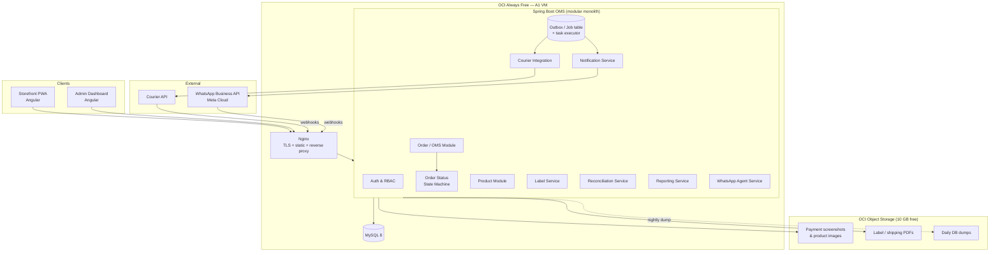
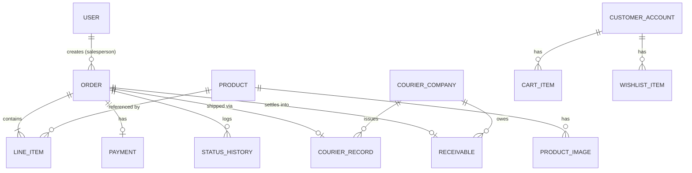
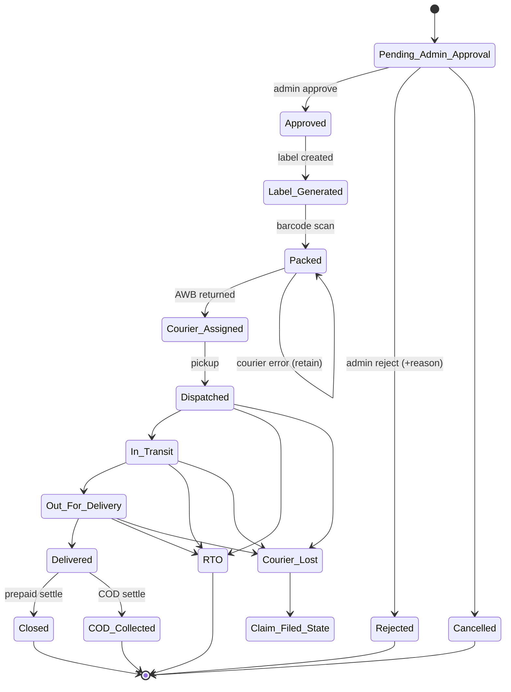

# Design Document

## Overview

Shifa Herbal Remedies is a mobile-responsive, PWA-capable e-commerce and order management platform. It automates the full order lifecycle from WhatsApp/Instagram enquiry and public-store checkout, through salesperson order entry, admin approval, label generation, packing, courier dispatch, live tracking, COD (Cash on Delivery) settlement, loss/claim reconciliation, salesperson-wise reporting, and WhatsApp customer notifications.

The platform is built on the mandated technology stack:

- **Frontend**: A single Angular workspace hosting two apps — the customer **Storefront** (PWA, installable, responsive) and the **Admin Dashboard** (SPA). Both consume the same REST API.
- **Backend**: A **Java 21 / Spring Boot 3.x** monolithic REST API (the OMS). It is organized internally into cohesive modules (order, product, label, reconciliation, reporting, notification, courier, agent) so responsibilities stay separate even though they deploy as one artifact.
- **Database**: **MySQL 8.x** (self-managed on the compute VM, InnoDB engine).
- **Deployment**: **Oracle Cloud Infrastructure (OCI) Always Free tier only.**
- **Integrations**: **WhatsApp Business API (Meta Cloud API)** and an external **Courier API** (AWB generation, shipping labels, tracking webhooks).

### Why a modular monolith rather than microservices

The workflow definition lists many logical services (OMS API, Label Service, Reconciliation Service, Reporting Service, Notification Service, Courier Integration, WhatsApp Agent Service). On the OCI Always Free tier we cannot afford the operational overhead (multiple VMs, service mesh, per-service databases) of true microservices. Instead, each of these is a **module (Spring `@Service` boundary + package)** inside one deployable Spring Boot application. This preserves the separation-of-concerns the requirements imply while fitting the free-tier compute budget. Modules communicate in-process via interfaces; asynchronous work (WhatsApp sends, courier calls, PDF generation, backups) runs on a bounded internal task executor and a lightweight DB-backed job/outbox table rather than a separate message broker.

### Always Free tier budget and how it shapes the design

OCI Always Free resources this design targets (subject to Oracle's current Always Free allowances):

- **Ampere A1 (Arm) compute**: up to 4 OCPU / 24 GB RAM total, split as we choose. Plan: **one A1 VM** (e.g., 2 OCPU / 12 GB) co-hosting the Spring Boot app, MySQL, and Nginx; headroom left for a second small VM if needed later.
- **Block storage**: up to 200 GB total. Plan: boot volume + a data volume for the MySQL data directory.
- **Object Storage**: 10 GB free (standard) + generous request allowance. Plan: store **payment screenshots, generated label/shipping PDFs, and daily DB dump archives** here, not on the block volume, to keep the DB small and the VM disk lean.
- **Autonomous Database**: 2 free ADBs are available, but the mandated DB is **MySQL**. We therefore self-host MySQL on the A1 VM's data volume. (The free ADB option is noted as a fallback for reporting offload but is not used in v1.)
- **Load balancer / networking**: the Always Free flexible load balancer (10 Mbps) is optional; for v1 Nginx on the VM terminates TLS and reverse-proxies, avoiding LB complexity.

Free-tier constraints that directly influence design decisions are called out inline throughout this document with the tag **[Free-tier].**

### Scope

This design covers all 24 requirements of Version 1.0. Items in "Future Considerations" (online payment gateway, SMS, GST invoices, inventory, auto COD remittance, auto claim filing, CRM) are explicitly out of scope and are only accommodated by leaving clean extension points.

## Architecture

### High-level component diagram

### Runtime and deployment topology

- **Single A1 VM** runs: Nginx (443, TLS via Let's Encrypt), Spring Boot app (8080, localhost only), MySQL (3306, localhost only). **[Free-tier]** Co-hosting avoids consuming a second compute allocation and needs no load balancer.
- **Object Storage** is reached via the OCI SDK using an instance principal / resource principal (no long-lived keys on disk where possible), with **pre-authenticated request (PAR) URLs** minted on demand for time-limited client downloads of screenshots and PDFs.
- **Inbound webhooks** (courier tracking updates, WhatsApp delivery/status callbacks) hit Nginx and are routed to dedicated authenticated webhook endpoints.
- **Scheduled jobs** run in-process via Spring `@Scheduled`: nightly `mysqldump` → gzip → upload to Object Storage; outbox drain; courier poll fallback.

### Request/response and async flow

Synchronous user actions (browse, checkout, punch order, approve) are plain REST calls. Side-effecting integrations are decoupled through a **transactional outbox**: the triggering transaction writes both the domain change and an outbox row; a drainer picks up rows and performs the WhatsApp send or courier call, with retries and status tracking. This guarantees that, e.g., an order reaching `Dispatched` reliably produces exactly one WhatsApp notification attempt stream even if the external call is briefly unavailable. **[Free-tier]** A DB-backed outbox replaces a dedicated broker (SQS/RabbitMQ), which the free tier does not include.

### Angular frontend architecture

- **One Nx/Angular workspace, two applications** sharing a `core` library (API client, auth interceptor, models) and a `ui` component library.
- **Storefront app**: routes for catalog, product detail, cart, wishlist, checkout, order tracking, and the live-agent query view. Ships a **web app manifest + service worker** (Angular Service Worker / `@angular/pwa`) for installability and offline shell. Responsive layout via CSS grid/flex breakpoints (mobile / tablet / desktop).
- **Admin Dashboard app**: routes for approval queue, orders, products, packing scan, dashboard metrics, reconciliation, reports, exports. Uses a chart library (e.g., ngx-charts) for the sales graph.
- **Real-time**: the Admin Dashboard opens a **Server-Sent Events (SSE)** stream (`/api/admin/events`) for packed-order notifications, courier status changes, live stats, and claim alerts. SSE is chosen over WebSockets because updates are server→client only, it works cleanly through Nginx, and it is cheap to hold open for a small admin user base. **[Free-tier]** Few concurrent admin connections means SSE fan-out from a single process is sufficient.

## Components and Interfaces

Each subsystem below maps to a package/module in the Spring Boot app.

### Auth & RBAC

- Stateless **JWT** access tokens (short-lived) + refresh tokens. Passwords hashed with BCrypt.
- Roles: `ADMIN`, `ACCOUNTANT`, `SALESPERSON`, `PACKING_USER`, `CUSTOMER` (Req 5.1).
- Method-level authorization via Spring Security `@PreAuthorize`. Route-level guards mirror this in Angular (defense in depth; server is authoritative).
- Unauthenticated access to role-protected endpoints → 401 (Req 5.2). Authenticated-but-forbidden → 403 with an authorization error payload (Req 5.3).
- Salesperson report/query endpoints filter results server-side to `createdBy = currentUser` (Req 5.5). Admin bypasses scoping (Req 5.4).
- **Security note**: all `/api/**` endpoints except the public catalog/product/search and PWA assets require authentication. The courier and WhatsApp webhook endpoints are unauthenticated to the browser but validated by a shared secret/HMAC signature.

### Product Module (Storefront + Admin)

- Admin CRUD for products; SKU uniqueness enforced by a DB unique constraint and checked before insert (Req 6.1, 6.2, 6.3).
- `visibility` flag (`PUBLISHED` / `HIDDEN`) controls Storefront exposure (Req 6.4, 1.1).
- Public catalog endpoints return only published products; case-insensitive substring search on name/SKU (Req 1.3). Placeholder image substitution when no published image (Req 1.4).

Key endpoints:

| Method | Path | Auth | Purpose |
|---|---|---|---|
| GET | `/api/catalog/products` | public | Published catalog (Req 1.1, 1.6) |
| GET | `/api/catalog/products/{id}` | public | Detail; 404/unavailable if not published (Req 1.2, 1.7) |
| GET | `/api/catalog/products?q=` | public | Search (Req 1.3, 1.5) |
| POST | `/api/admin/products` | ADMIN | Create (Req 6.1, 6.2) |
| PUT | `/api/admin/products/{id}` | ADMIN | Update / visibility (Req 6.3, 6.4) |

### Order / OMS Module

Owns Order aggregate: line items, amounts, payment status, lifecycle status, status history, receivables. Hosts the payment math (Req 7.4–7.10) and delegates transitions to the Status State Machine.

Key endpoints:

| Method | Path | Auth | Purpose |
|---|---|---|---|
| POST | `/api/checkout` | CUSTOMER/public | Storefront order (Req 3.6, 3.7) |
| POST | `/api/orders` | SALESPERSON | Punch order (Req 7.*) |
| GET | `/api/orders/{id}` | role-scoped | Order detail (Req 21.1) |
| GET | `/api/orders?search=` | role-scoped | Search by name/mobile/id/AWB (Req 22.1) |
| GET | `/api/orders/duplicate-check?mobile=` | SALESPERSON | Repeat-order flag (Req 22.2) |
| POST | `/api/admin/orders/{id}/approve` | ADMIN | Approve (Req 9.3) |
| POST | `/api/admin/orders/{id}/reject` | ADMIN | Reject + reason (Req 9.4) |
| GET | `/api/admin/orders/approval-queue` | ADMIN | Pending queue (Req 9.1, 9.2) |
| POST | `/api/packing/scan` | PACKING_USER | Barcode scan → Packed (Req 11.*) |
| GET | `/api/orders/{id}/payment-screenshot` | ACCOUNTANT/ADMIN | PAR download (Req 21.2) |
| GET | `/api/track/{orderId}` | CUSTOMER | Status/AWB/tracking link (Req 13.4) |

### Order Status State Machine

A dedicated component validating every transition (Req 8.3). See the state machine section below. Implemented as an explicit transition table; illegal transitions throw `IllegalStatusTransitionException` (mapped to 409) and leave status unchanged.

### Label Service

- Generates the **internal company label** on `Approved` (Order id, barcode encoding the order id, customer details, line items, and COD amount when COD/Partially_Paid) (Req 10.1, 10.2), then sets status `Label_Generated` (Req 10.3).
- Generates **courier shipping label** PDF (AWB + COD amount when applicable) after courier assignment (Req 12.3).
- Single and **bulk** PDF output (Req 10.4, 12.5).
- Barcode: **Code128** encoding the order id via a Java barcode lib (e.g., ZXing/Barbecue); PDF via a Java PDF lib (e.g., OpenPDF/PDFBox). Generated PDFs uploaded to Object Storage; endpoints return PAR URLs. **[Free-tier]** PDFs live in Object Storage, not on the VM disk or in MySQL.

### Courier Integration

- On `Packed`, requests AWB + shipping label with order details and COD amount (Req 12.1); on success stores AWB and sets `Courier_Assigned` (Req 12.2). On error/timeout, keeps `Packed` and notifies Admin (Req 12.4).
- Receives tracking webhooks and maps courier states → internal states: pickup→`Dispatched` (Req 13.1); `In_Transit`/`Out_For_Delivery`/`Delivered`/`RTO`/`Courier_Lost` (Req 13.2, 17.1).
- All outbound courier calls go through the outbox with retry + timeout; a scheduled poll reconciles any missed webhooks. Webhooks validated by HMAC signature.

### Notification Service (WhatsApp)

- Sends templated WhatsApp messages via Meta Cloud API on `Dispatched` (full tracking payload incl. COD when applicable) (Req 14.1) and on `Out_For_Delivery`/`Delivered`/`RTO`/`Courier_Lost` (Req 14.2).
- Only **pre-approved Meta templates** are used; a `whatsapp_template` registry maps event → template name + parameter mapping (Req 14.3).
- Failures recorded and the Order flagged for Admin review (Req 14.4). Sends are outbox-driven with retry.

### Reconciliation Service

- Records `Courier_Company_Receivable` on COD delivery and `Claim_Receivable` on loss (Req 16.2, 17.2).
- Per-courier receivable/claim totals, unsettled lists, prepaid/COD segregation, settlement marking with date, RTO exclusion (Req 18.*).

### Reporting Service

- Daily/monthly/product-wise/state-wise reports; custom date range; salesperson-wise detailed rows; Excel + PDF export; Vyapar CSV/Excel export (Req 20.*, 23.*). Excel via Apache POI, PDF via the same PDF lib, CSV via a CSV writer.

### WhatsApp Agent Service

- Live-agent lookup by order id / mobile / AWB returning current status + tracking details, or a "no matching order" result (Req 15.1, 15.2).

### Admin Dashboard (backend support)

- Metrics aggregation endpoints with time-period filters, sales graph with previous-period comparison and % change, live stats, activity cards, top performers (Req 19.*). Live stats and packed/claim notifications pushed over SSE (Req 11.2, 13.3, 17.4).

### Platform / Backup

- Nightly DB dump to Object Storage; Admin notified on backup failure (Req 24.*).

## Data Models

MySQL 8, InnoDB, UTF8MB4. Monetary values stored as `DECIMAL(12,2)` to avoid floating-point error in payment/COD math. Enumerations stored as `VARCHAR` with app-level enums (portable and human-readable in dumps).

### Entity-relationship diagram

### Tables

**users**
| column | type | notes |
|---|---|---|
| id | BIGINT PK | |
| username | VARCHAR(100) UNIQUE | |
| password_hash | VARCHAR(100) | BCrypt |
| role | VARCHAR(20) | ADMIN/ACCOUNTANT/SALESPERSON/PACKING_USER/CUSTOMER |
| full_name | VARCHAR(150) | |
| active | BOOLEAN | |
| created_at | DATETIME | |

**products**
| column | type | notes |
|---|---|---|
| id | BIGINT PK | |
| sku | VARCHAR(64) UNIQUE | Req 6.2 |
| name | VARCHAR(200) | |
| description | TEXT | |
| mrp | DECIMAL(12,2) | |
| sale_price | DECIMAL(12,2) | default rate (Req 7.2) |
| visibility | VARCHAR(10) | PUBLISHED/HIDDEN (Req 6.4) |
| created_at, updated_at | DATETIME | |

**product_images**
| column | type | notes |
|---|---|---|
| id | BIGINT PK | |
| product_id | BIGINT FK | |
| object_key | VARCHAR(512) | Object Storage key |
| published | BOOLEAN | for placeholder logic (Req 1.4) |
| sort_order | INT | |

**orders**
| column | type | notes |
|---|---|---|
| id | BIGINT PK | |
| order_code | VARCHAR(30) UNIQUE | human/barcode value |
| source | VARCHAR(20) | STOREFRONT / SALESPERSON |
| created_by | BIGINT FK users | salesperson scoping (Req 5.5) |
| customer_name | VARCHAR(100) | |
| customer_mobile | VARCHAR(10) | 10-digit (Req 3.4) |
| address_line | VARCHAR(250) | |
| city | VARCHAR(100) | |
| state | VARCHAR(100) | |
| postal_code | VARCHAR(6) | 6-digit (Req 3.5) |
| total_amount | DECIMAL(12,2) | derived (Req 7.4) |
| amount_received | DECIMAL(12,2) | |
| remaining_amount | DECIMAL(12,2) | total - received (Req 7.5) |
| cod_amount | DECIMAL(12,2) | (Req 7.8, 7.9) |
| payment_status | VARCHAR(20) | FULLY_PAID/PARTIALLY_PAID/COD |
| order_status | VARCHAR(30) | see state machine (Req 8.1) |
| customer_outstanding | DECIMAL(12,2) | settlement (Req 16, 17) |
| rejection_reason | VARCHAR(500) | (Req 9.4) |
| payment_screenshot_key | VARCHAR(512) | Object Storage key (Req 7.11, 21.2) |
| created_at, updated_at | DATETIME | |

Indexes: `customer_mobile`, `order_status`, `created_by`, `created_at`, and `order_code`; AWB indexed on `courier_records` — supporting search (Req 22.1) and duplicate detection (Req 22.2).

**line_items**
| column | type | notes |
|---|---|---|
| id | BIGINT PK | |
| order_id | BIGINT FK | |
| product_id | BIGINT FK | |
| product_name | VARCHAR(200) | snapshot |
| quantity | INT | 1..999 |
| rate | DECIMAL(12,2) | editable applied rate (Req 7.3) |
| line_total | DECIMAL(12,2) | rate*quantity |

**payments** (order-level payment capture; one per order in v1)
| column | type | notes |
|---|---|---|
| id | BIGINT PK | |
| order_id | BIGINT FK | |
| amount_received | DECIMAL(12,2) | |
| screenshot_key | VARCHAR(512) | mandatory when amount_received>0 (Req 7.6) |
| captured_at | DATETIME | |

**status_history** (Req 8.4)
| column | type | notes |
|---|---|---|
| id | BIGINT PK | |
| order_id | BIGINT FK | |
| from_status | VARCHAR(30) | nullable for creation |
| to_status | VARCHAR(30) | |
| actor | VARCHAR(150) | user or "COURIER_API"/"SYSTEM" |
| source | VARCHAR(20) | ADMIN/PACKING/COURIER/SYSTEM |
| changed_at | DATETIME | |

**courier_companies**
| column | type | notes |
|---|---|---|
| id | BIGINT PK | |
| name | VARCHAR(150) | |
| tracking_url_template | VARCHAR(300) | build link from AWB (Req 13.4) |

**courier_records**
| column | type | notes |
|---|---|---|
| id | BIGINT PK | |
| order_id | BIGINT FK UNIQUE | |
| courier_company_id | BIGINT FK | |
| awb | VARCHAR(64) INDEX | (Req 12.2, 22.1) |
| shipping_label_key | VARCHAR(512) | PDF in Object Storage |
| estimated_delivery | DATE | (Req 14.1) |
| last_courier_status | VARCHAR(40) | raw courier state |

**receivables** (COD + claim ledger, Req 16.2, 17.2, 18.*)
| column | type | notes |
|---|---|---|
| id | BIGINT PK | |
| order_id | BIGINT FK | |
| courier_company_id | BIGINT FK | |
| type | VARCHAR(20) | COD_RECEIVABLE / CLAIM_RECEIVABLE |
| amount | DECIMAL(12,2) | |
| settled | BOOLEAN | |
| settled_date | DATE | (Req 18.5) |
| created_at | DATETIME | |

**cart_items / wishlist_items** (per customer account or session)
| column | type | notes |
|---|---|---|
| id | BIGINT PK | |
| customer_id | BIGINT FK (or session key) | |
| product_id | BIGINT FK | |
| quantity | INT | cart only, 1..999 (Req 2) |
| unique (customer_id, product_id) | | prevents duplicate wishlist/cart lines (Req 2.7, 2.8) |

**outbox** (integration reliability)
| column | type | notes |
|---|---|---|
| id | BIGINT PK | |
| aggregate_type | VARCHAR(40) | ORDER |
| aggregate_id | BIGINT | |
| event_type | VARCHAR(40) | WHATSAPP_DISPATCH, COURIER_ASSIGN, ... |
| payload | JSON | |
| status | VARCHAR(20) | PENDING/SENT/FAILED |
| attempts | INT | |
| next_attempt_at | DATETIME | |
| last_error | VARCHAR(1000) | (Req 14.4, 12.4) |

**backup_runs** (Req 24)
| column | type | notes |
|---|---|---|
| id | BIGINT PK | |
| started_at, finished_at | DATETIME | |
| status | VARCHAR(20) | SUCCESS/FAILED |
| object_key | VARCHAR(512) | dump location |
| error | VARCHAR(1000) | |

### Derived-value invariants (enforced in the domain layer)

- `line_total = rate * quantity` for every line item.
- `total_amount = Σ line_total`.
- `remaining_amount = total_amount - amount_received`.
- `cod_amount` and `payment_status` derived per Req 7.7–7.10 (see state machine + payment rules below).
- `amount_received ≤ total_amount` (Req 7.10 rejects otherwise).

## Order Status State Machine

`Order_Status` is exactly one of the 15 states in Req 8.1. Initial state on creation is `Pending_Admin_Approval` (Req 8.2, 3.6, 7.11). Every transition is validated against the table below; a requested transition not present is rejected and the current status is retained (Req 8.3). Each accepted transition writes a `status_history` row (Req 8.4).

Transition table (allowed source → targets):

| From | Allowed targets | Trigger |
|---|---|---|
| Pending_Admin_Approval | Approved, Rejected, Cancelled | Admin (Req 9.3, 9.4) |
| Approved | Label_Generated | Label_Service (Req 10.3) |
| Label_Generated | Packed | Packing scan (Req 11.1) |
| Packed | Courier_Assigned, Packed | Courier ok / error-retain (Req 12.2, 12.4) |
| Courier_Assigned | Dispatched | Pickup (Req 13.1) |
| Dispatched | In_Transit, Out_For_Delivery, RTO, Courier_Lost | Courier webhook (Req 13.2, 17.1) |
| In_Transit | Out_For_Delivery, Delivered, RTO, Courier_Lost | Courier webhook |
| Out_For_Delivery | Delivered, RTO, Courier_Lost | Courier webhook |
| Delivered | Closed (prepaid), COD_Collected (COD) | Settlement (Req 16.1, 16.2) |
| COD_Collected, Closed, Rejected, Cancelled, RTO | (terminal) | — |
| Courier_Lost | (terminal; triggers Claim_Receivable) | Req 17.2 |

Settlement side effects on entering a state:
- `Delivered` + `payment_status=FULLY_PAID` → auto `Closed`, `customer_outstanding=0` (Req 16.1).
- `Delivered` + `cod_amount>0` → auto `COD_Collected`, `customer_outstanding=0`, create `COD_RECEIVABLE = cod_amount` (Req 16.2).
- `RTO` → cancel `cod_amount` (set 0), `customer_outstanding=0`, excluded from COD totals (Req 16.3, 18.6).
- `Courier_Lost` → create `CLAIM_RECEIVABLE = net order amount` (prepaid or COD), `customer_outstanding=0`, Admin claim notification (Req 17.2, 17.3, 17.4).

## API Surface (summary)

Beyond the endpoints listed per module, the platform exposes:

- **Reconciliation**: `GET /api/recon/receivables?courier=&type=`, `GET /api/recon/cod/unsettled`, `POST /api/recon/receivables/{id}/settle` (ACCOUNTANT/ADMIN) (Req 18).
- **Reporting/Export**: `GET /api/reports/{daily|monthly|product|state|salesperson}?from=&to=`, `GET /api/reports/export?type=&format={xlsx|pdf}`, `GET /api/reports/vyapar?from=&to=&format={csv|xlsx}` (Req 20, 23).
- **Dashboard**: `GET /api/admin/metrics?period=`, `GET /api/admin/events` (SSE stream) (Req 19, 11.2, 13.3, 17.4).
- **Agent**: `GET /api/agent/lookup?key=&value=` (Req 15).
- **Webhooks**: `POST /api/webhooks/courier`, `POST /api/webhooks/whatsapp` (HMAC-validated).

### Authentication and Authorization

- **AuthN**: JWT bearer tokens issued at `/api/auth/login`; refresh at `/api/auth/refresh`. Storefront customers may browse anonymously; checkout and tracking associate to a lightweight customer identity or order-access token.
- **AuthZ**: Spring Security filter chain + `@PreAuthorize` per endpoint. A single authority matrix maps each endpoint to allowed roles. Salesperson-scoped queries inject a `createdBy` predicate at the repository layer so scoping cannot be bypassed by client manipulation (Req 5.5).
- **Webhook auth**: shared-secret HMAC signature header verified before processing; replay protection via timestamp + nonce window.

### Real-time notifications (Admin Dashboard)

SSE stream `/api/admin/events` pushes typed events: `ORDER_PACKED` (Req 11.2), `ORDER_STATUS_CHANGED` (Req 13.3), `CLAIM_FILED_REQUIRED` (Req 17.4), `COURIER_ASSIGN_FAILED` (Req 12.4), `WHATSAPP_FAILED` (Req 14.4), and periodic `LIVE_STATS`. Events are published in-process to an SSE broker after the committing transaction succeeds (post-commit hook), so the dashboard never shows a change that was rolled back. If no admin is connected, events are still persisted (notifications/flags), so nothing is lost.

### PDF / label / barcode generation

- **Barcode**: Code128 encoding `order_code`, rendered to PNG (ZXing) and embedded in the PDF.
- **PDF**: OpenPDF/PDFBox templates for internal label and courier shipping label; bulk generation concatenates one label block per requested order (Req 10.4, 12.5).
- Generated PDFs are streamed to Object Storage; clients receive time-limited PAR URLs. **[Free-tier]** avoids storing binary blobs in MySQL and keeps VM disk usage low.

### Image / screenshot storage

- Payment screenshots and product images upload directly to **OCI Object Storage** (10 GB free) under keyed prefixes (`payments/{orderId}/...`, `products/{productId}/...`). The DB stores only object keys. Downloads use PAR URLs with short expiry, gated by role checks (Req 21.2). **[Free-tier]** 10 GB comfortably holds screenshots (JPEGs) and PDFs for v1 volume; lifecycle rules can archive old objects if needed.

### Daily backup strategy (Req 24)

- A Spring `@Scheduled` job (default 02:00 local, interval ≤ 24h) runs `mysqldump --single-transaction`, gzips the output, and uploads it to Object Storage under `backups/{yyyy-MM-dd}.sql.gz`, recording a `backup_runs` row. Retention: keep last N daily dumps via an Object Storage lifecycle policy. On any failure (dump error or upload error), the job records `FAILED` and emits an Admin notification (SSE + persisted flag) (Req 24.2). **[Free-tier]** Object Storage is the durable, off-VM location for backups; no separate backup service is required.

## Correctness Properties

*A property is a characteristic or behavior that should hold true across all valid executions of a system — essentially, a formal statement about what the system should do. Properties serve as the bridge between human-readable specifications and machine-verifiable correctness guarantees.*

The following properties target the parts of the system that are pure logic and benefit most from property-based testing: the payment/COD money math, the order status state machine, settlement and the receivables ledger, cart/wishlist semantics, filtering/aggregation, validation, and content/round-trip guarantees. Infrastructure, UI rendering, and external-service side effects are covered by unit, integration, and smoke tests instead (see Testing Strategy).

### Property 1: Total amount equals sum of line totals

*For any* Order with any list of line items (each with a rate ≥ 0 and an integer quantity in 1..999), the computed `Total_Amount` equals the sum over all line items of `rate × quantity`, computed with exact decimal arithmetic (no floating-point drift).

**Validates: Requirements 7.3, 7.4**

### Property 2: Payment classification and COD math

*For any* Order with a `Total_Amount` and an `Amount_Received`, the payment computation satisfies: `Remaining_Amount = Total_Amount − Amount_Received`; if `Amount_Received = 0` then `Payment_Status = COD` and `COD_Amount = Total_Amount`; if `0 < Amount_Received < Total_Amount` then `Payment_Status = Partially_Paid` and `COD_Amount = Remaining_Amount`; if `Amount_Received = Total_Amount` then `Payment_Status = Fully_Paid` and `COD_Amount = 0`; and if `Amount_Received > Total_Amount` the entry is rejected.

**Validates: Requirements 7.5, 7.7, 7.8, 7.9, 7.10**

### Property 3: Payment screenshot mandatory when money received

*For any* Order-entry submission, submission is permitted only if `Amount_Received = 0` or a Payment_Screenshot is attached; whenever `Amount_Received > 0` and no screenshot is attached, the submission is rejected and no Order is created.

**Validates: Requirements 7.6**

### Property 4: New orders start in Pending_Admin_Approval

*For any* validly created Order — whether from Storefront checkout or Salesperson entry — its initial `Order_Status` is `Pending_Admin_Approval`.

**Validates: Requirements 3.6, 7.11, 8.2**

### Property 5: Illegal status transitions are rejected and state is retained

*For any* Order in any `Order_Status` and *for any* requested target status, if the target is not an allowed transition from the current status, the transition is rejected and the Order's `Order_Status` is unchanged; the resulting status is always one of the 15 defined states.

**Validates: Requirements 8.1, 8.3, 11.4**

### Property 6: Every accepted transition is recorded in status history

*For any* Order and *for any* accepted status transition, the status-history log grows by exactly one entry recording the new status, a timestamp, and the actor or source that caused the change.

**Validates: Requirements 8.4**

### Property 7: Courier status mapping

*For any* courier status update, the update maps to the correct internal `Order_Status` (pickup → `Dispatched`; in-transit → `In_Transit`; out-for-delivery → `Out_For_Delivery`; delivered → `Delivered`; return → `RTO`; lost/damaged/missing → `Courier_Lost`), and is applied only when that transition is legal from the current status.

**Validates: Requirements 13.1, 13.2, 17.1**

### Property 8: Settlement on delivery and RTO

*For any* Order reaching `Delivered`: if `Payment_Status = Fully_Paid` the Order becomes `Closed` with customer outstanding 0; if `COD_Amount > 0` the Order becomes `COD_Collected` with customer outstanding 0 and a `Courier_Company_Receivable` equal to the `COD_Amount` is recorded. *For any* Order reaching `RTO`, its `COD_Amount` is cancelled (set to 0) and customer outstanding is 0.

**Validates: Requirements 16.1, 16.2, 16.3**

### Property 9: Loss produces a claim for the full net amount

*For any* Order that becomes `Courier_Lost`, regardless of whether it is prepaid or COD, a `Claim_Receivable` equal to the net Order amount is recorded and the customer outstanding for that Order is set to 0.

**Validates: Requirements 17.2, 17.3**

### Property 10: Reconciliation totals, segregation, and RTO exclusion

*For any* set of Orders and courier companies, per-courier `Courier_Company_Receivable` total equals the sum of unsettled COD receivables for delivered COD Orders of that courier (RTO Orders excluded), per-courier `Claim_Receivable` total equals the sum of unsettled claim receivables, and every Order appears in exactly one of the prepaid or COD segregation groups.

**Validates: Requirements 18.1, 18.2, 18.3, 18.4, 18.6**

### Property 11: Settling a receivable reduces outstanding and is idempotent

*For any* receivable, marking it settled records the settlement date and reduces the courier's outstanding receivable by exactly the settled amount; marking an already-settled receivable settled again does not further reduce the outstanding total.

**Validates: Requirements 18.5**

### Property 12: Cart consistency

*For any* sequence of cart operations (add, change quantity, remove) using quantities in 1..999, the cart contains at most one line item per product, each line quantity is capped at 999 when merging, the displayed cart subtotal always equals the sum over line items of `sale_price × quantity`, and the displayed line item count always equals the number of line items.

**Validates: Requirements 2.1, 2.2, 2.3, 2.7**

### Property 13: Wishlist set semantics and move-to-cart

*For any* sequence of wishlist operations, the wishlist holds at most one entry per product (adding a duplicate is a no-op), and moving a wishlist product to the cart adds it to the cart with quantity ≥ 1 and removes it from the wishlist.

**Validates: Requirements 2.4, 2.5, 2.8**

### Property 14: Invalid cart quantities are rejected without side effects

*For any* quantity that is less than 1, greater than 999, or not a whole number, attempting to add a product or set a line item to that quantity is rejected and leaves the existing cart contents unchanged.

**Validates: Requirements 2.6**

### Property 15: Checkout validation

*For any* checkout submission, the submission is accepted only if all required fields (customer name, mobile, address line, city, state, postal code) are present, the mobile is exactly 10 numeric digits, and the postal code is exactly 6 numeric digits; otherwise it is rejected, previously entered values are retained, and each invalid or missing field is flagged.

**Validates: Requirements 3.3, 3.4, 3.5**

### Property 16: Catalog and search show only matching published products

*For any* set of products with mixed visibility and *for any* search term, the catalog contains exactly the published products, and search results contain exactly the published products whose name or SKU contains the term as a case-insensitive substring.

**Validates: Requirements 1.1, 1.3, 6.4**

### Property 17: Placeholder image when no published image

*For any* product, the displayed catalog/detail image is a real published image if one exists, and the placeholder image if and only if the product has no available published image.

**Validates: Requirements 1.4**

### Property 18: Label content completeness

*For any* Order, the generated internal company label contains the Order identifier, a barcode encoding that identifier, the customer details, and every line item; and both the internal label and the courier shipping label include the `COD_Amount` if and only if the Order is COD or Partially_Paid (the shipping label additionally includes the AWB).

**Validates: Requirements 10.1, 10.2, 12.3**

### Property 19: Bulk label output has one label per requested order

*For any* non-empty set of eligible Orders, the produced PDF contains exactly one label block per requested Order.

**Validates: Requirements 10.4, 12.5**

### Property 20: WhatsApp notification content and template use

*For any* Order reaching `Dispatched`, the outgoing WhatsApp message parameters include the Order identifier, courier company name, AWB, courier tracking link, estimated delivery date, and the `COD_Amount` if and only if the Order is COD or Partially_Paid; *for any* Order reaching `Out_For_Delivery`, `Delivered`, `RTO`, or `Courier_Lost`, the message reflects that status; and every message sent references a registered, pre-approved Meta template.

**Validates: Requirements 14.1, 14.2, 14.3**

### Property 21: Integration failures are recorded without losing state

*For any* courier assignment failure or timeout, the Order retains `Order_Status = Packed` and an Admin failure notification is produced; and *for any* WhatsApp send failure, the failure is recorded and the Order is flagged for Admin review.

**Validates: Requirements 12.4, 14.4**

### Property 22: Search and duplicate detection

*For any* set of Orders and *for any* query by customer name, mobile number, Order identifier, or AWB, the search returns exactly the Orders matching that key; and *for any* mobile number, the duplicate-order flag is true if and only if at least one prior Order exists for that mobile number.

**Validates: Requirements 22.1, 22.2**

### Property 23: Reports and metrics aggregate exactly the orders within the selected window

*For any* set of Orders and *for any* time period or custom date range, each metric count/sum and each report's rows are computed over exactly the Orders whose order date falls within the window, the previous-period percentage change equals `(current − previous) / previous × 100` (defined as 0 change when previous is 0 and current is 0, and reported as not-applicable when previous is 0 and current is non-zero), and top performers are the argmax of their respective aggregations within the window.

**Validates: Requirements 19.3, 19.4, 19.7, 20.2**

### Property 24: Report and export content fidelity

*For any* generated report, the salesperson-wise rows contain all required columns (customer name, mobile, product name and quantity, Total_Amount, Amount_Received, COD_Amount, Payment_Status, Order_Status, COD settlement status, loss claim status, AWB, order date), and each exported file (Excel, PDF, and Vyapar CSV/Excel) contains the same set of rows and columns as the displayed report.

**Validates: Requirements 20.3, 20.4, 23.1**

### Property 25: Role scoping and authentication enforcement

*For any* role-protected endpoint, an unauthenticated request is denied; *for any* authenticated user whose role is not permitted for an endpoint, the request is denied; and *for any* Salesperson report or order query, only Orders created by that Salesperson are returned.

**Validates: Requirements 5.2, 5.3, 5.5**

## Error Handling

### API error model

A consistent JSON error envelope: `{ "timestamp", "status", "error", "code", "message", "fieldErrors": [...] }`. HTTP mapping:

- **400** — validation failures (checkout fields, mobile/postal format, invalid quantity, `Amount_Received > Total_Amount`, missing rejection reason, screenshot required).
- **401 / 403** — unauthenticated / forbidden (Req 5.2, 5.3).
- **404** — unavailable product (Req 1.7), unknown order.
- **409** — illegal status transition (Req 8.3, 11.4), duplicate SKU (Req 6.2), unrecognized barcode context.
- **422** — semantically invalid domain operations.
- **502 / 504** — upstream courier/WhatsApp errors surfaced where relevant (handled asynchronously via outbox in most flows).

### Domain-specific handling

- **Illegal transitions**: the state machine throws `IllegalStatusTransitionException`; the current status is retained and returned in the response (Req 8.3, 11.4).
- **Courier failures** (Req 12.4): outbound assignment runs via the outbox with a configured timeout and bounded retries; on exhaustion the Order stays `Packed`, an `COURIER_ASSIGN_FAILED` event notifies the Admin, and `outbox.last_error` records the cause.
- **WhatsApp failures** (Req 14.4): send attempts run via the outbox; on rejection/failure the failure is recorded, the Order is flagged, and a `WHATSAPP_FAILED` event is emitted for Admin review.
- **Webhook robustness**: courier/WhatsApp webhooks are validated (HMAC), idempotent (dedupe by event id / AWB+status), and tolerant of out-of-order and duplicate deliveries; a scheduled poll reconciles missed courier updates.
- **Backup failures** (Req 24.2): recorded as `backup_runs.status = FAILED` with error text and an Admin notification.
- **Object Storage failures**: screenshot/label upload failures surface as 502 to the user action with a retriable message; PDFs can be regenerated on demand.
- **Concurrency**: Order updates use optimistic locking (`@Version`) so concurrent transitions (e.g., simultaneous courier webhook + admin action) cannot corrupt state; the loser retries against the current status.

## Testing Strategy

### Dual approach

- **Property-based tests** verify the 25 universal properties above across many generated inputs. They target pure/near-pure logic: payment and COD math, the state-machine transition table, settlement and receivables ledger, cart/wishlist semantics, filtering/aggregation, validation predicates, and content/round-trip guarantees.
- **Unit tests** cover specific examples, edge cases, and error conditions: duplicate SKU (6.2), reject-without-reason (9.4), empty-cart checkout (3.2), unknown barcode (11.3), no-match search (1.5), empty catalog (1.6), unavailable product detail (1.7), agent no-match (15.2), Vyapar empty-range header-only export (23.2).
- **Integration tests (1–3 examples each)** cover external-service wiring with mocks/stubs: courier AWB request/response and label retrieval (12.1, 12.2), courier webhook → status → SSE (13.3), WhatsApp send via Meta Cloud template (11.2, 17.4 notifications), payment screenshot upload/download via Object Storage (21.2), backup dump upload (24.1).
- **Smoke/config tests** cover setup: role enum presence (5.1), PWA manifest + service worker registration (4.2), responsive layout checks at breakpoints (4.1, 4.3), backup scheduler interval ≤ 24h (24.1).

### Why some requirements are not property-based

PWA/responsiveness (Req 4) and dashboard rendering presence (Req 19.1, 19.2, 19.6) are UI/visual and use snapshot/e2e checks. External-service behaviors (courier API, WhatsApp delivery, Object Storage, SSE push, backup upload) are integration/smoke concerns where input variation does not meaningfully expand coverage — 1–3 representative examples with mocks are appropriate rather than 100+ iterations against external systems.

### Property-based testing tooling and conventions

- **Backend (Java)**: use **jqwik** (property-based testing for JUnit 5). Do not hand-roll generators frameworks. Money math uses `BigDecimal` with fixed scale.
- **Frontend (Angular/TypeScript)**: use **fast-check** with Jest/Karma for cart, wishlist, validation, and search/filter properties in the client logic layer.
- Each property test runs a **minimum of 100 iterations**.
- Each property test is tagged with a comment referencing its design property in the format:
  `Feature: shifa-herbal-remedies, Property {number}: {property_text}`
- Each correctness property is implemented by a **single** property-based test; supporting examples/edge cases live in separate unit tests.
- Custom generators: valid/invalid mobiles and postal codes, product sets with mixed visibility, line-item lists (rate ≥ 0, qty 1..999), order-status values, courier status updates, and receivable ledgers.

### Coverage targets

- Every acceptance criterion maps to at least one property, unit, integration, or smoke test.
- The 25 properties collectively validate the financially and behaviorally critical requirements (payment/COD math, state machine, settlement, reconciliation), which are the highest-risk areas for the business.
