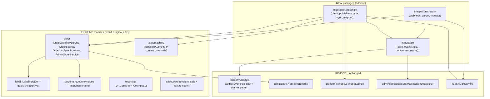
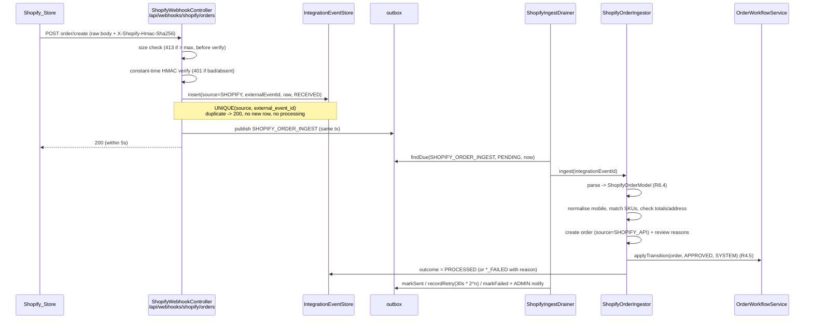
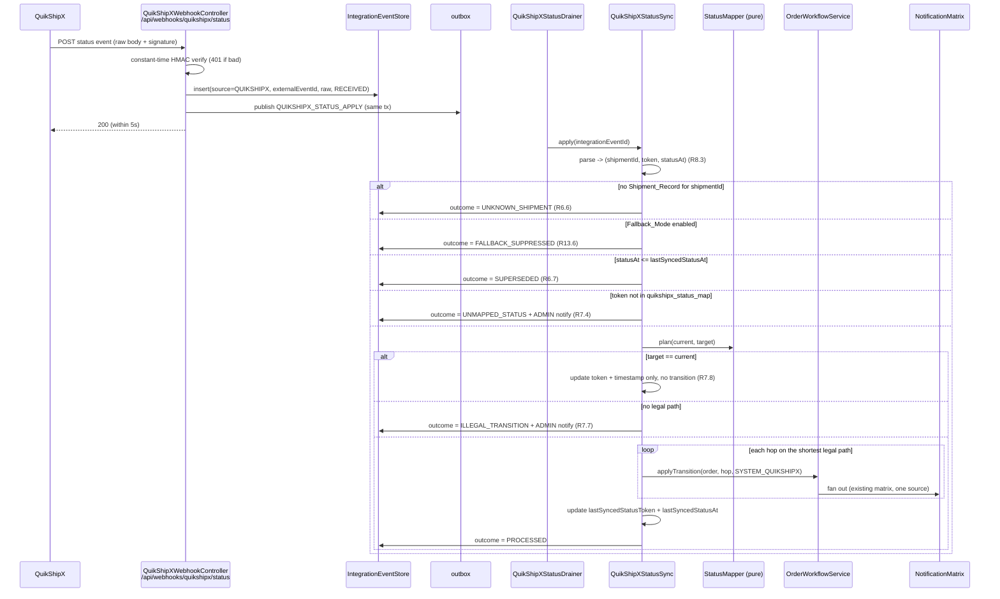
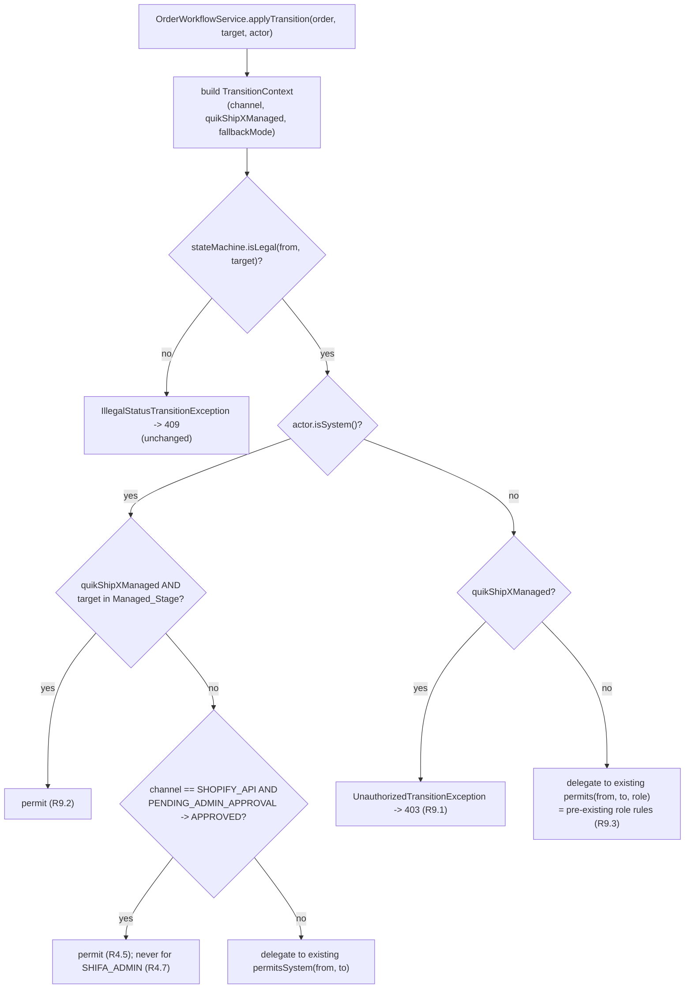

# Design Document

## Overview

This feature makes Shifa OMS the single **tracking** surface across two order channels while handing
**fulfilment authority** (label + post-handoff status) to QuikShipX.

Two inbound flows and one outbound flow are added, all of them additive to the existing modular
monolith:

| Flow | Direction | Trigger | Result |
| --- | --- | --- | --- |
| Shopify order ingestion | Shopify → Shifa | Shopify order webhook | a Shifa order tagged `SHOPIFY_API`, auto-approved (R2, R3, R4) |
| QuikShipX publication | Shifa → QuikShipX | `SHIFA_ADMIN` order reaches `APPROVED` | a `Shipment_Record` on the order, tagged `SHIFA_ADMIN` in QuikShipX (R5) |
| QuikShipX status mirroring | QuikShipX → Shifa | QuikShipX status webhook (or optional poll) | `SYSTEM`-actor transitions applied through `OrderWorkflowService` (R6, R7, R9) — **config-gated and OFF by default**, see below |

### The confirmed QuikShipX contract, and what it forecloses

`docs/QUIKSHIPX-API-V1.md` holds the full extracted contract. It documents **exactly one operation**:

```
POST https://head.quikshipx.com/api/create-order-v1
Content-Type: application/json
```

Three properties of it drive this design:

- **Authentication is in the body**, not a header: `shipper_details { client_code, user_id, user_secret }`.
  A TEST secret files the order under QuikShipX's *Test* section, a LIVE secret under *Pending*. There is
  no bearer token and no request signing, so there is nothing to rotate in a header and no HMAC to compute
  on the outbound side.
- **Every value is a JSON string**, amounts and dimensions included, and `customer_order_date` is
  `"14 March 2026"`. This is a real serialization concern, not a formatting detail — it gets its own codec.
- **`customer_order_id`** is "Unique ID for the order from your system".

And what it does **not** define:

| Absent | Design consequence |
| --- | --- |
| Any channel / source / tag field | The Order_Channel **cannot** be sent as a field. It is encoded in `customer_order_id` as the **QuikShipX_Order_Reference** (`SHIFA-` + order code), which doubles as the correlation key. |
| Response body | `ShipmentAcceptance` treats shipment id, AWB, courier, tracking URL and label URL as **all optional**; a 2xx counts as accepted with none of them. `order_reference` therefore becomes the reliable unique key on `order_shipments`, and `quikshipx_shipment_id` becomes nullable. |
| Status webhook **and** status query | Status mirroring cannot run. The webhook controller and the poller are both `@ConditionalOnProperty` on `app.quikshipx.status-feed-available` (default `false`), so **neither bean exists** by default. The full sync design is retained so enabling it later is configuration, not redesign. |
| Label endpoint | No `QuikShipXLabelService`, no label-download endpoint, no label caching, no 502 path. The packer downloads the label from the QuikShipX portal; Shifa shows `label_url` as a link only if the create response happens to return one, plus the QuikShipX_Order_Reference so the shipment is findable there. |
| Cancel endpoint | Cancelling stays a portal action, consistent with the already-deferred cancel/RTO push-back. |

The contract also **requires data Shifa OMS does not hold**: pickup warehouse, package type, shipping mode,
dead weight, dimensions, shipping amount and product category. Verified against the real `Product` entity:
`hsn_code`, `gst_rate` and a `Category` relation exist; **weight does not**. Hence Requirement 16's
Shipment_Defaults, and a new nullable `products.dead_weight_grams`.

Five design commitments shape everything below.

**1. QuikShipX status vocabulary is data, not code.** Only *Label Printed* and *Ready for Pickup* are
confirmed with the client. A seeded `quikshipx_status_map` table maps token → `OrderStatus`; an
unrecognised token is an `UNMAPPED_STATUS` outcome plus an ADMIN notification, never a deploy
(R7.1–R7.4).

**2. `OrderWorkflowService.applyTransition` stays the only transition path.** The new
"QuikShipX-managed orders deny human transitions" rule is layered onto `TransitionAuthority` as
*additive, context-aware overloads*. The existing `permits` / `permitsSystem` / `assertAuthorized`
methods and the existing edge table are byte-for-byte unchanged, so
`TransitionAuthorityPropertyTest`, `OrderStatusTransitionTablePropertyTest`,
`EndpointRoleGuardIntegrationTest` and the packing suites keep passing (R9.1–R9.3).

**3. Everything is a no-op when the integration is disabled.** `app.quikshipx.enabled=false` and
`app.shopify.enabled=false` are the defaults. With both off, no shipment rows exist, so every new
predicate (`NOT EXISTS (order_shipments …)`, `quikShipXManaged == false`) collapses to today's
behaviour: internal label on approval, packing Scan & Move, role-based transitions (R13.2, R15.7).

**4. Async work reuses the existing outbox.** No new async mechanism. Webhook receipt writes an
`integration_events` row **and** an `outbox` row in one transaction; new drainers mirror
`OutboxCourierDrainer` / `WhatsAppOutboxDrainer` exactly, including the `attempts` /
`next_attempt_at` / `last_error` retry columns already on `outbox` (R2.5, R2.9, R5.6).

**5. Shipment logistics are configured once, not captured per order.** Shipment_Defaults extend the
**existing single-row `app_settings` table** and the existing ADMIN `/api/admin/settings` surface rather
than introducing a new table and a new page. `AppSettings`, `SettingsService`, `SettingsController` and the
Angular Settings page already exist with exactly the shape Requirement 16.8 asks for, and adding nullable
columns is additive for `SettingsServiceTest`. A missing pickup warehouse id blocks publication with an
ADMIN notification rather than sending a malformed body (R16.6).

### Research findings that shaped the design

- **`/api/webhooks/**` is already `permitAll()`** in `SecurityConfig` (used today by the courier and
  WhatsApp webhooks). Mounting the new endpoints at `/api/webhooks/shopify/orders` and
  `/api/webhooks/quikshipx/status` therefore needs **no `SecurityConfig` change at all** — a smaller
  blast radius than adding new permitted paths. R2.1 and R6.1 are satisfied by path placement.
- **`HmacSignatureVerifier` already does constant-time HMAC-SHA256** over the raw body bytes with
  `MessageDigest.isEqual`. It is bound to `CourierProperties`, so the new verifiers are two thin
  siblings (`ShopifyWebhookVerifier`, `QuikShipXWebhookVerifier`) rather than new crypto (R2.2, R6.2).
  Shopify signs with **base64 HMAC-SHA256** in `X-Shopify-Hmac-Sha256`, not hex — the Shopify verifier
  must base64-encode, not hex-encode.
- **`orders.customer_mobile`, `address_line`, `city`, `state`, `postal_code` are `NOT NULL`.** R3.5 and
  R3.11 ("left empty") are therefore implemented as the **empty string**, never `null`. `customer_mobile`
  is `VARCHAR(10)`, which is exactly why R3.2's normaliser must reject anything that is not 10 digits.
- **`LabelService.generateInternalLabelOnApproval` bypasses `OrderWorkflowService`** and drives
  `OrderStatusStateMachine` directly (source `SYSTEM`). It is called from `AdminOrderService.approve`.
  Gating it behind the QuikShipX flag is a single `if` in `AdminOrderService`, and because it never
  consults `TransitionAuthority` the new managed-order rule cannot accidentally break it.
- **AWB search already exists** via a `LEFT JOIN courier_records` in
  `OrderRepository.search` / `searchIn`. R10.9 is a second `LEFT JOIN order_shipments` in those two
  native queries — no denormalised AWB column on `orders`.
- **`ReportType` switch expressions are not exhaustiveness-checked under incremental compilation.**
  This has bitten the project before: a `mvn clean` build failed on `ReportController.reportLabel`
  and `ReportTableBuilder.build` after new report types were added. Adding `ORDERS_BY_CHANNEL`
  therefore *requires* updating both switches and verifying with `mvn clean test`.
- **`OutboxEvent` already carries `attempts`, `next_attempt_at`, `last_error`** and
  `OutboxEventRepository.findDue(eventType, status, now)`. Exponential backoff is a pure function
  over `attempts`; nothing schema-side is needed for retry.

---

## Architecture

### Module map



`integration` (core) owns the event store and the replay entry point; it depends on nothing
channel-specific. `integration.shopify` and `integration.quikshipx` depend on `integration` and on
`order`, never on each other.

### Channel A — Shopify order ingestion



Shopify orders are **never** submitted to QuikShipX (R5.9) — QuikShipX already has them from the
storefront integration. Shifa only mirrors their status.

### Channel B — Shifa Admin order publication

```mermaid
sequenceDiagram
    participant A as ADMIN
    participant AO as AdminOrderService.approve
    participant WF as OrderWorkflowService
    participant L as LabelService
    participant OB as outbox
    participant DP as QuikShipXPublishDrainer
    participant P as QuikShipXPublisher
    participant Q as QuikShipXClient

    A->>AO: POST /api/admin/orders/{id}/approve
    AO->>WF: applyTransition(order, APPROVED, ADMIN)
    alt QuikShipX disabled (or order in Fallback_Mode)
        AO->>L: generateInternalLabelOnApproval -> LABEL_GENERATED
        Note over AO,L: today's behaviour, unchanged (R13.2, R15.7)
    else QuikShipX enabled and channel = SHIFA_ADMIN
        AO->>OB: publish QUIKSHIPX_PUBLISH (same tx)
        Note over AO: order stays at APPROVED; no internal label
    end

    DP->>OB: findDue(QUIKSHIPX_PUBLISH, PENDING, now)
    DP->>P: publish(orderId)
    P->>P: guard: channel == SHIFA_ADMIN (R5.9)<br/>guard: history has ADMIN -> APPROVED (R4.4)<br/>guard: no existing Shipment_Record (R5.4)
    P->>P: guard: Shipment_Defaults complete (R16.6)
    P->>Q: POST /api/create-order-v1<br/>customer_order_id = SHIFA-{orderCode}<br/>shipper_details = client_code/user_id/user_secret
    Q-->>P: shipmentId, awb, courier, trackingUrl, labelUrl
    P->>P: save Shipment_Record (UNIQUE order_id) + audit (R15.4)
    Note over DP: failure -> up to 5 retries (30s, 60s, 120s, 240s, 480s)<br/>then FAILED + ADMIN notify; order retains APPROVED (R5.7)
```

Status after publication comes back through Channel C: QuikShipX's *Label Printed* token drives
`APPROVED → LABEL_GENERATED`. The internal label is **not** produced for a managed order (R10.7).

### Channel C — QuikShipX status mirroring (both channels)



The optional poller (`QuikShipXStatusPoller`, config-gated `@Scheduled`) calls
`QuikShipXClient.fetchStatus(shipmentId)` for every non-terminal managed order and feeds the result
into **the same** `QuikShipXStatusSync.apply(...)` path, so R6.10 shares all of the guards above.

### Transition authority layering



Only the two `TransitionContext`-aware overloads are new. When the context reports
`quikShipXManaged == false` and `channel != SHOPIFY_API` — which is every order in the system today —
both branches delegate straight to the untouched methods.

---

## Components and Interfaces

### Backend package layout

```
com.shifa.oms.integration                  (NEW — channel-agnostic core)
├── IntegrationSource.java                 enum SHOPIFY, QUIKSHIPX
├── IntegrationOutcome.java                enum RECEIVED, PROCESSED, DUPLICATE, MALFORMED_PAYLOAD,
│                                               UNKNOWN_SHIPMENT, SUPERSEDED, UNMAPPED_STATUS,
│                                               ILLEGAL_TRANSITION, FALLBACK_SUPPRESSED,
│                                               PROCESSING_FAILED, PUBLICATION_FAILED
├── IntegrationEvent.java                  @Entity -> integration_events
├── IntegrationEventRepository.java
├── IntegrationEventStore.java             record()/markOutcome()/findForReplay(); REQUIRES_NEW writes
├── IntegrationReplayService.java          replay(eventId) -> same path as a live delivery (R14.4)
├── IntegrationHealthService.java          console queries (R14.2, R14.3, R14.7)
├── IntegrationHealthController.java       /api/admin/integrations/**   ADMIN
├── RetryBackoff.java                      PURE: nextDelay(attempt, base) = base * 2^(attempt-1)
├── WebhookPayloadLimit.java               PURE: verdict(contentLength, bodyLength, maxBytes)
└── dto/                                   IntegrationEventRow, IntegrationHealthResponse,
                                           FailedPublicationRow, ReplayResponse

com.shifa.oms.integration.shopify          (NEW)
├── ShopifyProperties.java                 @ConfigurationProperties("app.shopify")
├── ShopifyConfig.java                     @EnableConfigurationProperties
├── ShopifyWebhookVerifier.java            base64 HMAC-SHA256, MessageDigest.isEqual
├── ShopifyWebhookController.java          POST /api/webhooks/shopify/orders   (no JWT)
├── ShopifyOrderPayloadCodec.java          PURE: parse + serialize (round-trip, R8.4/R8.6)
├── ShopifyOrderModel.java                 PURE record + nested Customer/Address/LineItem/Money
├── MobileNumberNormalizer.java            PURE: R3.2
├── ShopifyOrderIngestor.java              @Transactional create-or-resolve + auto-approve
├── ShopifySkuMatcher.java                 PURE-ish: trimmed, case-insensitive, exactly-one rule
├── ReviewReason.java                      enum UNMAPPED_SKU, MISSING_CONTACT, TOTAL_MISMATCH,
│                                               INCOMPLETE_ADDRESS
├── ShopifyIngestDrainer.java              @Scheduled, mirrors OutboxCourierDrainer
├── ReviewQueueService.java / Controller    GET /api/admin/orders/review-queue   ADMIN
└── dto/                                   ReviewQueueRow, ShopifyWebhookAck

com.shifa.oms.integration.quikshipx        (NEW)
├── QuikShipXProperties.java               @ConfigurationProperties("app.quikshipx")
├── QuikShipXConfig.java                   selects the client bean by app.quikshipx.mode
├── QuikShipXClient.java                   INTERFACE (the single client contract, R15.9)
├── MockQuikShipXClient.java               @ConditionalOnProperty mode=MOCK (default)
├── HttpQuikShipXClient.java               @ConditionalOnProperty mode=HTTP; POST /api/create-order-v1
├── QuikShipXClientException.java          carries retryable vs permanent (R5.6 / R5.11)
├── QuikShipXSubmissionCodec.java          PURE: serialize + parse the 4-section body (R8.1/R8.5)
├── QuikShipXValueFormat.java              PURE: money/int -> JSON string, "14 March 2026" date (R5.13)
├── QuikShipXAcceptanceCodec.java          PURE: tolerant response parse, all fields optional (R8.2)
├── QuikShipXStatusEventCodec.java         PURE: parse status event (R8.3)
├── OrderReference.java                    PURE: build/parse QuikShipX_Order_Reference (channel prefix)
├── ShipmentSubmission.java                PURE record: CustomerDetails/ShipmentDetails/ProductDetail[]/ShipperDetails
├── ShipmentAcceptance.java                PURE record (every identifier Optional)
├── QuikShipXStatusEvent.java              PURE record (shipmentId, orderReference, token, statusAt, raw)
├── OrderShipment.java                     @Entity -> order_shipments
├── OrderShipmentRepository.java
├── QuikShipXStatusMapping.java            @Entity -> quikshipx_status_map
├── QuikShipXStatusMappingRepository.java
├── StatusMapper.java                      PURE: map(token) + plan(current, target) BFS (R7.5/R7.6)
├── StatusTransitionPlan.java              PURE record (List<OrderStatus> hops, PlanOutcome)
├── ManagedStages.java                     PURE: the Managed_Stage set (glossary)
├── ShipmentPayloadFactory.java            order + Shipment_Defaults -> ShipmentSubmission (R16.5/R16.7)
├── QuikShipXPublisher.java                @Transactional submit + persist Shipment_Record
├── QuikShipXPublishDrainer.java           @Scheduled, 5 retries
├── QuikShipXStatusSync.java               @Transactional apply(integrationEventId) / applyPolled(...)
├── QuikShipXStatusDrainer.java            @Scheduled, @ConditionalOnProperty status-feed-available
├── QuikShipXStatusPoller.java             @Scheduled, @ConditionalOnProperty status-feed-available + polling
├── QuikShipXWebhookVerifier.java
├── QuikShipXWebhookController.java        POST /api/webhooks/quikshipx/status (no JWT),
│                                          @ConditionalOnProperty status-feed-available (R6.1/R6.14)
├── ShipmentController.java                shipment read + fallback toggle (NO label download)
├── OrderFulfilmentOwnershipAdapter.java   implements order.OrderFulfilmentOwnership
└── dto/                                   ShipmentResponse, StatusMappingRow, FallbackModeResponse
```

### The QuikShipX client contract (R15.9)

```java
public interface QuikShipXClient {

    /**
     * The one confirmed operation: POST /api/create-order-v1.
     * Credentials travel inside the submission body (shipper_details), not in a header.
     */
    ShipmentAcceptance createShipment(ShipmentSubmission submission) throws QuikShipXClientException;

    /**
     * Current status of a shipment (R6.10). SPECULATIVE: no status-query operation is documented.
     * Only ever called when app.quikshipx.status-feed-available=true; the HTTP implementation throws
     * UnsupportedOperationException until QuikShipX publishes an endpoint.
     */
    QuikShipXStatusEvent fetchStatus(String shipmentReference) throws QuikShipXClientException;
}
```

`MockQuikShipXClient` is the default (`app.quikshipx.mode=MOCK`), mirroring `MockCourierClient` and
`MockWhatsAppClient`: deterministic derived values (`shipmentId = "QSX-" + orderCode`,
`awb = "QSXAWB" + zero-padded hash`, courier `"QuikShipX Partner"`, a `trackingUrl` under
`https://quikshipx.com/track/…`) so the whole flow is end-to-end testable with no credentials and no
network. It records every submission so tests can assert the exact body.

`HttpQuikShipXClient` POSTs the serialized body to `{base-url}/api/create-order-v1` with the JDK
`HttpClient`, sets only `Content-Type: application/json`, applies `app.quikshipx.request-timeout`, and
translates a non-2xx or a transport failure into `QuikShipXClientException` carrying whether the failure
is retryable. Because the response body is undocumented, it parses **tolerantly**: it scans the response
JSON for the first present value among a configured list of candidate key names per field
(`app.quikshipx.response-keys.*`, e.g. `shipment_id,shipmentId,waybill,awb_number`) and treats a 2xx with
no recognised key as an acceptance carrying only the `order_reference` we sent. That keeps the first live
call from failing on a field-name guess, and the recorded raw response in `integration_events` is what we
use to pin the real key names afterwards.

**Secret mode.** `app.quikshipx.secret-mode` (`TEST` | `LIVE`) selects which configured secret is sent and
stamps `order_shipments.is_test`, so a shipment booked against the Test section is never mistaken for a
live one in the admin UI (R5.12).

Bean selection uses `@ConditionalOnProperty` with `matchIfMissing = true` on `MOCK`, the pattern
already proven by `StorageService`'s three implementations, so exactly one bean is ever active.

### Pure components (the property-testable core)

| Component | Signature | Purity notes |
| --- | --- | --- |
| `StatusMapper.plan` | `StatusTransitionPlan plan(OrderStatus current, OrderStatus target)` | BFS over `OrderStatus.allowedTargets()`. No Spring, no DB. Deterministic: `EnumSet` iterates in ordinal order, and the self-loop `HANDED_TO_DELIVERY → HANDED_TO_DELIVERY` is skipped by the visited set. Returns `SAME` (empty hops), `PATH(hops)`, or `NO_PATH`. |
| `StatusMapper.resolve` | `Optional<OrderStatus> resolve(String token, Map<String,OrderStatus> table)` | Token trimmed + upper-cased + inner whitespace collapsed to `_`, so `"Label Printed"`, `"label_printed"` and `" LABEL PRINTED "` all hit the same row. The table is passed in, never read from the DB here. |
| `MobileNumberNormalizer.normalize` | `Optional<String> normalize(String raw)` | Strip non-digits → drop leading `91` or `0` when the remainder is 11–12 digits → present only when exactly 10 digits (R3.2). |
| `ShopifyOrderPayloadCodec` | `ShopifyOrderModel parse(byte[])` / `byte[] serialize(ShopifyOrderModel)` | Jackson with `FAIL_ON_UNKNOWN_PROPERTIES=false` (R8.8); missing required field → `MalformedPayloadException(fieldName)` (R8.7). |
| `QuikShipXSubmissionCodec` | `byte[] serialize(ShipmentSubmission)` / `ShipmentSubmission parse(byte[])` | Same rules; round-trip is Property 7. |
| `RetryBackoff.nextDelay` | `Duration nextDelay(int attempt, Duration base)` | `base * 2^(attempt-1)`, capped at `app.*.retry-max-backoff` (default 15 min). Monotone non-decreasing. |
| `WebhookPayloadLimit.verdict` | `Verdict verdict(Long contentLength, int bodyLength, int maxBytes)` | `ACCEPT` / `TOO_LARGE`. Evaluated **before** signature verification (R2.8). |
| `ChannelReportBuilder` | `TabularData build(List<OrderReportRecord>, DateRange)` | Groups by channel; legacy `SALESPERSON`/`STOREFRONT` fold into `SHIFA_ADMIN` (R1.6). |
| `ManagedStages.contains` | `boolean contains(OrderStatus)` | The glossary's Managed_Stage set as a frozen `EnumSet`. |

### Changes inside existing modules

Everything here is **additive or a guarded branch**; no existing public signature is removed.

**`order.OrderSource`** — add `SHOPIFY_API` and `SHIFA_ADMIN`. `STOREFRONT` and `SALESPERSON` are
retained as legacy values (R1.6); a new static `OrderSource canonical()` folds
`SALESPERSON`/`STOREFRONT` → `SHIFA_ADMIN` for filtering, reporting and dashboard grouping. No
existing switch over `OrderSource` exists in the codebase, so this is a safe enum extension.

**`order.OrderEntity`** — additive fields: `shopifyOrderId` (`String`), `shopifyOrderNumber`
(`String`), `fallbackMode` (`boolean`, default `false`). New `setSource(OrderSource)` is **not**
added — `source` stays constructor-only, which is how R1.4's immutability is enforced structurally.

**`order.OrderService.createSalespersonOrder`** — already sets `OrderSource.SALESPERSON`; changes to
`OrderSource.SHIFA_ADMIN` and ignores any client-supplied channel (R1.3). `CreateOrderRequest` gains
no channel field.

**`statemachine.TransitionAuthority`** — two new methods plus a nested `TransitionContext`; the edge
table and all four existing methods are untouched:

```java
public record TransitionContext(OrderSourceView channel, boolean quikShipXManaged, boolean fallbackMode) {
    public static final TransitionContext LEGACY = new TransitionContext(null, false, false);
}

public boolean permits(OrderStatus from, OrderStatus to, Role role, TransitionContext ctx);
public boolean permitsSystem(OrderStatus from, OrderStatus to, TransitionContext ctx);
public void assertAuthorized(OrderStatus from, OrderStatus to, Role role, TransitionContext ctx);
public void assertSystemAuthorized(OrderStatus from, OrderStatus to, TransitionContext ctx);
```

With `TransitionContext.LEGACY` the 4-arg forms are *definitionally* equal to the 3-arg forms — that
equivalence is Property 9, which is what protects the existing suite.

> `TransitionContext` takes a small `OrderSourceView` enum local to `statemachine` (`SHOPIFY_API`,
> `OTHER`) rather than `order.OrderSource`, keeping `statemachine` free of a dependency on `order`
> (today the dependency runs the other way).

**`order.OrderFulfilmentOwnership`** (new interface in `order`) —
`boolean isQuikShipXManaged(Long orderId)` plus `boolean isFallbackMode(Long orderId)`. Implemented
in `integration.quikshipx` by `OrderFulfilmentOwnershipAdapter` over
`OrderShipmentRepository.existsByOrderId`. Injected into `OrderWorkflowService` through a **new**
`@Autowired` constructor:

```java
public OrderWorkflowService(AuditService a)                                        // existing (tests)
public OrderWorkflowService(AuditService a, Clock c)                               // existing (tests)
public OrderWorkflowService(AuditService a, NotificationDispatcher n)              // existing — @Autowired MOVED OFF
@Autowired
public OrderWorkflowService(AuditService a, NotificationDispatcher n,
                            OrderFulfilmentOwnership ownership)                    // NEW primary
```

A `null` `ownership` (every existing test call site) means "not managed", i.e. today's behaviour.
**Gotcha guard:** exactly one constructor carries `@Autowired`; this is the same class of bug that
took production down with `PaymentVerificationService`, so the 3-arg constructor must be the only
annotated one and a `@SpringBootTest` context-load smoke test is part of the task list.

**`order.OrderListSpecifications`** — one new overload, mirroring how `OrderStatusGroup` was added:

```java
public static Specification<OrderEntity> build(String q, OrderStatus status, OrderStatusGroup statusGroup,
                                               OrderSource channel,          // NEW, nullable
                                               PaymentStatus paymentStatus,
                                               LocalDate from, LocalDate to,
                                               Collection<Long> creatorIds);
```

`channel == SHIFA_ADMIN` expands to `source IN (SHIFA_ADMIN, SALESPERSON, STOREFRONT)` so legacy rows
filter correctly (R1.6). Every pre-existing overload delegates with `channel = null` — unchanged
results, so the specification's existing tests are untouched (R11.3, R11.4, R11.5).

**`order.AdminOrderService.listOrders`** — the same additive-overload chain, ending in one canonical
method that takes `channel`. `AdminOrderController.list` accepts `?channel=` (exact enum-name
binding) and, for `SALESPERSON` / `TEAM_LEAD` callers, force-excludes `SHOPIFY_API` server-side
(R11.6) *after* `SalespersonScopeResolver.creatorScope` has been applied — creator scoping is
untouched.

**`order.AdminOrderService.approve`** — the single branch that decides internal label vs QuikShipX
publication (see the Channel B diagram). `OrderService.cancel`/update paths gain a
`rejectIfShopifyOwned(order)` guard returning 409 (R9.4, R9.5).

**`order.OrderRepository`** — `search` and `searchIn` gain `LEFT JOIN order_shipments os ON
os.order_id = o.id` and `OR LOWER(os.awb) LIKE …` (R10.9). New finders:
`findByShopifyOrderId`, `findPackingQueueByStatus(status)`, `countUnresolvedIntegrationFailures`.

**`packing.PackingService.queue`** — swaps `findByOrderStatusOrderByCreatedAtDesc` for
`findPackingQueueByStatus`, which adds
`AND (o.fallback_mode = TRUE OR NOT EXISTS (SELECT 1 FROM order_shipments s WHERE s.order_id = o.id))`
(R9.6, R9.7). With no shipment rows the predicate is vacuously true, so behaviour is identical when
the integration is off. `PackingScanPreviewResponse` gains nothing; a scan of a managed order is
rejected by the transition guard with 403.

**`reporting`** — `ReportType.ORDERS_BY_CHANNEL` (+ `from()` aliases `channel`, `orders-by-channel`,
`by-channel`), restricted to ADMIN/ACCOUNTANT via a new `isChannelReport()` fed into
`ReportService.requireAdminOrAccountant()` (R12.2). `OrderReportRecord` gains a trailing
`OrderSource channel` component with a backwards-compatible constructor (the exact pattern used when
`leadSource` was appended), so no existing construction site breaks.
**Both** `ReportTableBuilder.build` and `ReportController.reportLabel` must gain the case — verified
with `mvn clean test`, never an incremental build.

**`dashboard.RoleDashboardSummary.Admin`** — two trailing components: `ChannelSplit channels`
(per-channel order count + revenue, R12.5) and `long integrationFailures` (R14.7). Appending record
components is source-compatible for readers; the only construction site is `RoleDashboardService`
(which already has two constructors — both must be updated together).

**`notification.NotificationMatrix`** — **unchanged**. Customer-message suppression for Shopify
orders (R15.2) is applied at the single existing fan-out point by having `NotificationDispatcher`
consult a new `CustomerMessagingPolicy` (channel + `app.shopify.suppress-customer-messaging`) before
enqueueing WhatsApp/email specs. In-app staff notifications are never suppressed. No second fan-out
path is introduced.

### Controllers, paths and roles

| Method + path | Auth | Purpose | Req |
| --- | --- | --- | --- |
| `POST /api/webhooks/shopify/orders` | **none** (already `permitAll`), HMAC-verified | Shopify order webhook | 2.1–2.8 |
| `POST /api/webhooks/quikshipx/status` | **none** (already `permitAll`), HMAC-verified | QuikShipX status webhook — bean only exists when `status-feed-available=true` | 6.1–6.4, 6.14 |
| `GET /api/admin/orders` (`?channel=`) | `hasAnyRole('ADMIN','ACCOUNTANT','SALESPERSON','TEAM_LEAD')` (existing) | channel filter, server-side | 11.2–11.7 |
| `GET /api/admin/orders/review-queue` | `hasRole('ADMIN')` | Shopify Review_Queue | 3.9 |
| `GET /api/orders/{id}/shipment` | `hasAnyRole('ADMIN','ACCOUNTANT','SALESPERSON','TEAM_LEAD','PACKING_USER')` | AWB / courier / tracking URL / last status | 10.1–10.3 |
| `GET` / `PUT /api/admin/settings` | `hasRole('ADMIN')` (existing controller, unchanged roles) | Shipment_Defaults added to the existing settings payload | 16.1–16.4, 16.8 |
| `POST /api/admin/orders/{id}/fallback-mode` | `hasRole('ADMIN')` | enable Fallback_Mode (+ internal label + audit) | 13.3–13.5 |
| `GET /api/admin/integrations/health` | `hasRole('ADMIN')` | failures, unmapped tokens, failed publications | 14.1–14.3 |
| `POST /api/admin/integrations/events/{id}/replay` | `hasRole('ADMIN')` | replay a stored payload | 14.4, 14.5 |
| `POST /api/admin/integrations/publications/{orderId}/retry` | `hasRole('ADMIN')` | resubmit a failed publication | 14.6 |
| `GET /api/admin/integrations/status-map` | `hasRole('ADMIN')` | view the token → status mapping | 7.3 |
| `GET /api/reports/orders-by-channel` | `hasAnyRole('ADMIN','ACCOUNTANT','SALESPERSON')` at the controller, **narrowed to ADMIN/ACCOUNTANT in `ReportService`** | Channel_Report | 12.1–12.3 |
| `GET /api/admin/labels/internal/{id}` | `hasAnyRole('ADMIN','PACKING_USER')` (existing, unchanged) | Fallback_Mode label stays reachable | 10.8 |

**Role audit (the two-403-bugs lesson).** Every new endpoint is ADMIN-only except the shipment read
and the label download. The shell-reachable roles hit no new `@PreAuthorize` on login: the only
existing endpoints touched are `GET /api/admin/orders` (new *optional* query param, role list
unchanged) and `GET /api/dashboard/summary` (response shape only, role list unchanged). The task list
includes an explicit re-audit of every `@PreAuthorize` a role hits on login, plus an
`EndpointRoleGuardIntegrationTest` case per new endpoint.

### Frontend (Angular 21 admin app)

New feature folder `frontend/projects/admin/src/app/integrations/`:

| Route | Guard | Nav placement | Content |
| --- | --- | --- | --- |
| `/integrations` | `adminOnlyGuard` | "Account & Settings" group, `adminOnly: true`, icon `ti-plug-connected` | Integration_Health_Console: failure list (source / event id / receipt time / outcome / reason) with per-row **Replay**, failed-publication list with **Retry**, and the read-only status-mapping table |
| `/orders/review-queue` | `adminOnlyGuard` | "Orders" area, `adminOnly: true`, icon `ti-alert-triangle` | Shopify Review_Queue: Shopify order number + every recorded reason as pills, row → order detail |

Changes to existing features:

- **`orders/orders.component`** — channel filter control wired to the server-side `channel` param
  (never a client-side lens, R11.3); a `Shopify` / `Shifa Admin` badge on every desktop row and mobile
  card and in the detail drawer header; AWB column shown at `≥768px` (`d-md-table-cell`) per R10.2; a
  **Shipment** block in the detail drawer (AWB, courier, last synced status, tracking link, label
  download for ADMIN/PACKING_USER); the internal **Print Label** button hidden when the order is
  QuikShipX-managed (R10.7) and shown when `fallbackMode` is true (R13.4); read-only affordances for
  `SHOPIFY_API` orders (R9.4).
- **`dashboard/dashboard.component`** — a channel-split tile (orders + revenue per channel) and an
  **Integration failures** tile linking to `/integrations`, both ADMIN-only.
- **`reports/reports.component`** — `orders-by-channel` added to the **Orders** optgroup; hidden for
  SALESPERSON (`isSalesperson()` already drops the restricted groups).
- **`shell/admin-shell.component`** — the two new links carry `adminOnly: true` matching their route
  guards. *Every nav link must carry `roles`/`adminOnly` matching its guard* — ungated links leaked to
  all roles once.

Mobile fit (R11.8): the channel filter joins the existing horizontally-scrollable stage tab strip
rather than adding a new full-width row, and the channel badge uses `.badge` (which the global
`white-space: normal` rule lets wrap). No new global CSS; the existing `overflow-x: clip` page guard
keeps the page from scrolling sideways at 360px.

Frontend pure helpers (fast-check-tested): `channelLabel(source)` / `channelBadgeClass(source)` in
`orders/order-channel.ts`, folding the legacy `SALESPERSON`/`STOREFRONT` values into "Shifa Admin".

---

## Data Models

### Entities

**`OrderShipment`** → `order_shipments` (the Shipment_Record). One row per order
(`UNIQUE(order_id)` is what makes publication idempotence a database invariant, R5.4).

| Field | Column | Notes |
| --- | --- | --- |
| `id` | `id` | identity |
| `orderId` | `order_id` | `UNIQUE`, FK → `orders(id)` |
| `orderReference` | `order_reference` | **`NOT NULL UNIQUE`** — the QuikShipX_Order_Reference we sent as `customer_order_id`. The reliable correlation key, because it is the one identifier we control (R5.3, R6.15) |
| `quikshipxShipmentId` | `quikshipx_shipment_id` | **nullable**, unique when present; the response body is undocumented so it may never arrive (R8.2) |
| `isTest` | `is_test` | booked with the TEST secret, so it lives in QuikShipX's Test section (R5.12) |
| `awb` | `awb` | indexed; searchable (R10.9) |
| `courierName` | `courier_name` | |
| `trackingUrl` | `tracking_url` | nullable (R10.3 is `WHERE`-conditional) |
| `labelUrl` | `label_url` | nullable (R10.4 is `WHERE`-conditional) |

| `lastStatusToken` | `last_status_token` | last synchronised token |
| `lastStatusAt` | `last_status_at` | last synchronised status timestamp; monotonic (R6.8) |
| `rawAcceptance` | `raw_acceptance` | the create-order response as received; retained so the real identifier key names can be pinned from live traffic |
| `createdAt` / `updatedAt` | | |

`OrderShipment` deliberately does **not** hold `fallbackMode`: an ADMIN can enable Fallback_Mode for an
order that has no shipment yet (R13.3), and R5.8 applies it to every newly approved order while the
integration is disabled. `fallback_mode` therefore lives on `orders`.

**`IntegrationEvent`** → `integration_events` (the Integration_Event_Store).

| Field | Column | Notes |
| --- | --- | --- |
| `id` | `id` | identity |
| `source` | `source` | `SHOPIFY` \| `QUIKSHIPX` |
| `externalEventId` | `external_event_id` | `UNIQUE(source, external_event_id)` — scoped, not global, so the two providers cannot collide (R2.6, R6.9) |
| `eventTopic` | `event_topic` | e.g. `orders/create`, `shipment.status` |
| `rawPayload` | `raw_payload` | `LONGTEXT`; the exact received bytes as UTF-8 — what replay re-feeds (R14.4) |
| `receivedAt` | `received_at` | R2.2, R2.4 |
| `outcome` | `outcome` | `IntegrationOutcome` |
| `failureReason` | `failure_reason` | `VARCHAR(1000)` |
| `attemptCount` | `attempt_count` | mirrors the driving outbox row for console display |
| `orderId` | `order_id` | nullable; set once resolved |
| `statusToken` | `status_token` | nullable; the received token, retained for `UNMAPPED_STATUS` (R7.4) |
| `processedAt` | `processed_at` | nullable |

Retention (R14.8): rows are never auto-deleted by this feature. A follow-up purge job, if ever added,
must keep ≥ 30 days; the health console query is bounded by `LIMIT`, not by deletion.

**Review reasons — child table, not a column.** `order_review_reasons(order_id, reason,
created_at, UNIQUE(order_id, reason))`.

Rationale: R3.12 requires each reason recorded **exactly once** per order, and R3.9 requires listing
**every** reason. A `UNIQUE(order_id, reason)` constraint makes "record once" an enforced database
invariant that survives concurrent re-processing, whereas a CSV column would need read-modify-write
(lost-update prone) and could not enforce it. Querying "orders in the Review_Queue" is a join on an
indexed FK — cheap, and the table stays empty when Shopify is off.

**`QuikShipXStatusMapping`** → `quikshipx_status_map(id, status_token UNIQUE, order_status,
description, active, sort_order, created_at, updated_at)`. Seeded in V49, ADMIN-viewable (R7.3),
editable only by SQL/migration for now (an admin edit UI is out of scope and noted in Open Questions).

**Additive columns on `orders`**: `shopify_order_id`, `shopify_order_number`, `fallback_mode`.

### V49 migration DDL sketch

`V48` is the current highest and is deployed to AWS. This feature is **V49 only**; no applied
migration is edited (R15.5).

```sql
-- V49__shopify_quikshipx_order_sync.sql
-- Additive only. Safe on the V22/V27 seeded data and on production.

-- 1) Order channel: widen the enum-backed column, backfill, and add identifiers.
--    `source` is VARCHAR(20) holding the OrderSource name — SHOPIFY_API / SHIFA_ADMIN both fit.
UPDATE orders SET source = 'SHIFA_ADMIN'
 WHERE source IS NULL OR source = '';                        -- R1.7
ALTER TABLE orders
    ADD COLUMN shopify_order_id     VARCHAR(64)  NULL,
    ADD COLUMN shopify_order_number VARCHAR(40)  NULL,
    ADD COLUMN fallback_mode        BOOLEAN      NOT NULL DEFAULT FALSE;
CREATE UNIQUE INDEX ux_orders_shopify_order_id ON orders (shopify_order_id);   -- R3.10
CREATE INDEX        ix_orders_source           ON orders (source);             -- R11.3 filter
CREATE INDEX        ix_orders_fallback_mode    ON orders (fallback_mode);

-- 2) Shipment_Record — one per order (R5.4 as a DB invariant).
CREATE TABLE order_shipments (
    id                     BIGINT       NOT NULL AUTO_INCREMENT,
    order_id               BIGINT       NOT NULL,
    -- The one identifier we control: sent as customer_order_id, so always present.
    order_reference        VARCHAR(80)  NOT NULL,
    -- Undocumented response body => may never arrive. Nullable, unique when present.
    quikshipx_shipment_id  VARCHAR(80)  NULL,
    awb                    VARCHAR(60)  NULL,
    courier_name           VARCHAR(120) NULL,
    tracking_url           VARCHAR(500) NULL,
    label_url              VARCHAR(500) NULL,
    last_status_token      VARCHAR(80)  NULL,
    last_status_at         DATETIME     NULL,
    is_test                BOOLEAN      NOT NULL DEFAULT FALSE,
    raw_acceptance         TEXT         NULL,
    created_at             DATETIME     NOT NULL DEFAULT CURRENT_TIMESTAMP,
    updated_at             DATETIME     NOT NULL DEFAULT CURRENT_TIMESTAMP
                                        ON UPDATE CURRENT_TIMESTAMP,
    PRIMARY KEY (id),
    UNIQUE KEY ux_order_shipments_order     (order_id),
    UNIQUE KEY ux_order_shipments_reference (order_reference),
    UNIQUE KEY ux_order_shipments_shipment  (quikshipx_shipment_id),
    KEY        ix_order_shipments_awb       (awb),
    CONSTRAINT fk_order_shipments_order FOREIGN KEY (order_id)
        REFERENCES orders (id) ON DELETE CASCADE
) ENGINE=InnoDB DEFAULT CHARSET=utf8mb4 COLLATE=utf8mb4_unicode_ci;

-- 2b) Shipment_Defaults on the EXISTING single-row app_settings table (R16), plus a
--     per-product weight for the R16.7 rollup. All nullable/defaulted => additive.
ALTER TABLE app_settings
    ADD COLUMN ship_pickup_warehouse_id VARCHAR(40)   NULL,
    ADD COLUMN ship_package_type        VARCHAR(1)    NOT NULL DEFAULT '1',
    ADD COLUMN ship_shipping_mode       VARCHAR(1)    NOT NULL DEFAULT '1',
    ADD COLUMN ship_dead_weight_grams   INT           NOT NULL DEFAULT 500,
    ADD COLUMN ship_length_cm           INT           NOT NULL DEFAULT 10,
    ADD COLUMN ship_width_cm            INT           NOT NULL DEFAULT 10,
    ADD COLUMN ship_height_cm           INT           NOT NULL DEFAULT 10,
    ADD COLUMN ship_shipping_amount     DECIMAL(10,2) NOT NULL DEFAULT 0.00,
    ADD COLUMN ship_default_category    VARCHAR(120)  NULL;

ALTER TABLE products
    ADD COLUMN dead_weight_grams INT NULL;

-- 3) Integration_Event_Store.
CREATE TABLE integration_events (
    id                 BIGINT        NOT NULL AUTO_INCREMENT,
    source             VARCHAR(20)   NOT NULL,
    external_event_id  VARCHAR(180)  NOT NULL,
    event_topic        VARCHAR(80)   NULL,
    raw_payload        LONGTEXT      NULL,
    received_at        DATETIME      NOT NULL,
    outcome            VARCHAR(30)   NOT NULL,
    failure_reason     VARCHAR(1000) NULL,
    attempt_count      INT           NOT NULL DEFAULT 0,
    order_id           BIGINT        NULL,
    status_token       VARCHAR(80)   NULL,
    processed_at       DATETIME      NULL,
    created_at         DATETIME      NOT NULL DEFAULT CURRENT_TIMESTAMP,
    PRIMARY KEY (id),
    UNIQUE KEY ux_integration_events_ext (source, external_event_id),
    KEY        ix_integration_events_outcome  (outcome, received_at),
    KEY        ix_integration_events_order    (order_id),
    KEY        ix_integration_events_received (received_at)
) ENGINE=InnoDB DEFAULT CHARSET=utf8mb4 COLLATE=utf8mb4_unicode_ci;

-- 4) Review_Queue reasons — child table so "record once" is enforced (R3.12).
CREATE TABLE order_review_reasons (
    id         BIGINT      NOT NULL AUTO_INCREMENT,
    order_id   BIGINT      NOT NULL,
    reason     VARCHAR(40) NOT NULL,
    detail     VARCHAR(255) NULL,
    created_at DATETIME    NOT NULL DEFAULT CURRENT_TIMESTAMP,
    PRIMARY KEY (id),
    UNIQUE KEY ux_order_review_reasons (order_id, reason),
    KEY        ix_order_review_reasons_order (order_id),
    CONSTRAINT fk_order_review_reasons_order FOREIGN KEY (order_id)
        REFERENCES orders (id) ON DELETE CASCADE
) ENGINE=InnoDB DEFAULT CHARSET=utf8mb4 COLLATE=utf8mb4_unicode_ci;

-- 5) QuikShipX status token -> OrderStatus mapping, as DATA (R7.1-R7.3).
CREATE TABLE quikshipx_status_map (
    id           BIGINT       NOT NULL AUTO_INCREMENT,
    status_token VARCHAR(80)  NOT NULL,
    order_status VARCHAR(40)  NOT NULL,
    description  VARCHAR(255) NULL,
    active       BOOLEAN      NOT NULL DEFAULT TRUE,
    sort_order   INT          NOT NULL DEFAULT 0,
    created_at   DATETIME     NOT NULL DEFAULT CURRENT_TIMESTAMP,
    updated_at   DATETIME     NOT NULL DEFAULT CURRENT_TIMESTAMP
                              ON UPDATE CURRENT_TIMESTAMP,
    PRIMARY KEY (id),
    UNIQUE KEY ux_quikshipx_status_map_token (status_token)
) ENGINE=InnoDB DEFAULT CHARSET=utf8mb4 COLLATE=utf8mb4_unicode_ci;

INSERT INTO quikshipx_status_map (status_token, order_status, description, sort_order) VALUES
  ('LABEL_PRINTED',    'LABEL_GENERATED',   'Label printed in the QuikShipX portal (CONFIRMED)', 10),
  ('READY_FOR_PICKUP', 'PACKED',            'Packer marked ready for pickup (CONFIRMED)',        20),
  ('PICKED_UP',        'DISPATCHED',        'Pickup completed by the courier (ASSUMED)',          30),
  ('PICKUP_DONE',      'DISPATCHED',        'Alias for pickup completed (ASSUMED)',              31),
  ('IN_TRANSIT',       'IN_TRANSIT',        'Shipment moving through the network (ASSUMED)',      40),
  ('OUT_FOR_DELIVERY', 'OUT_FOR_DELIVERY',  'With the delivery agent (ASSUMED)',                 50),
  ('DELIVERED',        'DELIVERED',         'Delivered to the customer (ASSUMED)',               60),
  ('RTO',              'RTO',               'Return to origin (ASSUMED)',                        70),
  ('RTO_INITIATED',    'RTO',               'Alias for return to origin (ASSUMED)',              71),
  ('CUSTOMER_REFUSED', 'CUSTOMER_REJECTED', 'Customer refused the shipment (ASSUMED)',           80),
  ('REFUSED',          'CUSTOMER_REJECTED', 'Alias for customer refusal (ASSUMED)',              81);
```

> `ddl-auto: validate` means every one of these columns must exist before the app boots, and the
> entities above must match exactly. `quikshipx_status_map` is idempotent per-token by
> `UNIQUE(status_token)`, so a later V50 may `INSERT ... ON DUPLICATE KEY UPDATE` real token names
> without editing V49.

### QuikShipX status token mapping

The seeded table above, read as the contract. `Confirmed` rows come from the client's described
workflow; `Assumed` rows are the default mapping R7.2 mandates and are the first thing to reconcile
against the real QuikShipX vocabulary (Open Question 2). Reconciliation is a V50 `INSERT … ON
DUPLICATE KEY UPDATE`, never a code change.

| QuikShipX token | Shifa `OrderStatus` | `OrderStatusGroup` shown | Source | Req |
| --- | --- | --- | --- | --- |
| `LABEL_PRINTED` | `LABEL_GENERATED` | Label Generated | **Confirmed** | 7.2 |
| `READY_FOR_PICKUP` | `PACKED` | Awaiting Handover | **Confirmed** | 7.2 |
| `PICKED_UP`, `PICKUP_DONE` | `DISPATCHED` | In Transit | Assumed | 7.2 |
| `IN_TRANSIT` | `IN_TRANSIT` | In Transit | Assumed | 7.2 |
| `OUT_FOR_DELIVERY` | `OUT_FOR_DELIVERY` | In Transit | Assumed | 7.2 |
| `DELIVERED` | `DELIVERED` | Completed | Assumed | 7.2 |
| `RTO`, `RTO_INITIATED` | `RTO` | Failed/Returned | Assumed | 7.2 |
| `CUSTOMER_REFUSED`, `REFUSED` | `CUSTOMER_REJECTED` | Failed/Returned | Assumed | 7.2 |
| *anything else* | — | — | `UNMAPPED_STATUS` + ADMIN notification | 7.4 |

Token matching is case- and separator-insensitive (`"Ready for Pickup"` → `READY_FOR_PICKUP`), which
is why the confirmed human-readable labels work without knowing the wire casing.

**Worked path example (why R7.5 needs a path walker).** A `READY_FOR_PICKUP` order sitting at
`APPROVED` (published but the *Label Printed* event was missed) maps to target `PACKED`, which is not
directly reachable. `StatusMapper.plan(APPROVED, PACKED)` returns
`[LABEL_GENERATED, PACKED]`; `QuikShipXStatusSync` applies both hops through `OrderWorkflowService`,
producing two history rows and preserving the history chain (R4.3). A `PICKED_UP` token on a `PACKED`
order plans `[HANDED_TO_DELIVERY, COURIER_ASSIGNED, DISPATCHED]` — three hops, all legal, all
`SYSTEM`-authorised because their targets are Managed_Stages (R9.2).

`OrderStatusGroup` is **not** modified (R13.7): every mapped target is an existing `OrderStatus` that
already belongs to exactly one group. The group partition test stays green untouched.

---

## Correctness Properties

*A property is a characteristic or behavior that should hold true across all valid executions of a
system — essentially, a formal statement about what the system should do. Properties serve as the
bridge between human-readable specifications and machine-verifiable correctness guarantees.*

Each property below is implemented as **exactly one** property-based test: **jqwik** for backend pure
functions and domain logic, **fast-check** for the frontend pure helpers. Every acceptance criterion
classified as an example, edge case or configuration check is covered by the unit/integration/smoke
tiers in the Testing Strategy instead.

### Property 1: Event processing is idempotent

*For any* Shopify order event or QuikShipX status event, and *for any* number of times that event is
delivered, re-drained or replayed by an ADMIN (one or more), the resulting order state — status,
customer fields, line items, money amounts, status-history chain, review reasons and Shipment_Record —
is identical to the state produced by processing that event exactly once, and the Integration_Event_Store
holds exactly one record for that (source, external event id).

**Validates: Requirements 1.8, 2.6, 2.7, 3.10, 6.9, 14.4, 14.5**

### Property 2: Valid signatures verify and are recorded; invalid ones persist nothing

*For any* raw payload body, *for any* configured secret, and *for either* webhook verifier, the
signature computed over that body with that secret verifies successfully and yields exactly one
Integration_Event_Store record with outcome `RECEIVED` whose stored raw payload is byte-equal to the
received body.

**Validates: Requirements 2.2, 2.4, 6.2, 6.4**

### Property 3: Any invalid or absent signature is rejected with no persistence

*For any* raw payload body and *for any* signature value that is absent, empty, whitespace-only, or
differs from the correct signature in at least one byte, the request is rejected with HTTP 401, no
Integration_Event_Store record is written, and no order is created or changed.

**Validates: Requirements 2.3, 6.3**

### Property 4: Oversized bodies are rejected before verification

*For any* body length, *for any* declared content length, and *for any* configured maximum between
256 kilobytes and 8 megabytes, the payload-limit verdict is `TOO_LARGE` if and only if either length
exceeds the maximum; a `TOO_LARGE` verdict yields HTTP 413 with no signature computation, no
Integration_Event_Store record and no order created.

**Validates: Requirements 2.8**

### Property 5: Retry backoff is exponential, monotone and bounded

*For any* attempt number and *for any* base delay, the next retry delay equals the base multiplied by
two raised to the power of (attempt − 1), capped at the configured maximum backoff, and the delay
sequence is non-decreasing in the attempt number.

**Validates: Requirements 2.9, 5.6**

### Property 6: Shopify order mapping preserves every supplied field

*For any* Shopify order model with between one and 200 line items, ingestion produces exactly one
Shifa order whose customer name, shipping address, Shopify order identifier and Shopify order number
equal the model's, whose line items preserve the name, quantity and amount of every model line in
order, and whose stored total equals the supplied Shopify total without recomputation from line
items; the contact number is stored only when it normalises to exactly ten digits, and every field the
model omits is stored as the empty string, never null.

**Validates: Requirements 3.1, 3.5, 3.6, 3.7, 3.8, 3.11**

### Property 7: Contact-number normalisation is total and digit-exact

*For any* raw contact string, the normalised result is either absent or exactly ten digits; and *for
any* ten-digit core value decorated with arbitrary non-digit characters and an optional leading `91`
or `0`, the normalised result equals that core value.

**Validates: Requirements 3.2**

### Property 8: SKU matching links exactly one product or none

*For any* product catalogue and *for any* line-item SKU, the line item is linked to a product if and
only if the SKU — compared after trimming and ignoring case — matches exactly one catalogue SKU; when
it matches none or more than one, or is absent or blank after trimming, the line item is recorded by
name, quantity and amount with no product link.

**Validates: Requirements 3.3, 3.4**

### Property 9: Review reasons form a set

*For any* multiset of review reasons applied to an order in *any* order, the reasons stored against
that order equal the distinct set of those reasons, one row each, and the Review_Queue row for that
order lists exactly that set alongside its Shopify order number.

**Validates: Requirements 3.9, 3.12**

### Property 10: Status history is a contiguous chain with one row per transition

*For any* order and *for any* sequence of transitions applied through `OrderWorkflowService` — human
or `SYSTEM`, single-hop or a multi-hop status-sync plan — the recorded status history is a contiguous
chain whose first row has no source status and whose every subsequent row's source status equals the
previous row's target status; the number of rows equals the number of applied transitions; and every
row carries a non-blank actor and source, with rows produced by a QuikShipX event carrying that
event's identifier as the transition source; every status change originating from a QuikShipX status
event is applied through `OrderWorkflowService` by the `SYSTEM` actor and by no other path.

**Validates: Requirements 4.1, 4.3, 6.5, 9.8**

### Property 11: Automatic approval is exactly the Shopify channel

*For any* order, a transition to `APPROVED` by the `SYSTEM` actor occurs if and only if that order's
channel is `SHOPIFY_API`, irrespective of whether the order is listed in the Review_Queue; and *for
any* order whose channel is `SHIFA_ADMIN`, no `SYSTEM` transition to `APPROVED` is ever permitted or
applied.

**Validates: Requirements 4.5, 4.7**

### Property 12: Publication happens exactly for eligible orders, at most once each

*For any* order and *for any* number of publication attempts (one or more), a QuikShipX submission is
made if and only if the order's channel is `SHIFA_ADMIN`, the integration is enabled, Fallback_Mode is
disabled, and the order's status history contains an `ADMIN`-actor transition to `APPROVED`; at most
one Shipment_Record exists for that order afterwards; and every submission carries as its
`customer_order_id` the QuikShipX_Order_Reference, a deterministic channel-prefixed function of the order
code, identical across the original submission and every retry.

**Validates: Requirements 4.4, 5.1, 5.2, 5.3, 5.4, 5.8, 5.9**

### Property 13: Shipment data round-trips and is persisted field-for-field

*For any* of the four integration payload models — QuikShipX submission, QuikShipX acceptance,
QuikShipX status event and Shopify order — serializing the model and parsing the result yields a model
equal to the original; and *for any* acceptance model, the persisted Shipment_Record's shipment
identifier, AWB, courier name, tracking URL, label URL and last synchronised status equal the
acceptance's values, preserving absent optional values as absent.

**Validates: Requirements 5.5, 8.1, 8.2, 8.3, 8.4, 8.5, 8.6, 10.1**

### Property 14: Payload parsing is strict on required fields and tolerant of unknown ones

*For any* integration payload model and *for any* single required field removed from its serialised
form, parsing fails with the outcome `MALFORMED_PAYLOAD` naming that field and no order is changed;
and *for any* set of additional unrecognised keys injected into a well-formed serialised payload,
parsing succeeds and yields a model equal to the model parsed from the payload without those keys.

**Validates: Requirements 8.7, 8.8**

### Property 15: Status mapping resolves to at most one status and plans only legal, minimal paths

*For any* status token and *for any* mapping table, resolution yields at most one `OrderStatus`, and
tokens differing only in letter case, surrounding whitespace or word separators resolve identically;
and *for any* pair of current and target statuses, the computed plan is either the same-state plan
with zero hops when they are equal, or a hop sequence in which every consecutive pair is a legal edge
of `OrderStatusStateMachine`, which starts at the current status, ends at the target status, repeats
no status, and is no longer than any other legal path between them, or no plan at all when no legal
path exists.

**Validates: Requirements 7.1, 7.5, 7.6, 7.8**

### Property 16: Every status event is classified into exactly one outcome, and only `PROCESSED` changes an order

*For any* QuikShipX status event and *for any* Shipment_Record state, the recorded outcome is exactly
one of `UNKNOWN_SHIPMENT` when no Shipment_Record matches the shipment identifier,
`FALLBACK_SUPPRESSED` when the order has Fallback_Mode enabled, `SUPERSEDED` when the event's status
timestamp is earlier than or equal to the last synchronised status timestamp, `UNMAPPED_STATUS` when
the token resolves to no status, `ILLEGAL_TRANSITION` when no legal path to the mapped target exists,
or `PROCESSED`; the guards apply in that precedence; the received token is retained verbatim for
`UNMAPPED_STATUS`; and no order status changes unless the outcome is `PROCESSED`. The same
classification, in the same precedence, applies to a status retrieved by polling as to one received by
webhook, and the set of orders selected for polling is exactly the QuikShipX-managed orders that are
neither in a terminal status nor in Fallback_Mode.

**Validates: Requirements 6.6, 6.7, 6.10, 7.4, 7.7, 13.6**

### Property 17: The last synchronised status timestamp never decreases

*For any* sequence of QuikShipX status events for a shipment, delivered in *any* order, the stored
last synchronised status timestamp after each event is greater than or equal to its value before that
event, and equals the maximum timestamp among the events accepted so far.

**Validates: Requirements 6.8**

### Property 18: QuikShipX-managed orders deny humans and permit `SYSTEM` into managed stages

*For any* legal transition edge and *for any* staff role, when the transition context reports the
order as QuikShipX-managed the transition is denied for that human role with HTTP 403 and the order's
status and history are unchanged, while the `SYSTEM` actor is permitted whenever the target status is
a Managed_Stage or the pre-existing authority table already permitted it.

**Validates: Requirements 9.1, 9.2**

### Property 19: The context-aware authority reduces to the pre-existing authority

*For any* transition edge, *for any* staff role, and *for any* transition context in which the order
is not QuikShipX-managed — including a context with Fallback_Mode enabled and the legacy context — the
context-aware authority decision is identical to the pre-existing two- and three-argument authority
decision for both human and `SYSTEM` actors.

**Validates: Requirements 9.3**

### Property 20: Shopify-origin orders are read-only

*For any* order whose channel is `SHOPIFY_API`, *for any* request that would modify its customer
details, shipping address, line items or money amounts, and *for any* cancellation request from an
actor other than `SYSTEM`, the request is rejected with HTTP 409 and every stored field of that order
is unchanged.

**Validates: Requirements 9.4, 9.5**

### Property 21: The packing queue contains exactly the non-managed orders

*For any* population of orders across statuses, channels, Fallback_Mode values and Shipment_Record
presence, and *for any* value of the integration-enabled setting, each packing queue contains exactly
those orders at that queue's status which are either not QuikShipX-managed or have Fallback_Mode
enabled, and contains no QuikShipX-managed order while the integration is enabled.

**Validates: Requirements 9.6, 9.7, 13.4**

### Property 22: The channel is total, correct per creation path, and exposed

*For any* order-creation input, the persisted channel is non-null and a member of `OrderSource`,
equals `SHOPIFY_API` when produced by the Shopify ingestor and `SHIFA_ADMIN` when produced through the
admin order-creation endpoint regardless of any channel value supplied in the request, is returned
unchanged in both the order list and order detail responses, and canonicalises the legacy
`SALESPERSON` and `STOREFRONT` values to `SHIFA_ADMIN` identically for filtering, reporting and
dashboard grouping.

**Validates: Requirements 1.1, 1.2, 1.3, 1.5, 1.6**

### Property 23: A channel change is rejected atomically

*For any* stored order and *for any* update request that would change its channel, the request is
rejected with HTTP 409, the stored channel is unchanged, and no other field carried by that request is
applied.

**Validates: Requirements 1.4**

### Property 24: Order-list filters are sound, conjunctive and page-stable

*For any* population of orders, *for any* subset of the channel, status-group, free-text, payment-status
and date filters, and *for any* page size, every returned order satisfies every selected filter, and
the concatenation of all pages equals the unpaginated filtered set with no duplicated and no omitted
order.

**Validates: Requirements 11.2, 11.3, 11.4, 11.5**

### Property 25: Channel visibility follows the caller's role

*For any* population of orders, an order query made by a `SALESPERSON` or `TEAM_LEAD` returns no order
whose channel is `SHOPIFY_API` and remains restricted to that caller's creator scope, while a query
made by an `ADMIN` or `ACCOUNTANT` returns orders of both channels; and the admin approval queue,
together with the count displayed for it, contains no order whose channel is `SHOPIFY_API`, including
orders listed in the Review_Queue.

**Validates: Requirements 4.2, 11.6, 11.7**

### Property 26: Channel aggregates are correct and revenue excludes cancelled orders

*For any* set of order records and *for any* date window, each Channel_Report row's order count,
revenue and delivered count equal the independently computed aggregate for that channel over the
windowed records, revenue excludes orders with status `REJECTED` or `CANCELLED` while the order count
does not, and the ADMIN dashboard's per-channel split equals the report's aggregate for the same
window.

**Validates: Requirements 12.1, 12.5, 12.6**

### Property 27: The channel report partitions the window

*For any* set of order records and *for any* date window, the sum of the per-channel order counts in
the Channel_Report equals the total number of records in that window, and no record contributes to
more than one channel row.

**Validates: Requirements 12.4**

### Property 28: Report exports reproduce the JSON report

*For any* report type, including `ORDERS_BY_CHANNEL`, and *for any* date window, the headers and rows
of the Excel and PDF exports equal the headers and rows of the JSON report for that type and window,
and every pre-existing report type produces the same output as before this feature.

**Validates: Requirements 12.3, 12.7**

### Property 29: Disabling the integration is a behavioural no-op

*For any* order, while QuikShipX integration is disabled by configuration, order creation, label
generation on approval, packing-queue membership and role-based status transitions produce results
identical to those produced before this feature: approval yields `LABEL_GENERATED` with a stored
internal label, the order appears in the packing queue for its status, no QuikShipX submission is
made, and no transition decision differs.

**Validates: Requirements 13.2, 15.7**

### Property 30: The `OrderStatusGroup` partition is preserved

*For all* `OrderStatus` values, exactly one `OrderStatusGroup` contains that status, no group is
empty, and the group containing each status is the same group it belonged to before this feature.

**Validates: Requirements 13.7**

### Property 31: The health console lists exactly the unresolved failures

*For any* population of Integration_Event_Store records and publication states, the
Integration_Health_Console lists exactly the records whose outcome is other than success — each
carrying its source, external event identifier, receipt time, outcome and failure reason — lists
exactly the orders whose publication reached a terminal failure without a Shipment_Record, and the
ADMIN dashboard's unresolved-failure count equals the size of that failure list.

**Validates: Requirements 14.2, 14.3, 14.7**

### Property 32: Notification fan-out has exactly one source and honours suppression

*For any* status entered by a transition applied through `OrderWorkflowService`, *for any* order
channel, and *for any* value of the customer-messaging suppression setting, the set of enqueued
notifications equals the set `NotificationMatrix` prescribes for that status minus the
customer-facing WhatsApp and email specs when and only when the channel is `SHOPIFY_API` and
suppression is enabled, and the in-app staff notifications are always present.

**Validates: Requirements 15.1, 15.2**

### Property 33: Existing order response fields are unchanged

*For any* order, every field present in the pre-feature `OrderResponse` and `OrderSummaryResponse` is
present in the post-feature response and holds the same value the pre-feature mapper produced for that
order.

**Validates: Requirements 15.6**

### Property 34: Channel labels are total and stable (frontend)

*For all* `OrderSource` values, including the legacy `SALESPERSON` and `STOREFRONT` values, the
channel label is exactly `Shopify` or `Shifa Admin` and is never empty, the badge class is
non-empty, and the internal-label print affordance is offered if and only if the order is not
QuikShipX-managed.

**Validates: Requirements 10.7, 11.1**

### Property 35: AWB search recall

*For any* Shipment_Record AWB and *for any* substring of it perturbed in letter case, the existing
order search endpoint returns the order that AWB belongs to, within the caller's scope.

**Validates: Requirements 10.9**

### Property 36: The QuikShipX body is string-typed, complete and internally consistent

*For any* order and *for any* valid Shipment_Defaults, the serialized create-order body carries all four
sections with every documented key present and every value rendered as a JSON string; `customer_order_id`
equals the QuikShipX_Order_Reference; `customer_order_date` is the order's creation date as day, full month
name and four-digit year; `customer_full_address` is the address line, city and state joined by a comma and
a space with empty parts omitted and never contains the postal code, which appears only in
`customer_pincode`; `shipment_pay_mode` is `1` exactly when an amount remains to be collected and `2`
otherwise, with `cod_amount` equal to that remaining amount and `0` whenever `shipment_pay_mode` is `2`;
`product_details` holds one entry per order line in order; and `product_tax_rate`, `product_hsn_code`,
`product_amount` and `product_quantity` equal the product's stored GST rate and HSN code and the line's
unit rate and quantity, with an empty string standing in for an absent stored value.

**Validates: Requirements 5.2, 5.3, 5.13, 8.1, 8.11, 8.12**

### Property 37: Shipment defaults are applied, validated and gate publication

*For any* Shipment_Defaults values, each of package type, shipping mode, dead weight, the three dimensions
and shipping amount is accepted if and only if it lies in its permitted range, and a rejected value leaves
every stored default unchanged; *for any* accepted defaults, the serialized body's
`shipment_package_type`, `shipment_shipping_mode`, `shipment_length`, `shipment_width`, `shipment_height`,
`shipment_pickup_warehouse_id` and `shipping_amount` equal those defaults, `product_category` falls back to
the default category exactly for lines whose product holds none, and
`shipment_dead_weight_in_grams` equals the sum over the order's lines of that product's stored dead weight
multiplied by the line quantity, substituting the default dead weight for a product that holds none; and
*for any* order, no submission is made while the pickup warehouse identifier is unset.

**Validates: Requirements 16.1, 16.4, 16.5, 16.6, 16.7**

### Property 38: A tolerant acceptance never loses the order reference

*For any* create-order response, including one carrying none of the recognised identifier keys, an accepted
submission yields exactly one Shipment_Record whose `order_reference` equals the reference sent, whose
recognised identifier fields equal the first present candidate key for each field, whose absent identifiers
remain absent, and whose test marking equals whether the TEST secret was used.

**Validates: Requirements 5.5, 5.12, 8.2**

### Criteria deliberately not property-tested

These acceptance criteria are not universal properties — they are fixed authorization facts, one-shot
configuration or migration checks, single error branches, or visual/layout rules. Each is covered by
the unit, integration or smoke tier in the Testing Strategy instead.

| Criteria | Why not a property | Tier |
| --- | --- | --- |
| 1.7 | one-shot Flyway backfill | smoke |
| 2.1, 6.1 | routing/security fact, not input-dependent | smoke (MockMvc) |
| 2.5 | scheduler timing guarantee | example + config assertion |
| 2.10, 4.6, 5.7 | single terminal failure branch | example |
| 7.2 | eight fixed seeded rows | example |
| 7.3, 12.2, 14.1 | fixed role restriction | `EndpointRoleGuardIntegrationTest` |
| 10.2, 11.8 | responsive layout / no-horizontal-scroll | component test at 360/768px |
| 10.3, 10.4 | conditional rendering with three inputs | edge-case examples |
| 10.5, 10.6 | fixed "download from the QuikShipX portal" hint + reference display | example |
| 16.2, 16.3, 16.6 | single admin action / audit write / one blocked-publication branch | example |
| 10.8 | unchanged authorization; regression guard | existing guard cases stay green |
| 13.1, 15.9 | configuration binding / bean selection | smoke (`@SpringBootTest` per mode) |
| 13.3, 13.5, 14.6, 15.3, 15.4 | single action or audit write | example |
| 14.8 | retention policy with no deleting code path | smoke |
| 15.5, 15.8 | repository-state facts | smoke (Flyway validate, secrets grep) |

---

## Error Handling

### Webhook receipt (synchronous, both channels)

| Condition | HTTP | Body / effect | Req |
| --- | --- | --- | --- |
| Body exceeds the configured maximum (checked before verification) | **413** | `ApiException(PAYLOAD_TOO_LARGE, "PAYLOAD_TOO_LARGE")`; nothing persisted, no HMAC computed | 2.8 |
| Signature absent, empty or invalid | **401** | `ApiException(UNAUTHORIZED, "INVALID_SIGNATURE")`; one `WARN` log line naming the source and receipt time, **payload not logged and not persisted** | 2.3, 6.3 |
| Body is not valid JSON | **200** | Accepted, stored, outcome `MALFORMED_PAYLOAD` with the parse error. Returning 200 prevents the provider from retrying a payload we can never parse; the ADMIN sees it in the health console | 8.7 |
| Duplicate `(source, external_event_id)` | **200** | Caught `DataIntegrityViolationException` on the unique index → no second row, no outbox row, no processing | 2.6 |
| Valid, first delivery | **200** | One `RECEIVED` row + one outbox row, same transaction | 2.4, 6.4 |

The event-store insert uses `REQUIRES_NEW` so a rollback in the enclosing request cannot erase the
audit trail of a received delivery.

### Asynchronous processing outcomes

Recorded on the `integration_events` row; the driving `outbox` row carries the retry state.

| Outcome | Meaning | Order effect | ADMIN notified | Req |
| --- | --- | --- | --- | --- |
| `PROCESSED` | applied successfully | as designed | no | 2.7, 6.5 |
| `MALFORMED_PAYLOAD` | a required field is missing (name recorded) | none | no (visible in console) | 8.7 |
| `UNKNOWN_SHIPMENT` | shipment id matches no Shipment_Record | none | no (visible in console) | 6.6 |
| `SUPERSEDED` | status timestamp ≤ last synchronised | none | no | 6.7 |
| `UNMAPPED_STATUS` | token not in `quikshipx_status_map` (token retained) | none | **yes** | 7.4 |
| `ILLEGAL_TRANSITION` | no legal path to the mapped target | none | **yes** | 7.7 |
| `FALLBACK_SUPPRESSED` | order is in Fallback_Mode | none | no | 13.6 |
| `PROCESSING_FAILED` | Shopify ingestion failed after 4 attempts | none (rolled back) | **yes** | 2.10, 4.6 |
| `PUBLICATION_FAILED` | QuikShipX submission failed after 6 attempts | retains `APPROVED` | **yes** | 5.7 |

Retry ladders: **Shopify ingestion** 1 + 3 retries at 30s, 60s, 120s. **QuikShipX publication** 1 + 5
retries at 30s, 60s, 120s, 240s, 480s. **QuikShipX status apply** 1 + 3 retries, same ladder as
ingestion. Each drainer processes one event per transaction so a poisoned event cannot stall the
queue — the `OutboxCourierDrainer` behaviour, unchanged.

All ADMIN notifications go through `StaffNotificationDispatcher.dispatchToRole(..., Role.ADMIN)` with
the outbox event id as `sourceEventId`, which is the existing de-duplication key, so a retried failure
does not spam the bell.

### Synchronous API errors

| Condition | HTTP | Req |
| --- | --- | --- |
| Human transition on a QuikShipX-managed order | **403** `UnauthorizedTransitionException` (existing mapping) | 9.1 |
| Mutation or non-`SYSTEM` cancellation of a `SHOPIFY_API` order | **409** `ApiException(CONFLICT, "SHOPIFY_ORDER_READ_ONLY")` | 9.4, 9.5 |
| A request attempting to change a stored channel | **409** `ApiException(CONFLICT, "ORDER_CHANNEL_IMMUTABLE")`, no field applied | 1.4 |
| Publication attempted with no pickup warehouse configured | **409** `ApiException(CONFLICT, "SHIPMENT_DEFAULTS_INCOMPLETE")` on a manual retry; the drainer path records the reason and notifies ADMIN instead | 16.6 |
| QuikShipX rejects a submission as permanently invalid | no retry; `PUBLICATION_FAILED` with the rejected field names, order stays `APPROVED` | 5.11 |
| Illegal target status from a manual admin action | **409** (existing `IllegalStatusTransitionException`) | unchanged |
| Replay of an unknown event id | **404** `ResourceNotFoundException` | 14.4 |

`GlobalExceptionHandler` is **reused as-is**. Its 401/403 handlers already write JSON straight to the
`HttpServletResponse` to survive non-JSON `Accept` headers; nothing in this feature changes that, and
the label-download endpoint (which produces `application/pdf`) benefits from it directly. The existing
`MaxUploadSizeExceededException → 413` handler stays; the webhook 413 is a distinct `ApiException`
path because raw JSON bodies never go through multipart resolution.

### Failure isolation

- A QuikShipX outage cannot block order intake: publication is asynchronous, and `SHIFA_ADMIN` orders
  simply sit at `APPROVED` until retries succeed or an ADMIN enables Fallback_Mode.
- A Shopify outage cannot corrupt anything: nothing arrives, nothing changes.
- A partially mappable Shopify order is **always** created (never rejected) and flagged in the
  Review_Queue — losing a real order the store already took is worse than an imperfect record
  (R3.4, R3.5, R3.7, R3.11).

---

## Testing Strategy

### Tiers

**Property tests (jqwik, backend).** One test per property above, minimum **100 tries** each
(`@Property(tries = 100)`; several use jqwik's 1000 default, matching
`TransitionAuthorityPropertyTest`). Every test carries the tag comment:

```java
// Feature: shopify-quikshipx-order-sync, Property 15: Status mapping resolves to at most one
// status and plans only legal, minimal paths
@Property(tries = 1000)
void planIsLegalAndMinimal(@ForAll("statuses") OrderStatus current,
                           @ForAll("statuses") OrderStatus target) { … }
```

Placement:

| Test class | Properties |
| --- | --- |
| `integration/IntegrationEventIdempotencePropertyTest` | 1 |
| `integration/WebhookSignaturePropertyTest` | 2, 3 |
| `integration/WebhookPayloadLimitPropertyTest` | 4 |
| `integration/RetryBackoffPropertyTest` | 5 |
| `integration/shopify/ShopifyOrderMappingPropertyTest` | 6 |
| `integration/shopify/MobileNumberNormalizerPropertyTest` | 7 |
| `integration/shopify/ShopifySkuMatchPropertyTest` | 8 |
| `integration/shopify/ReviewReasonSetPropertyTest` | 9 |
| `order/StatusHistoryChainPropertyTest` | 10 |
| `integration/shopify/AutoApprovalChannelPropertyTest` | 11 |
| `integration/quikshipx/PublicationIdempotencePropertyTest` | 12 |
| `integration/quikshipx/PayloadRoundTripPropertyTest` | 13, 14 |
| `integration/quikshipx/StatusMapperPathPropertyTest` | 15 |
| `integration/quikshipx/StatusOutcomePropertyTest` | 16, 17 |
| `statemachine/ManagedOrderAuthorityPropertyTest` | 18, 19 |
| `order/ShopifyReadOnlyPropertyTest` | 20 |
| `packing/PackingQueueMembershipPropertyTest` | 21 |
| `order/OrderChannelPropertyTest` | 22, 23 |
| `order/OrderListFilterPropertyTest` | 24, 25 |
| `reporting/ChannelReportPropertyTest` | 26, 27 |
| `reporting/ReportExportFidelityPropertyTest` (existing, extended) | 28 |
| `integration/IntegrationDisabledNoOpPropertyTest` | 29 |
| `order/OrderStatusGroupPartitionPropertyTest` | 30 |
| `integration/IntegrationHealthSelectionPropertyTest` | 31 |
| `notification/ChannelSuppressionPropertyTest` | 32 |
| `order/OrderResponseCompatibilityPropertyTest` | 33 |
| `integration/quikshipx/AwbSearchPropertyTest` | 35 |
| `integration/quikshipx/SubmissionBodyPropertyTest` | 36 |
| `integration/quikshipx/ShipmentDefaultsPropertyTest` | 37 |
| `integration/quikshipx/AcceptanceTolerancePropertyTest` | 38 |

**Property tests (fast-check, frontend).** Property 34 in
`frontend/projects/admin/src/app/orders/order-channel.pbt.ts`, run by the existing
`npm --prefix frontend run test:pbt` script alongside `auth-interceptor-scope.pbt.ts` and
`models.pbt.ts`.

**Unit tests (examples and edge cases).** One focused test per criterion classified `EXAMPLE` or
`EDGE_CASE`: the eight seeded default mappings (7.2), the terminal failure branches (2.10, 4.6, 5.7),
the tracking-URL/label-URL present/absent/blank rendering (10.3, 10.4), the portal-label hint and the
order-reference display (10.5, 10.6), Fallback_Mode enable + audit (13.3, 13.5), publication retry (14.6),
the two audit writes (15.3, 15.4), and the Shipment_Defaults admin round trip plus the
publication-blocked-on-missing-warehouse branch (16.2, 16.3, 16.6). Deliberately kept few — the property
tests cover input variation.

**Integration tests.** `EndpointRoleGuardIntegrationTest` gains one case per new endpoint (ADMIN
allowed, at least one other role 403), extending the existing 15 cases rather than replacing them. Two
MockMvc webhook tests assert reachability without an `Authorization` header (2.1, 6.1) and the 413
wiring. One `@SpringBootTest` context-load test per `app.quikshipx.mode` value asserts exactly one
`QuikShipXClient` bean (15.9) — this also closes the "no default constructor" DI gap that
`PaymentVerificationService` shipped with.

**Smoke tests.** V49 applies cleanly into a throwaway scratch database from V1 (never against
`shifa_dashboard`), the migration backfill behaves as specified (1.7), `application.yml` contains only
`${ENV:}` placeholders for secrets (15.8), and no code path deletes `integration_events` rows (14.8).

### Java 25 / Mockito constraint

Mockito cannot mock concrete classes on this runtime. Every test double is a **real instance or a
recording subclass**, following `TeamPerformanceServiceTest`:

- `RecordingQuikShipXClient` — a hand-written `QuikShipXClient` (it is an interface, so a lambda or a
  small class is enough) that records submissions and can be told to fail the next *n* calls.
- `RecordingOrderWorkflowService extends OrderWorkflowService` — captures `(order, target, actor)`
  tuples so Property 10 and Property 32 can assert that the status sync uses **no other** transition
  path.
- `CurrentUserService` is subclassed to override `requireCurrentUser()` where an actor is needed.
- Repositories in pure property tests are hand-written in-memory implementations of the Spring Data
  interface subset actually used; the `integration_events` uniqueness is modelled with a `Set` so
  Property 1 holds without a database.

### Verification commands

`mvn -f "backend/pom.xml" clean test` — **`clean` is mandatory**, not optional. Incremental
compilation does not re-check `switch` exhaustiveness over `ReportType`, and that exact gap has
already produced a broken build in this project. The channel report touches
`ReportController.reportLabel` and `ReportTableBuilder.build`; both must be verified by a clean build.
Then `npm --prefix frontend run build:admin` and `npm --prefix frontend run test:pbt`.

Target: the current **532-test** suite stays green and grows. Two known, intentional test touches:
`PackingServiceTest`'s repository double gains `findPackingQueueByStatus`, and
`RoleDashboardService`'s two constructors plus their test call sites gain the new summary components.
`TransitionAuthorityPropertyTest`, `OrderStatusTransitionTablePropertyTest`, `TeamScopeResolverTest`
and `EndpointRoleGuardIntegrationTest`'s 15 existing cases are **not** modified — Property 19 is the
machine-checked statement of that guarantee.

---

## Configuration

All keys are additive; every default leaves the system behaving exactly as it does today.

```yaml
app:
  shopify:
    # Master switch for Shopify ingestion. Default OFF -> the webhook records
    # deliveries but no order is created until the client confirms the app setup.
    enabled: ${SHOPIFY_ENABLED:false}
    # HMAC-SHA256 secret from the Shopify app's webhook configuration (base64 digest,
    # header X-Shopify-Hmac-Sha256). NEVER committed.
    webhook-secret: ${SHOPIFY_WEBHOOK_SECRET:}
    # Shop domain, used only for audit/log context and admin deep links.
    shop-domain: ${SHOPIFY_SHOP_DOMAIN:}
    # Max accepted webhook body. Default 1 MB; permitted range 256KB..8MB (R2.8).
    max-payload-bytes: ${SHOPIFY_MAX_PAYLOAD_BYTES:1048576}
    # Ingestion retry policy (R2.9): 1 attempt + 3 retries, exponential from 30s.
    max-attempts: ${SHOPIFY_MAX_ATTEMPTS:4}
    retry-backoff: PT30S
    retry-max-backoff: PT15M
    # Outbox drain interval (ms). Must stay well under 60s (R2.5).
    drain-interval-ms: ${SHOPIFY_DRAIN_INTERVAL_MS:15000}
    # Suppress customer WhatsApp/email for Shopify orders (Shopify already messages
    # the customer). Staff in-app notifications are never suppressed (R15.2).
    suppress-customer-messaging: ${SHOPIFY_SUPPRESS_CUSTOMER_MESSAGING:true}

  quikshipx:
    # Master switch (R13.1). Default OFF -> today's internal label + packing flow.
    enabled: ${QUIKSHIPX_ENABLED:false}
    # Client backend: MOCK (default, deterministic, no network) or HTTP (live API).
    mode: ${QUIKSHIPX_MODE:MOCK}
    # Confirmed host; the single operation is POST {base-url}/api/create-order-v1.
    base-url: ${QUIKSHIPX_BASE_URL:https://head.quikshipx.com}
    # Credentials travel in the request body (shipper_details), NOT in a header.
    client-code: ${QUIKSHIPX_CLIENT_CODE:}
    user-id: ${QUIKSHIPX_USER_ID:}
    user-secret: ${QUIKSHIPX_USER_SECRET:}
    # TEST files the order under QuikShipX's Test section, LIVE under Pending (R5.12).
    secret-mode: ${QUIKSHIPX_SECRET_MODE:TEST}
    # There is no channel field in the API, so the channel rides in customer_order_id
    # as the QuikShipX_Order_Reference: <prefix><orderCode> (R5.3).
    order-reference-prefix: ${QUIKSHIPX_ORDER_REFERENCE_PREFIX:SHIFA-}
    # The response body is undocumented. Candidate key names, first match wins (R8.2).
    response-keys:
      shipment-id: ${QUIKSHIPX_KEYS_SHIPMENT_ID:shipment_id,shipmentId,id,order_id}
      awb: ${QUIKSHIPX_KEYS_AWB:awb,awb_number,waybill,waybill_number,tracking_number}
      courier-name: ${QUIKSHIPX_KEYS_COURIER:courier,courier_name,carrier}
      tracking-url: ${QUIKSHIPX_KEYS_TRACKING_URL:tracking_url,track_url}
      label-url: ${QUIKSHIPX_KEYS_LABEL_URL:label_url,label,shipping_label_url}
    # Status mirroring: QuikShipX documents NO status webhook and NO status query, so
    # this is OFF and the webhook + poller beans do not exist (R6.14).
    status-feed-available: ${QUIKSHIPX_STATUS_FEED_AVAILABLE:false}
    webhook-secret: ${QUIKSHIPX_WEBHOOK_SECRET:}
    request-timeout: PT15S
    # Publication retry policy (R5.6): 1 attempt + 5 retries, exponential from 30s.
    max-attempts: ${QUIKSHIPX_MAX_ATTEMPTS:6}
    retry-backoff: PT30S
    retry-max-backoff: PT15M
    # Status-apply retry policy (mirrors Shopify ingestion).
    status-max-attempts: ${QUIKSHIPX_STATUS_MAX_ATTEMPTS:4}
    # Outbox drain intervals (ms) for publication and status application.
    publish-drain-interval-ms: ${QUIKSHIPX_PUBLISH_DRAIN_INTERVAL_MS:15000}
    status-drain-interval-ms: ${QUIKSHIPX_STATUS_DRAIN_INTERVAL_MS:15000}
    polling:
      # Optional missed-webhook fallback (R6.10). Default OFF.
      enabled: ${QUIKSHIPX_POLLING_ENABLED:false}
      cron: ${QUIKSHIPX_POLL_CRON:0 */15 * * * *}
      # Max shipments queried per poll cycle, so a large backlog cannot stall.
      batch-size: ${QUIKSHIPX_POLL_BATCH_SIZE:200}
```

### Secrets (R15.8)

`SHOPIFY_WEBHOOK_SECRET`, `QUIKSHIPX_CLIENT_CODE`, `QUIKSHIPX_USER_ID`, `QUIKSHIPX_USER_SECRET` and
`QUIKSHIPX_WEBHOOK_SECRET`
carry **empty defaults in the repository** and are supplied on the EC2 instance through
`/etc/shifa/shifa.env` (mode 600, root-owned — the same file that already holds `JWT_SECRET` and the
DB credentials, read by the `shifa-oms` systemd unit). `deploy/shifa.env.example` gains the four keys
with blank values. Nothing secret is committed, and `local-secrets.properties` stays gitignored.

### Polling and scheduling

`QuikShipXStatusPoller` is annotated `@ConditionalOnProperty(name = "app.quikshipx.polling.enabled",
havingValue = "true")` so the `@Scheduled` bean does not exist at all when polling is off — the same
approach that keeps `WebPushService` inert without VAPID keys. When enabled it selects non-terminal
QuikShipX-managed orders (excluding Fallback_Mode) and feeds each result through
`QuikShipXStatusSync`, so all six outcome guards apply identically to polled and pushed statuses.

### Webhook registration (what the client's side needs)

| Provider | URL to register | Header | Notes |
| --- | --- | --- | --- |
| Shopify | `https://<host>/api/webhooks/shopify/orders` | `X-Shopify-Hmac-Sha256` | Topics `orders/create` and `orders/updated`; the shared secret is the app's webhook signing secret |
| QuikShipX | `https://<host>/api/webhooks/quikshipx/status` | `X-QuikShipX-Signature` (name to confirm) | Shipment status events — **nothing to register yet**; QuikShipX documents no webhook. Endpoint exists only when `status-feed-available=true` |

Nginx already proxies `/api/` to `127.0.0.1:8080` and permits bodies up to 15 MB, comfortably above the
8 MB configuration ceiling, so no Nginx change is required.

---

## Migration and Rollout Plan

### Deployment mechanics

One migration (**V49**) and one command: `deploy\push-to-aws.ps1 -KeyPath "<pem>"`. The script builds
the JAR and the admin bundle, uploads both plus `aws-apply.sh`, which takes a MySQL backup **first**,
swaps the artifacts, restarts `shifa-oms` and reloads Nginx. Flyway applies V49 on boot.

### Stage 0 — deploy dark (both flags off)

This is the default state of the code. With `app.shopify.enabled=false` and
`app.quikshipx.enabled=false`:

- `order_shipments` is empty → `NOT EXISTS (order_shipments …)` is true for every order → the packing
  queue is byte-identical to today (R9.6 vacuous, R13.2).
- No order is QuikShipX-managed → `TransitionContext` always reports `quikShipXManaged = false` →
  `TransitionAuthority` decisions are identical to today by Property 19 (R9.3).
- `AdminOrderService.approve` takes the existing branch → internal label on approval, `LABEL_GENERATED`
  (R13.2).
- No `SHOPIFY_API` order exists → the channel filter, the report and the dashboard split all show a
  single `Shifa Admin` bucket; `SALESPERSON`/`TEAM_LEAD` exclusion is vacuous (R11.6).
- Webhook endpoints are live and will **record** deliveries in `integration_events`, but the ingest
  drainer no-ops while `app.shopify.enabled=false`. This is deliberate: the client can register the
  webhooks and we can inspect real payloads in the health console before mapping a single order.

**Rollback from Stage 0 is a JAR swap.** V49 is purely additive (new tables, nullable columns, one
`NOT NULL DEFAULT FALSE` boolean, one backfill `UPDATE` of blank `source` values to `SHIFA_ADMIN`), so
the pre-feature JAR runs unchanged against the V49 schema — the same property that made the V39–V43
rollout safe.

### Stage 1 — verify with real payloads, still no writes

Register the Shopify webhook. Confirm in `/integrations` that deliveries arrive with valid signatures
and readable payloads. Reconcile the real QuikShipX token vocabulary against
`quikshipx_status_map`; ship any corrections as **V50** (`INSERT … ON DUPLICATE KEY UPDATE`), never by
editing V49.

### Stage 2 — enable Shopify ingestion

Set `SHOPIFY_ENABLED=true`. Shopify orders begin appearing as `SHOPIFY_API`, auto-approved, with
unmappable details surfaced in the Review_Queue rather than rejected. QuikShipX stays off, so these
orders have no Shipment_Record: they are visible and reportable in Shifa but their status does not
advance. Reversible by flipping the flag back; already-ingested orders remain (and are correct).

### Stage 2b — configure Shipment_Defaults (hard prerequisite)

An ADMIN sets the pickup warehouse id from the QuikShipX dashboard, plus package type, shipping mode,
default weight, dimensions, shipping amount and default product category on the Settings page. Until the
warehouse id is set, publication is blocked with an ADMIN notification (R16.6) rather than sending a body
QuikShipX would reject. Optionally set `products.dead_weight_grams` on the highest-volume products so the
per-order weight rollup is realistic.

### Stage 3 — enable QuikShipX with the mock client

`QUIKSHIPX_ENABLED=true`, `QUIKSHIPX_MODE=MOCK`. This exercises the whole publication and status path
end-to-end in production without touching the real courier: deterministic shipment ids, AWBs and a
generated label PDF. Approving a `SHIFA_ADMIN` order now creates a Shipment_Record and **stops
producing the internal label**, so this is the first stage that changes the packing team's world.
Validate that the packing queue empties of managed orders as expected before going live.

### Stage 4 — go live against the TEST secret first

`QUIKSHIPX_MODE=HTTP`, `QUIKSHIPX_SECRET_MODE=TEST`, with `QUIKSHIPX_CLIENT_CODE`, `QUIKSHIPX_USER_ID` and
`QUIKSHIPX_USER_SECRET` in `/etc/shifa/shifa.env`. Submissions land in QuikShipX's **Test** section and are
stamped `is_test`, so this is the first stage that exercises the real endpoint without booking real
parcels. Read the stored `raw_acceptance` values from `/integrations` and pin the real response key names
into `app.quikshipx.response-keys.*` — this is the intended way to close Open Question 1.

Then flip `QUIKSHIPX_SECRET_MODE=LIVE`. Orders now file under *Pending* and the packing team picks them up
in the QuikShipX portal.

### Stage 5 — status mirroring, if and when QuikShipX offers it

Status mirroring stays **off** through every stage above, because the confirmed contract exposes no status
feed. Shifa tracks orders up to *published to QuikShipX* and shows that fulfilment status lives in the
QuikShipX portal (R6.14). When QuikShipX provides a webhook or a status query, set
`QUIKSHIPX_STATUS_FEED_AVAILABLE=true`, reconcile `quikshipx_status_map` against the real token vocabulary
in a V50 data migration, and optionally enable polling. No code change is required for the sync path
itself; only `HttpQuikShipXClient.fetchStatus` needs its endpoint filled in.

**Per-order escape hatch at every stage:** an ADMIN can enable Fallback_Mode on any single order
(R13.3), which generates the internal label, returns the order to the packing queue and to role-based
transitions, and stops the status sync from touching it — no redeploy, no flag flip, no downtime.

**Full-feature kill switch:** setting both flags to `false` returns the system to Stage 0 behaviour
for all *new* work. Orders that already carry a Shipment_Record stay managed unless Fallback_Mode is
enabled on them, so the documented recovery for a QuikShipX outage is: flip
`QUIKSHIPX_ENABLED=false` (stops new publications) **and** enable Fallback_Mode on the in-flight
managed orders.

### Data and rollout risks

| Risk | Mitigation |
| --- | --- |
| Real QuikShipX tokens differ from the seeded guesses | Unknown tokens are `UNMAPPED_STATUS` + an ADMIN alert, never a crash and never a wrong status; fixed by a V50 data migration |
| Shopify orders with no valid mobile hit the `NOT NULL VARCHAR(10)` column | Stored as the empty string plus a `MISSING_CONTACT` review reason (Property 6) |
| Duplicate Shopify webhook deliveries (Shopify retries aggressively) | `UNIQUE(source, external_event_id)` plus Property 1 |
| A missed *Label Printed* event leaves an order behind | The path walker catches up from any reachable status (Property 15); the optional poller closes the gap entirely |
| The channel report breaks a `ReportType` switch | `mvn clean test` is mandatory; both switch sites are named in the task list |
| A new role/endpoint 403s a role on login | Every new endpoint is ADMIN-only except two reads; the task list includes a full `@PreAuthorize` re-audit and per-endpoint guard tests |

### Documentation to update in the same change

`README.md` (module list, new endpoints), `.kiro/steering/project-memory.md` (new section, highest
migration → V49, new config keys, the "webhooks are already permitAll" finding),
`deploy/shifa.env.example` (four new keys) and `DEPLOYMENT.md` (the staged rollout above).

---

## Open Questions to Confirm with the Client

1. **The create-order response body.** *Answered for the request, open for the response.* The supplied
   document defines the request in full but shows no response. We need the field names carrying the
   shipment identifier, AWB/waybill, courier name, tracking URL and label URL, plus the error shape for a
   rejected submission. Mitigated, not blocked: `HttpQuikShipXClient` scans a configurable candidate-key
   list and stores the raw response, so the first live submissions tell us the real names.
2. **Is there a status webhook or a status query operation?** *This is now the gating question for the
   client's actual goal.* The document defines neither, so Shifa cannot mirror fulfilment status at all —
   orders would sit at `APPROVED` while the packing team advances them in the QuikShipX portal. The whole
   sync path is built and switched off behind `status-feed-available`. If QuikShipX has nothing, the
   options are a status query we poll, a webhook they push, or accepting that Shifa tracks *dispatch* but
   not *delivery*.
3. **The real status token vocabulary.** Only *Label Printed* and *Ready for Pickup* are confirmed, and
   only verbally. Needed once question 2 is resolved: the exact strings and casing for pickup-completed,
   in-transit, out-for-delivery, delivered, RTO and customer-refusal, and whether intermediate tokens
   ("Manifested", "Reached Hub") should map to an existing Shifa status or be ignored. Wrong guesses
   surface as `UNMAPPED_STATUS` with an ADMIN alert, never as wrong data.
4. **The pickup warehouse id.** `shipment_pickup_warehouse_id` is mandatory and its value comes from the
   QuikShipX dashboard (the sample uses `"65"`). Publication is blocked until an ADMIN sets it, so this is
   a hard prerequisite for Stage 3, not a nicety. Also confirm the standard package type, shipping mode,
   parcel weight and dimensions Shifa should default to, and whether `shipping_amount` is a real charge
   levied on the customer or always `0`.
5. **Does QuikShipX distinguish Shopify-app orders from API orders on its own?** The API has **no channel
   field**, so Shifa encodes the channel in `customer_order_id` (`SHIFA-<orderCode>`). Two things need
   confirming: that this satisfies the client's "send it as `SHIFA_ADMIN`" requirement, and — more
   importantly — what identifier QuikShipX holds for a Shopify-origin order, because without one, a
   Shopify order in Shifa can never be matched to a QuikShipX shipment and only `SHIFA_ADMIN` orders can
   ever show tracking data.
6. **Confirm the label-from-portal workflow.** With no label endpoint, packers keep downloading labels in
   QuikShipX. Shifa shows the QuikShipX_Order_Reference so they can find the shipment, and surfaces
   `label_url` only if the response happens to return one.
7. **TEST versus LIVE secret handling.** Confirm both secrets exist, and that a Test-section order is
   never fulfilled — Shifa stamps `is_test` so the two are distinguishable, but the operational rule
   should be explicit.
8. **Shopify app and webhook topics.** Is there an existing custom/private Shopify app we can add
   webhooks to, or do we create one? Which topics do we subscribe to — `orders/create` alone, or also
   `orders/updated`, `orders/cancelled` and `orders/fulfilled`? Confirm the webhook API version and
   who holds the signing secret.
9. **Does the packing team keep working in the QuikShipX portal?** The design assumes yes, and the absent
   label endpoint effectively settles it: the packer downloads the label and moves *Label Printed → Ready
   for Pickup* in QuikShipX. If the client would rather the team stayed in Shifa, we need a **write-back**
   path (a Shifa action that pushes *Ready for Pickup* to QuikShipX), and the confirmed contract has no
   operation for it — that is new scope and a new API request to QuikShipX.
10. **Should ADMINs be able to edit the status mapping in the UI?** R7.3 requires only *view*. The
    table is deliberately data, so an edit screen is a small follow-up if wanted.
11. **Customer messaging for Shopify orders.** The design defaults
    `suppress-customer-messaging=true` on the assumption Shopify already emails the customer. Confirm,
    or we will double-message every Shopify buyer.
12. **COD remittance and cancel/RTO push-back** are explicitly out of scope per the requirements.
    Confirm they remain deferred to a follow-up spec.
