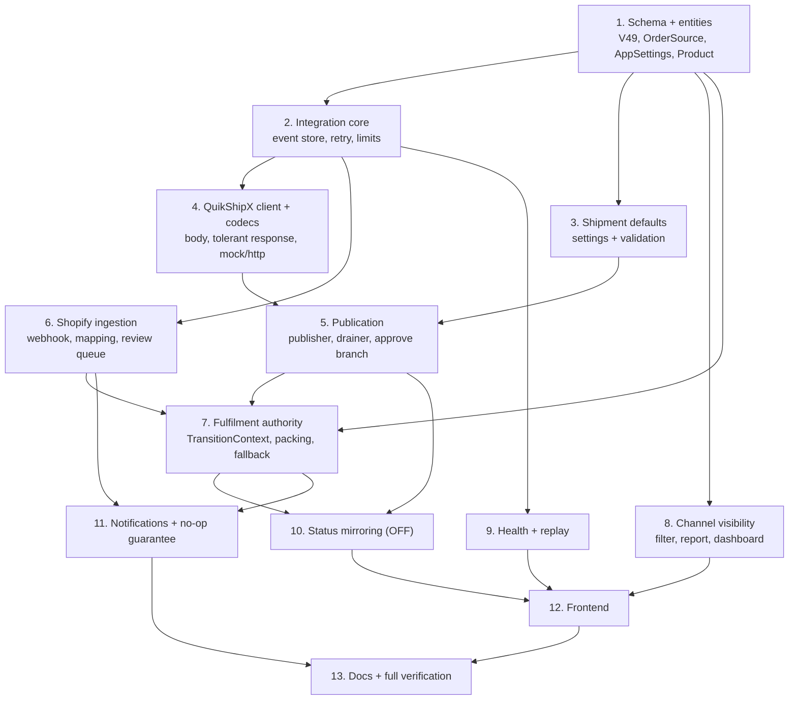

# Implementation Plan

## Overview

Hands label generation and post-approval fulfilment status to QuikShipX while making Shifa OMS the single
tracking surface for both order channels: Shopify orders ingested by webhook and tagged `SHOPIFY_API`, and
portal-punched orders published to QuikShipX carrying a `SHIFA-` prefixed `customer_order_id`.

The work is ordered so that every stage leaves the build green and the running system behaviourally
unchanged until the flags are turned on. `app.shopify.enabled`, `app.quikshipx.enabled` and
`app.quikshipx.status-feed-available` all default to `false`, and Property 29 pins that "disabled" is a
behavioural no-op.

The confirmed QuikShipX contract (`docs/QUIKSHIPX-API-V1.md`) defines only create-order, so section 10
builds the whole status-mirroring path and ships it switched off behind `status-feed-available`. Section 3
exists because the create-order body needs logistics data Shifa OMS has never stored.

Verification for every backend task is `mvn -f "backend/pom.xml" clean test` — **`clean` is mandatory**,
because `ReportType` switch exhaustiveness is not re-checked incrementally and that has broken this build
before. Frontend tasks verify with `npm --prefix frontend run build:admin` and, where property tests are
added, `npm --prefix frontend run test:pbt`.

## Tasks

### 1. Schema and persistence foundation

- [x] 1.1 Write `V49__shopify_quikshipx_order_sync.sql` exactly as sketched in the design: backfill blank
  `orders.source` to `SHIFA_ADMIN`; add `orders.shopify_order_id` / `shopify_order_number` /
  `fallback_mode`; create `order_shipments`, `integration_events`, `order_review_reasons` and
  `quikshipx_status_map` (seeded); extend `app_settings` with the nine `ship_*` Shipment_Defaults columns;
  add `products.dead_weight_grams`. Additive only; never edit an applied migration.
  - _Requirements: 1.7, 3.10, 5.4, 6.6, 15.5, 16.1_
- [x] 1.2 Validate V49 applies cleanly from V1 into a throwaway scratch database. Never run against
  `shifa_dashboard`.
  - _Requirements: 15.5_
- [x] 1.3 Extend `order.OrderSource` with `SHOPIFY_API` and `SHIFA_ADMIN`, keeping `SALESPERSON` and
  `STOREFRONT` as legacy values, and add a pure `canonical()` folding the legacy values to `SHIFA_ADMIN`.
  Also switch `OrderService.createSalespersonOrder` to persist `SHIFA_ADMIN`.
  - _Requirements: 1.1, 1.3, 1.6_
- [x] 1.4 Add the additive `OrderEntity` fields (`shopifyOrderId`, `shopifyOrderNumber`, `fallbackMode`)
  with no `setSource`, so channel immutability is structural.
  - _Requirements: 1.4, 3.8_
- [x] 1.5 Add `AppSettings` Shipment_Defaults fields and `Product.deadWeightGrams`, both additive so
  `SettingsServiceTest` and the product suites stay green.
  - _Requirements: 16.1, 16.7_

### 2. Integration core

- [x] 2.1 Create `com.shifa.oms.integration` with `IntegrationSource`, `IntegrationOutcome`,
  `IntegrationEvent` + repository, and `IntegrationEventStore` writing with `REQUIRES_NEW` so a rollback
  cannot erase the record of a received delivery.
  - _Requirements: 2.4, 6.4, 14.8_
- [x] 2.2 Write the pure helpers `RetryBackoff.nextDelay` and `WebhookPayloadLimit.verdict`.
  - _Requirements: 2.8, 2.9, 5.6_
- [x] 2.3 Property test `RetryBackoffPropertyTest` (Property 5) and `WebhookPayloadLimitPropertyTest`
  (Property 4).
  - _Requirements: 2.8, 2.9, 5.6_
- [x] 2.4 Property test `IntegrationEventIdempotencePropertyTest` (Property 1) over an in-memory store
  modelling `UNIQUE(source, external_event_id)`.
  - _Requirements: 1.8, 2.6, 2.7, 6.9, 14.4, 14.5_

### 3. Shipment defaults on the existing settings surface

- [x] 3.1 Extend `SettingsService` and the settings DTOs with the Shipment_Defaults, including range
  validation for package type, shipping mode, weight, dimensions and shipping amount, and an
  "incomplete" indicator when the pickup warehouse is unset.
  - _Requirements: 16.1, 16.2, 16.4_
- [x] 3.2 Audit every Shipment_Defaults change with the ADMIN and the changed values; keep
  `SettingsController` roles unchanged.
  - _Requirements: 16.3_
- [x] 3.3 Property test `ShipmentDefaultsPropertyTest` (Property 37) for validation ranges, default
  application and the publication gate. Per-product weight rollup (16.7) moves to task 5.1 where
  `ShipmentPayloadFactory` lives.
  - _Requirements: 16.1, 16.4, 16.5, 16.6_

### 4. QuikShipX client and codecs

- [x] 4.1 Add `QuikShipXProperties` bound to `app.quikshipx.*` per the design's configuration block, plus
  `application.yml` entries with empty secret defaults and `deploy/shifa.env.example` keys.
  - _Requirements: 13.1, 15.8_
- [x] 4.2 Write the pure `OrderReference` (build and parse `SHIFA-<orderCode>`) and `QuikShipXValueFormat`
  (money and integer to JSON string, `"14 March 2026"` date).
  - _Requirements: 5.3, 5.13_
- [x] 4.3 Write the pure `ShipmentSubmission` record tree and `QuikShipXSubmissionCodec` producing the
  four-section, all-strings body, with `customer_full_address` composed from address line, city and state
  and the postal code kept in `customer_pincode`.
  - _Requirements: 8.1, 8.11, 8.12_
- [x] 4.4 Write `ShipmentAcceptance` with every identifier optional and `QuikShipXAcceptanceCodec` doing
  tolerant candidate-key parsing, treating a 2xx with no recognised key as accepted.
  - _Requirements: 8.2_
- [x] 4.5 Define the `QuikShipXClient` interface; implement `MockQuikShipXClient` (default, deterministic,
  records submissions) and `HttpQuikShipXClient` (`POST {base-url}/api/create-order-v1`, body auth,
  retryable vs permanent failure classification, `fetchStatus` unsupported until an endpoint exists).
  Exactly one bean active via `@ConditionalOnProperty`.
  - _Requirements: 5.2, 5.6, 5.11, 15.9_
- [x] 4.6 Property tests. Delivered as `QuikShipXCodecPropertyTest` (Properties 13, 14, 38) and
  `QuikShipXValueFormatTest` (Property 36's value-level half plus the order-reference round trip). The
  whole-body half of Property 36 — defaults applied, weight rollup, pay-mode consistency over a real
  order — needs `ShipmentPayloadFactory` and lands with task 5.1.
  - _Requirements: 5.3, 5.5, 5.12, 5.13, 8.1, 8.2, 8.5, 8.7, 8.8, 8.11_

### 5. Publication

- [x] 5.1 Add `OrderShipment` + repository and `ShipmentPayloadFactory` combining order, products and
  Shipment_Defaults into a `ShipmentSubmission`, including the per-product weight rollup. Covered by
  `ShipmentPayloadFactoryPropertyTest` (Property 36 whole-body half, Property 37 rollup).
  - _Requirements: 5.2, 5.13, 8.1, 8.11, 8.12, 16.5, 16.7_
- [x] 5.2 Implement `QuikShipXPublisher` with the eligibility guards (channel is `SHIFA_ADMIN`, integration
  enabled, Fallback_Mode off, an ADMIN transition to `APPROVED` exists, no existing Shipment_Record,
  Shipment_Defaults complete, credentials present), persisting the Shipment_Record and auditing the
  submission.
  - _Requirements: 4.4, 5.1, 5.5, 5.9, 5.10, 15.4, 15.12, 16.6_
- [x] 5.3 Add `QuikShipXPublishDrainer` mirroring `OutboxCourierDrainer`, with the 30/60/120/240/480 second
  ladder, terminal `PUBLICATION_FAILED` and an ADMIN notification; no retry on a permanent rejection.
  - _Requirements: 5.6, 5.7, 5.11_
- [x] 5.4 Branch `AdminOrderService.approve` via the new `order.OrderFulfilmentPublisher` inversion,
  implemented by `QuikShipXPublicationGateway`: internal label as today when QuikShipX is disabled or the
  order is in Fallback_Mode, otherwise enqueue publication and skip the internal label.
  - _Requirements: 5.1, 5.8, 5.9, 5.10, 13.2, 15.7_
- [ ] 5.5 Property test `PublicationIdempotencePropertyTest` (Property 12) — end-to-end "at most one
  Shipment_Record per order across any number of attempts", exercising the publisher guards against an
  in-memory shipment repository and a recording client. Deferred to sit with task 7.x, where
  `OrderFulfilmentOwnership` makes a managed order observable.
  - _Requirements: 4.4, 5.1–5.4, 5.8, 5.9_

### 6. Shopify ingestion

- [x] 6.1a Add `ShopifyProperties` and `ShopifyWebhookVerifier` (base64 HMAC-SHA256, constant-time).
  Unlike the courier verifier this **fails closed** on a blank secret: accepting unsigned deliveries would
  make order creation an open endpoint.
  - _Requirements: 2.2, 2.3_
- [x] 6.1b Add `ShopifyWebhookController` at `POST /api/webhooks/shopify/orders` with the size check before
  verification, the event-store write and the outbox enqueue. No `SecurityConfig` change —
  `/api/webhooks/**` is already `permitAll`. Also added `ShopifyConfig` and `dto/ShopifyWebhookAck`.
  The body is taken as `byte[]` so the HMAC covers exactly the received bytes; an absent
  `X-Shopify-Webhook-Id` falls back to a SHA-256 of the body, which preserves idempotence
  because a retried delivery carries identical bytes.
  - _Requirements: 2.1, 2.4, 2.5, 2.6, 2.8_
- [x] 6.2 Write the pure `ShopifyOrderModel`, `ShopifyOrderPayloadCodec` (unknown fields ignored, only the
  order id required), `MobileNumberNormalizer`, `ShopifySkuMatcher` and `ReviewReason`. Covered by
  `ShopifyMappingPropertyTest` (Properties 6, 7, 8 plus the round trip).
  - _Requirements: 3.2, 3.3, 3.4, 3.6, 3.7, 8.4, 8.6, 8.7, 8.8_
- [x] 6.3 Implement `ShopifyOrderIngestor`: create-or-resolve by Shopify order id, empty strings for
  NOT NULL columns, review reasons recorded once each, then the SYSTEM transition to `APPROVED`.
  Split across TWO beans: `ShopifyOrderWriter` holds the two `REQUIRES_NEW` steps (create, then
  approve) and `ShopifyOrderIngestor` sequences them. The split is forced by Req 4.6 — a failed
  approval must leave the created order at `PENDING_ADMIN_APPROVAL`, which is only possible if the
  creation has already committed, and Spring's proxying means self-invocation would not open a
  second transaction. Added `OrderRepository.findByShopifyOrderId`. Stock is deliberately NOT
  reserved: an internal order rejects on a shortfall, but a Shopify order is already sold.
  - _Requirements: 3.1, 3.5–3.12, 4.1, 4.5, 4.6, 15.3_
- [x] 6.4 Add `ShopifyIngestDrainer` (1 + 3 attempts) and the ADMIN `GET /api/admin/orders/review-queue`
  (`ReviewQueueService`, `ReviewQueueController`, `dto/ReviewQueueRow`). The queue is derived from
  `order_review_reasons` rather than carrying a resolution flag, so it cannot disagree with the order.
  - _Requirements: 2.5, 2.9, 2.10, 3.9_
- [x] 6.5 Property tests. Delivered as `WebhookSignaturePropertyTest` (Properties 2, 3),
  `ReviewReasonSetPropertyTest` (Property 9, over the real writer plus queue service) and
  `AutoApprovalChannelPropertyTest` (Property 11, over the real `TransitionAuthority` and
  `OrderWorkflowService`). Properties 6, 7 and 8 were already delivered by `ShopifyMappingPropertyTest`
  in task 6.2 and were not duplicated. Section total 43 tests green.
  - _Requirements: 2.2, 2.3, 3.1–3.12, 4.5, 4.7_

### 7. Fulfilment authority

- [x] 7.1 Add `order.OrderFulfilmentOwnership` and its `integration.quikshipx` adapter; inject it into
  `OrderWorkflowService` through a NEW primary constructor and move `@Autowired` onto it so exactly one
  constructor carries the annotation. A null ownership means "not managed".
  - _Requirements: 9.1, 9.2, 9.3_
- [x] 7.2 Add the `TransitionContext`-aware `TransitionAuthority` overloads plus `ManagedStages`, leaving
  the edge table and the four existing methods untouched. `TransitionContext` normalises the
  fallback-mode/managed contradiction so the authority never has to resolve it.
  - _Requirements: 4.5, 4.7, 9.1, 9.2, 9.3, 9.10_
- [x] 7.3 Property tests `ManagedOrderAuthorityPropertyTest` (Properties 18, 19) — 19 pins the reduction to
  pre-existing behaviour and is what protects the existing suite.
  - _Requirements: 9.1, 9.2, 9.3_
- [x] 7.4 Guard Shopify-origin orders read-only (409 `ExternalOrderReadOnlyException`) on content mutation
  and non-SYSTEM cancellation, via the pure `order.ExternalOrderGuard`, wired into
  `AdminOrderService.reject`. Packing actions on managed orders are already denied 403 by the
  `TransitionAuthority` context rule from 7.2, since every packing move routes through Order_Workflow —
  no separate check needed.
  - _Requirements: 9.4, 9.5, 9.9_
- [x] 7.5 Exclude managed orders from the packing queues via the new
  `OrderRepository.findPackingQueueByStatus` predicate, keeping Fallback_Mode orders in the queue matching
  their status. `PackingServiceTest` needed NO change — it does not exercise `queue()`.
  - _Requirements: 9.6, 9.7, 13.8_
- [x] 7.6 Property test `ExternalOrderGuardPropertyTest` (Property 20) — content immutability, SYSTEM-only
  cancellation, and no field movement on a rejected guard.
  - _Requirements: 9.4, 9.5_
- [ ] 7.6b Property tests `PackingQueueMembershipPropertyTest` (21) and `StatusHistoryChainPropertyTest`
  (10). Both need a persistence-backed fixture (the queue predicate is native SQL; the history chain spans
  multi-hop status-sync plans), so they land with the status-sync work in section 10.
  - _Requirements: 4.1, 4.3, 6.5, 9.6, 9.7, 9.8_
- [x] 7.7 Implement the ADMIN Fallback_Mode toggle (`FallbackModeService` + `ShipmentController`
  `POST /api/admin/orders/{id}/fallback-mode`) with internal label generation, audit, eligibility check,
  idempotent repeat and the label-render failure path. Added `GET /api/orders/{id}/shipment` for the
  tracking read (no label download — QuikShipX documents no label endpoint).
  - _Requirements: 10.1–10.6, 13.3, 13.4, 13.5, 13.9, 13.10_

### 8. Channel visibility, reporting and dashboard

- [ ] 8.1 Add the `OrderSource channel` overload to `OrderListSpecifications` and
  `AdminOrderService.listOrders`, expanding `SHIFA_ADMIN` to include the legacy values; every existing
  overload delegates with `null`.
  - _Requirements: 11.2, 11.3, 11.4, 11.5, 11.10_
- [ ] 8.2 Accept `?channel=` on `AdminOrderController.list` and force-exclude `SHOPIFY_API` for SALESPERSON
  and TEAM_LEAD after creator scoping, including the order-detail not-found path.
  - _Requirements: 11.6, 11.7, 11.9_
- [ ] 8.3 Add AWB and order-reference recall to `OrderRepository.search` / `searchIn` via a
  `LEFT JOIN order_shipments`.
  - _Requirements: 10.9_
- [ ] 8.4 Add `ReportType.ORDERS_BY_CHANNEL` with the channel column on `OrderReportRecord`, and update
  **both** `ReportTableBuilder.build` and `ReportController.reportLabel`. Verify with a clean build.
  - _Requirements: 12.1–12.10_
- [ ] 8.5 Add the dashboard channel split and the unresolved-integration-failure count.
  - _Requirements: 12.5, 14.7_
- [ ] 8.6 Property tests `OrderChannelPropertyTest` (22, 23), `OrderListFilterPropertyTest` (24, 25),
  `ChannelReportPropertyTest` (26, 27), extend `ReportExportFidelityPropertyTest` (28),
  `AwbSearchPropertyTest` (35), `OrderResponseCompatibilityPropertyTest` (33).
  - _Requirements: 1.1–1.6, 4.2, 10.9, 11.2–11.7, 12.1–12.7, 15.6_

### 9. Integration health and replay

- [ ] 9.1 Implement `IntegrationHealthService` + `IntegrationHealthController` under
  `/api/admin/integrations` (ADMIN): failure list, publication-failure list, status-map view.
  - _Requirements: 7.3, 7.10, 14.1, 14.2, 14.3, 14.9_
- [ ] 9.2 Implement `IntegrationReplayService` (replay through the live path, audited, in-progress and
  out-of-retention rejections) and publication retry reusing the original order reference.
  - _Requirements: 14.4, 14.5, 14.6, 14.10, 14.11_
- [ ] 9.3 Property test `IntegrationHealthSelectionPropertyTest` (Property 31).
  - _Requirements: 14.2, 14.3, 14.7_

### 10. Status mirroring, built and switched off

- [ ] 10.1 Add `QuikShipXStatusMapping` + repository and the pure `StatusMapper` (token resolution, BFS
  shortest legal path, deterministic tie-break) plus `ManagedStages`.
  - _Requirements: 7.1, 7.2, 7.5, 7.6, 7.8, 7.11_
- [ ] 10.2 Property test `StatusMapperPathPropertyTest` (Property 15) against the real
  `OrderStatusStateMachine`, and `OrderStatusGroupPartitionPropertyTest` (Property 30).
  - _Requirements: 7.1, 7.5, 7.6, 7.8, 13.7_
- [ ] 10.3 Implement `QuikShipXStatusSync` with the ordered outcome guards, path walking through
  `OrderWorkflowService` as SYSTEM, monotonic timestamp update and full rollback on a rejected hop.
  - _Requirements: 6.5, 6.6, 6.7, 6.8, 6.15, 7.4, 7.7, 7.9, 13.6_
- [ ] 10.4 Add `QuikShipXWebhookController`, `QuikShipXStatusDrainer` and `QuikShipXStatusPoller`, all
  `@ConditionalOnProperty` on `status-feed-available` so no bean exists by default.
  - _Requirements: 6.1–6.4, 6.10–6.14_
- [ ] 10.5 Property tests `StatusOutcomePropertyTest` (Properties 16, 17).
  - _Requirements: 6.6–6.10, 7.4, 7.7, 13.6_

### 11. Notifications and no-op guarantee

- [ ] 11.1 Add the customer-messaging policy consulted at the existing `NotificationDispatcher` fan-out
  point; do not add a second fan-out path.
  - _Requirements: 15.1, 15.2, 15.10, 15.11_
- [ ] 11.2 Property tests `ChannelSuppressionPropertyTest` (32) and
  `IntegrationDisabledNoOpPropertyTest` (29).
  - _Requirements: 13.2, 15.1, 15.2, 15.7_
- [ ] 11.3 Add a plain `@SpringBootTest` context-load smoke test per `app.quikshipx.mode`, asserting
  exactly one `QuikShipXClient` bean. This also closes the missing-`@Autowired` DI class of failure.
  - _Requirements: 13.1, 15.9_
- [ ] 11.4 Extend `EndpointRoleGuardIntegrationTest` with one case per new endpoint, leaving the existing
  15 cases untouched, and re-audit every `@PreAuthorize` a shell-reachable role hits on login.
  - _Requirements: 7.10, 12.2, 14.1, 14.9_

### 12. Frontend

- [ ] 12.1 Add the pure `orders/order-channel.ts` helpers and their fast-check property test (Property 34).
  - _Requirements: 10.7, 11.1_
- [ ] 12.2 Orders page: channel badge, server-side channel filter in the existing tab strip, AWB column at
  ≥768px and on the mobile card, and read-only affordances for Shopify orders.
  - _Requirements: 10.2, 10.12, 11.1, 11.2, 11.8, 9.4_
- [ ] 12.3 Order detail drawer: shipment block with AWB, courier, last synced status, tracking link,
  `label_url` link when present, the QuikShipX order reference, the portal-label hint, the
  status-in-portal notice, the test-shipment marking, and the internal print action hidden for managed
  orders.
  - _Requirements: 6.14, 10.1, 10.3–10.7, 10.10, 10.11, 5.12_
- [ ] 12.4 Settings page: Shipment_Defaults section, ADMIN only, 360px clean.
  - _Requirements: 16.2, 16.3, 16.4, 16.8_
- [ ] 12.5 New `integrations/` feature at `/integrations` (`adminOnlyGuard`) and
  `/orders/review-queue` (`adminOnlyGuard`), with nav links carrying `adminOnly` matching their guards.
  - _Requirements: 3.9, 7.3, 14.1–14.6_
- [ ] 12.6 Dashboard channel-split tile and integration-failures tile, ADMIN only; Reports page gains
  `orders-by-channel` under Orders, hidden for SALESPERSON.
  - _Requirements: 12.3, 12.5, 14.7_

### 13. Documentation and rollout

- [ ] 13.1 Update `README.md`, `.kiro/steering/project-memory.md` (new section, highest migration V49, new
  config keys, the "webhooks are already permitAll" finding) and `DEPLOYMENT.md` with the staged rollout.
  - _Requirements: 15.5, 15.8_
- [ ] 13.2 Full clean verification: `mvn -f "backend/pom.xml" clean test`,
  `npm --prefix frontend run build:admin`, `npm --prefix frontend run test:pbt`.
  - _Requirements: all_

## Task Dependency Graph



```json
{
  "waves": [
    {
      "wave": 1,
      "name": "Schema and entities",
      "tasks": ["1.1", "1.2", "1.3", "1.4", "1.5"]
    },
    {
      "wave": 2,
      "name": "Integration core and shipment defaults",
      "tasks": ["2.1", "2.2", "2.3", "2.4", "3.1", "3.2", "3.3"]
    },
    {
      "wave": 3,
      "name": "QuikShipX client and codecs",
      "tasks": ["4.1", "4.2", "4.3", "4.4", "4.5", "4.6"]
    },
    {
      "wave": 4,
      "name": "Publication, ingestion, channel visibility, health",
      "tasks": [
        "5.1", "5.2", "5.3", "5.4", "5.5",
        "6.1", "6.2", "6.3", "6.4", "6.5",
        "8.1", "8.2", "8.3", "8.4", "8.5", "8.6",
        "9.1", "9.2", "9.3"
      ]
    },
    {
      "wave": 5,
      "name": "Fulfilment authority",
      "tasks": ["7.1", "7.2", "7.3", "7.4", "7.5", "7.6", "7.7"]
    },
    {
      "wave": 6,
      "name": "Status mirroring (off) and no-op guarantee",
      "tasks": ["10.1", "10.2", "10.3", "10.4", "10.5", "11.1", "11.2", "11.3", "11.4"]
    },
    {
      "wave": 7,
      "name": "Frontend",
      "tasks": ["12.1", "12.2", "12.3", "12.4", "12.5", "12.6"]
    },
    {
      "wave": 8,
      "name": "Documentation and full verification",
      "tasks": ["13.1", "13.2"]
    }
  ]
}
```

Critical path: **1 → 2 → 4 → 5 → 7 → 10 → 12 → 13**. Sections 3, 6, 8 and 9 can proceed in parallel once
their prerequisites land. Section 7 is the highest-risk step because it touches `TransitionAuthority` and
the packing queue, both heavily covered by the existing suite — do it only after publication works, so a
managed order actually exists to test against.

## Notes

- **Feature flags stay off.** Nothing in sections 1–12 changes production behaviour until
  `app.shopify.enabled` / `app.quikshipx.enabled` are set. Task 11.2 (Property 29) is the machine-checked
  statement of that, and it should be treated as a release gate, not an optional extra.
- **`mvn clean`, always.** Task 8.4 adds a `ReportType` value. Incremental compilation does not re-check
  switch exhaustiveness, and this exact gap has produced a broken build in this project before. Both
  `ReportTableBuilder.build` and `ReportController.reportLabel` must be updated together.
- **One `@Autowired` constructor.** Task 7.1 adds a constructor to `OrderWorkflowService`. A service with a
  `Clock` test constructor and no `@Autowired` on the primary one took production down once
  (`PaymentVerificationService`). Task 11.3's context-load smoke test exists to catch that class of failure
  before a restart, not after.
- **Java 25 runtime: Mockito cannot mock concrete classes.** Use recording subclasses and hand-written
  in-memory repository implementations, following `TeamPerformanceServiceTest`.
- **Two intentional test touches** are expected and are not regressions: `PackingServiceTest`'s repository
  double gains the new queue finder (7.5), and `RoleDashboardService`'s two constructors plus their call
  sites gain the new summary components (8.5). `TransitionAuthorityPropertyTest`,
  `OrderStatusTransitionTablePropertyTest`, `TeamScopeResolverTest` and the 15 existing
  `EndpointRoleGuardIntegrationTest` cases must **not** be modified.
- **No `SecurityConfig` change.** `/api/webhooks/**` is already `permitAll()`, used today by the courier and
  WhatsApp webhooks. Mounting the new webhooks under that prefix satisfies R2.1 and R6.1 by path placement.
- **Migration discipline.** V48 is the highest applied migration and is live in production. This feature is
  V49 and must stay additive, so a code rollback tolerates the new schema. Any status-token corrections
  later ship as V50 `INSERT … ON DUPLICATE KEY UPDATE`, never by editing V49.
- **Blocked on the client, but not blocking.** Publication cannot go live until an ADMIN sets the pickup
  warehouse id from the QuikShipX dashboard (Open Question 4), and status mirroring cannot be enabled until
  QuikShipX exposes a status feed (Open Question 2). Both are configuration, so implementation proceeds
  against `MockQuikShipXClient` regardless.
