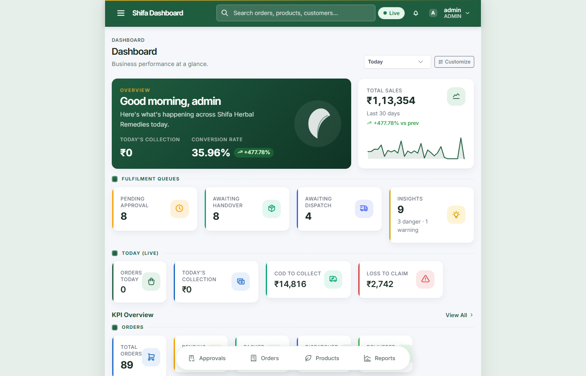

# Shifa OMS - Screenshot Capture Guide

This guide helps you capture screenshots from the live application to complete the Features Guide documentation.

## Login Credentials

**URL:** http://13.207.62.222/dashboard

### Test Accounts:
- **Admin:** `admin` / `admin123`
- **Salesperson:** `sales1` / `admin123` (or `sales2`, `sales3`, etc.)
- **Packer:** `packer` / `packer123`
- **Accountant:** `accountant` / `admin123`

## Screenshot Requirements

### Tools Needed:
- Browser: Chrome/Edge (latest)
- Screenshot tool: Windows Snipping Tool, ShareX, or browser DevTools
- Image editor: Paint, GIMP, or Photoshop (for cropping/resizing)

### Recommended Settings:
- **Desktop:** 1920x1080 resolution, browser at ~1400px width
- **Tablet:** Browser DevTools responsive mode, 768px width
- **Mobile:** Browser DevTools responsive mode, 360px width
- **Format:** PNG (for UI screenshots), JPEG (for photos)
- **Quality:** High, but compress before adding to HTML

## Screenshot Checklist

### 1. Dashboard & Overview (4 screenshots)
- [ ] Admin dashboard (login as admin)
  - Path: `/dashboard`
  - Show: KPI tiles, order summary, fulfilment queues
- [ ] Salesperson dashboard (login as sales1)
  - Path: `/dashboard`
  - Show: My orders stats, lead pipeline widget
- [ ] Packing user dashboard (login as packer)
  - Path: `/dashboard`
  - Show: Orders to pack count, queues
- [ ] Accountant dashboard (login as accountant)
  - Path: `/dashboard`
  - Show: COD outstanding, receivables

### 2. Order Management (4 screenshots)
- [ ] New Order form - top half (login as sales1)
  - Path: `/orders/new`
  - Show: Customer details section with state typeahead
- [ ] New Order form - bottom half
  - Path: `/orders/new` (scroll down)
  - Show: Product picker, payment section, notes
- [ ] Order detail drawer
  - Path: `/orders` → click any order
  - Show: Full order detail with customer, items thumbnails, payment, status history
- [ ] Orders list with filters
  - Path: `/orders`
  - Show: Filter tabs (All, Pending, Approved, etc.), order cards

### 3. Approval Workflow (2 screenshots)
- [ ] Approval queue (login as admin)
  - Path: Navigate to approval queue from dashboard
  - Show: List of pending orders awaiting approval
- [ ] Generated label PDF
  - Path: Open any approved order → click "Print Label"
  - Show: PDF with barcode, customer address, items

### 4. Packing & Dispatch (2 screenshots)
- [ ] Packing page with 3 queues (login as packer)
  - Path: `/packing`
  - Show: "Orders to pack", "Awaiting handover", "Awaiting dispatch" sections
- [ ] Barcode scanner in action
  - Path: `/packing` (scroll to scanner box)
  - Show: Scanner input + recent scans list

### 5. Courier & Tracking (2 screenshots)
- [ ] Assign courier modal
  - Path: `/orders` → dispatched order → "Assign Courier"
  - Show: Courier selection dropdown, tracking fields
- [ ] Courier records list
  - Path: Navigate to Reconciliation → Couriers
  - Show: List of shipments with tracking info

### 6. COD Reconciliation (2 screenshots)
- [ ] Receivables list (login as accountant)
  - Path: Navigate to Reconciliation → Receivables
  - Show: Outstanding receivables table
- [ ] Settle receivable modal
  - Path: Click "Settle" on any pending receivable
  - Show: Settlement form with amount, UTR, date fields

### 7. Finance & Invoicing (3 screenshots)
- [ ] Tax invoice PDF
  - Path: Any order → "Download Invoice"
  - Show: GST invoice with line items, tax breakdown
- [ ] Expenses page
  - Path: Navigate to Finance → Expenses
  - Show: Expense list with categories
- [ ] P&L report
  - Path: Navigate to Finance → P&L → select month
  - Show: Revenue, expenses, net profit/loss

### 8. Products & Inventory (2 screenshots)
- [ ] Products list
  - Path: Navigate to Products
  - Show: Product cards with images, pricing, stock
- [ ] Inventory page
  - Path: Navigate to Inventory
  - Show: Stock levels, low-stock warnings

### 9. Leads & CRM (3 screenshots)
- [ ] Capture lead form (login as sales1)
  - Path: `/leads` → "+ New Lead"
  - Show: Lead capture form with source picker
- [ ] Leads list with pipeline
  - Path: `/leads`
  - Show: Status filter tabs with counts, lead cards
- [ ] Lead detail with follow-up
  - Path: Click any lead
  - Show: Lead detail drawer with follow-up date picker

### 10. Staff Management (3 screenshots)
- [ ] Salespeople directory (login as admin)
  - Path: Navigate to Settings → Salespeople
  - Show: Salesperson cards with verification status
- [ ] Salesperson profile with images
  - Path: Click any salesperson in directory
  - Show: Profile drawer with photo + ID proof sections
- [ ] My Profile page (login as sales1)
  - Path: Click "My Profile" from top navigation
  - Show: Own profile view with change request form
- [ ] Profile approvals (login as admin)
  - Path: Navigate to Settings → Profile Approvals
  - Show: Pending change requests with current vs. proposed diff

### 11. Reports & Insights (2 screenshots)
- [ ] Reports page
  - Path: Navigate to Reports
  - Show: Report cards (lead source, status, salesperson, delivery)
- [ ] Insights page (login as admin)
  - Path: Navigate to Insights
  - Show: Insights grouped by severity with dismiss/recompute

### 12. Notifications (2 screenshots)
- [ ] Notification bell & dropdown
  - Path: Any page → click bell icon in top nav
  - Show: Notification dropdown with unread badge
- [ ] Notifications list
  - Path: Navigate to Notifications page
  - Show: Full notifications list with filters

### 13. Security & Audit (2 screenshots)
- [ ] Login page
  - Path: http://13.207.62.222/ (logged out)
  - Show: Login form with Shifa branding
- [ ] Audit log (login as admin)
  - Path: Navigate to Audit
  - Show: Audit trail with timestamp, user, action, entity

### 14. Mobile Experience (4 screenshots)
- [ ] Mobile dashboard (360px width)
  - Path: `/dashboard` in responsive mode
  - Show: Stacked KPI cards, hamburger menu
- [ ] Mobile bottom tabs
  - Path: Any page on mobile
  - Show: Bottom 4-tab bar with icons
- [ ] Order detail on mobile
  - Path: `/orders` → click order (360px width)
  - Show: Mobile-optimized order drawer
- [ ] Tablet view (768px width)
  - Path: Any page at 768px
  - Show: Mixed layout (cards + some tables)

## How to Add Screenshots to HTML

1. **Save screenshots** in `docs/screenshots/` folder (create it if needed)
2. **Name files descriptively:** `admin-dashboard.png`, `order-detail.png`, etc.
3. **Replace placeholder divs** in `Shifa-Features-Guide.html`:

```html
<!-- BEFORE (placeholder) -->
<div class="screenshot placeholder">
  <div>📸 Screenshot: Admin Dashboard<br>
  <small>Replace with actual screenshot</small></div>
</div>

<!-- AFTER (with image) -->
<div class="screenshot">
  
</div>
```

4. **Keep the caption** below each screenshot
5. **Optimize images** before adding (compress to <500KB each)

## Tips for Great Screenshots

✅ **Do:**
- Clean browser (no extensions, bookmarks visible)
- Use real data from seeded test accounts
- Capture at standard resolutions
- Show complete workflows (forms filled, not empty)
- Include mouse cursor for "click here" context

❌ **Don't:**
- Include personal/sensitive data (use test data only)
- Capture with low resolution
- Leave UI in error state (unless showing error handling)
- Include browser dev tools unless needed
- Use production data

## Quick Capture Workflow

1. Open browser to http://13.207.62.222/dashboard
2. Login with appropriate role
3. Navigate to target page
4. Arrange window to recommended size
5. Use Snipping Tool (Win+Shift+S) or screenshot tool
6. Save to `docs/screenshots/` with descriptive name
7. Update HTML to replace placeholder
8. Commit changes to git

## Testing the Guide

After adding screenshots:
1. Open `Shifa-Features-Guide.html` in browser
2. Navigate through all sections using sidebar
3. Verify all images load correctly
4. Check mobile screenshots at 360px width
5. Ensure captions match screenshots

## Estimated Time

- **All 45 screenshots:** ~2-3 hours
- **Per section:** ~10-15 minutes
- **HTML updates:** ~30 minutes
- **Review & polish:** ~30 minutes

**Total:** ~3-4 hours for complete documentation
